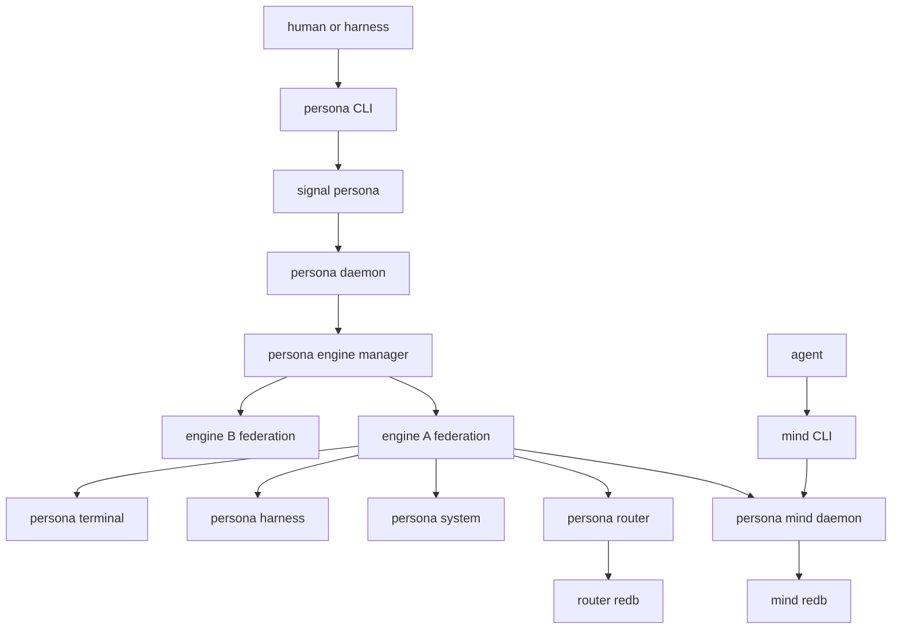
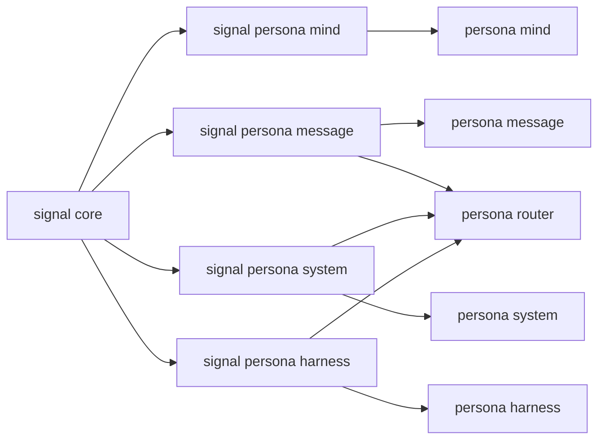
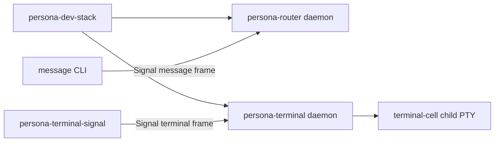
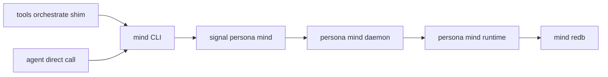
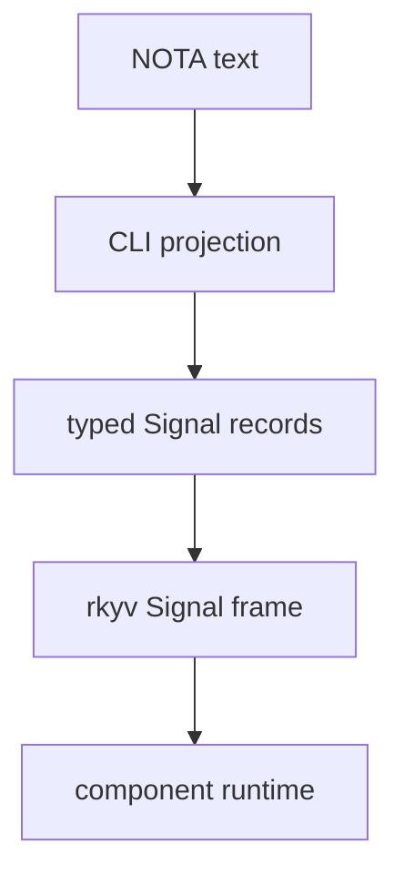
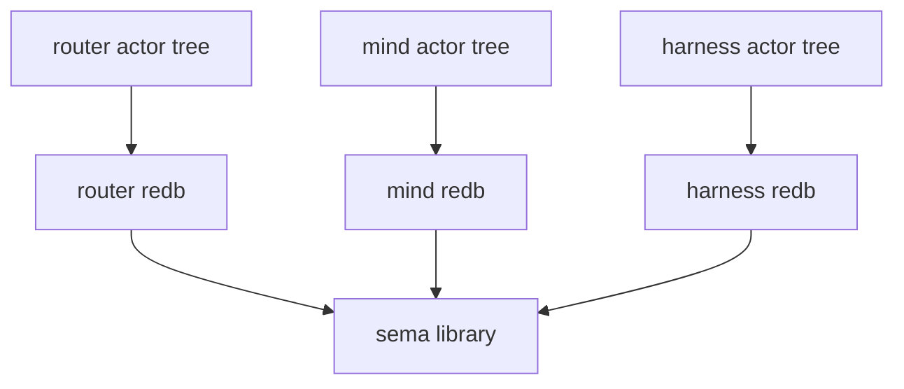
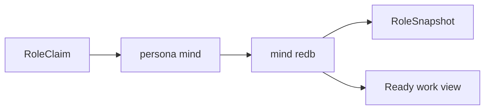

# persona — architecture

*Engine manager and apex integration repository for the Persona component ecosystem.*

> `persona` is the host-level engine manager for the Persona component
> ecosystem. One privileged `persona` daemon supervises multiple engine
> instances, keeps component daemons visible and coordinated, allocates their
> per-engine sockets and state directories, wires them through Nix, documents
> the whole topology, and owns deployment-level verification. Component
> implementations live in component repositories.

---

## 0 · TL;DR

Persona coordinates interactive AI harnesses as first-class participants in
durable, inspectable engines. The top-level `persona-daemon` process is the
host-level engine manager: it runs as the dedicated `persona` system user,
supervises multiple engine instances, exposes engine status, allocates local
socket/state boundaries, records origin context for audit, and gives operators
and harnesses one place to ask whether the total system is up, healthy, and
coherent.

`signal-persona` is the management contract for the `persona` engine manager.
It is the contract a client uses to ask for engine status, component health,
engine-visible projections, and supervisor actions. Component-to-component
behavior uses the relation-specific `signal-persona-*` contracts.

The `persona` CLI is a thin daemon client. It decodes one NOTA request record,
sends one length-prefixed `signal-persona` frame to `persona-daemon`, waits for one
typed reply frame, renders one NOTA reply record, and exits. `persona-daemon` owns
the live Kameo `EngineManager` actor for the daemon lifetime.

The center of agent state is `persona-mind`: the daemon-backed state component
for role coordination, activity, work memory, decisions, aliases, and
ready/blocked views. The command-line surface for that state is the `mind`
binary: one NOTA request record in, one NOTA reply record out, with the CLI
acting as a thin client to the daemon.

The architecture is contract-first. A wire boundary is defined in a dedicated
`signal-persona-*` repository before producer and consumer implementations
move against it. Contract crates own typed records and rkyv frame behavior;
runtime crates own actors, policy, storage, and side effects.

`persona` is the apex repo and engine-manager home. It owns architecture,
flake composition, supervisor wiring, deployment verification, and
cross-component tests. Component repositories own router policy, mind state
transitions, terminal adapters, storage table internals, actor logic, and
relation-specific signal records.

Sema belongs to the component that owns the state inside an engine:
`persona-mind` has mind Sema / `mind.redb`, `persona-router` has router Sema /
`router.redb`, and so on. The `persona` engine manager owns manager-level
state: the engine catalog, component desired state, health, lifecycle
observations, startup/shutdown activity, inter-engine routes, and
engine-level status.



## 0.5 · Persona — the durable agent

Persona is the durable agent. The Persona ecosystem is the workspace's
answer to OpenClaw and Gas City: long-lived, persistent, inspectable
agent runtime instead of one-shot agent CLIs and reconciliation-stack
controllers.

| Failure mode being rejected | Persona answer |
|---|---|
| Many sources of truth reconciled by polling | Each state-bearing component owns one redb file; producers push, consumers subscribe. |
| Hidden mutation under uncertainty | Every state transition has a typed input event, typed output event, durable record. Constraints become witness tests. |
| State-machine controller spawning processes | Direct Kameo actors with named planes, supervised, traceable. |
| Tmux-as-runtime-substrate | Terminal as adapter; harnesses as first-class records. |
| One-shot agent CLIs with no persistent state | Long-lived daemons. CLIs are thin clients to the daemons. |

This positioning is upstream of every individual persona-* component.
It is the criterion that decides what belongs in the persona ecosystem:
durable-agent work belongs here; one-shot operator actions (deploy CLIs)
live in `lojix-cli` / `CriomOS`; declarative cluster data lives in
`goldragon`; auth/security/identity infrastructure (host trust, cluster
identity) lives in the criome ecosystem.

> **Scope.** Today's Persona sits on today's stack — Rust on Linux,
> direct Kameo, component-owned Sema/redb storage, signal-* wire. The
> eventually-self-hosting stack is one Sema-on-Sema substrate that
> subsumes these pieces; today's Persona is a realization step
> toward it, built rightly for the scope it serves now. See
> `~/primary/ESSENCE.md` §"Today and eventually — different things,
> different names".
>
> Eventual cross-trust-domain federation (multiple Persona deployments,
> distinct organizations, schema evolution across the federation) is
> named separately in §"Eventual cross-domain federation" below, marked
> as **future work, not first-prototype work**. Today's Persona is
> single-trust-domain — one user, that user's agents, one workspace
> root. Federation arrives only after today's Persona works.

## 0.6 · Introspection

`persona-introspect` is the supervised inspection-plane component.
It sits next to the six-component operational delivery path instead
of inside that path. It asks each supervised component daemon for
typed inspectable records over Signal and projects them to NOTA at
the edge.

- `persona-introspect` is **not** part of the six-component
  operational delivery path.
- `persona-introspect` **is** part of the prototype-supervised
  component set, so the manager can launch and observe it with the
  rest of the engine skeletons.
- `persona-introspect` does **not** directly open any other
  component's redb. Live introspection asks the owning
  component daemon through a Signal relation; the component
  decides which records to expose, how to read consistent
  snapshots, and what to redact.
- The contract layer split:
  - **Operational contracts** stay where they are
    (`signal-persona-*` per existing pattern).
  - **Component-specific introspection records** live
    inside the existing `signal-persona-<X>` crate at first;
    they split to a sibling `signal-persona-<X>-introspect`
    when they're heavy / high-churn / unrelated to
    operational consumers.
  - **`signal-persona-introspect`** (planned) owns the
    central query/projection envelope vocabulary
    (`IntrospectionRequest`, `IntrospectionReply`,
    `IntrospectionSubscription`, etc.).

The first introspection slice is **terminal** — `persona-terminal`
has the largest existing gap between durable local Sema records
(`StoredTerminalSession`, `StoredDeliveryAttempt`,
`StoredTerminalEvent`, `StoredViewerAttachment`,
`StoredSessionHealth`, `StoredSessionArchive`) and
contract-owned inspectable vocabulary. Manager event-log
records are the second slice (likely promoted into
`signal-persona`); router trace/table readouts are the
third.

## 0.7 · Persona-system: paused (FocusTracker is real, plan is deferred)

`persona-system` was originally scoped to push focus and prompt-buffer
observations to the router for injection gating. That use case dissolves:
the terminal-cell lock-and-cache input gate (see §5.1) handles
non-interleaving locally without needing focus observation. The
`FocusTracker` Kameo actor exists in code in `persona-system` and stays;
plan substance does not grow until persona-system is unpaused by a real
consumer.

- The Niri focus observer + `FocusTracker` actor are real and tested.
- `signal-persona-system` keeps its current observation shape; no new
  variants land until a real consumer surfaces.
- The privileged-action surface (`SystemPrivilegedRequest` with
  `ForceFocus` / `SuppressDrift`) is deferred. When persona-system
  returns, force-focus's naming is reopened.
- Likely future consumers: window-focus-aware notifications,
  multi-engine UI coordination, multi-monitor layout observations.

## 1 · Component Map

| Repository | Role |
|---|---|
| `persona` | Engine manager, `persona-daemon` home, apex Nix/deployment/test composition, and meta architecture. |
| `persona-mind` | Central state component and command-line mind runtime. |
| `signal-persona-mind` | Typed contract for role coordination, activity, and work graph operations. |
| `persona-router` | Message routing, delivery state, gate state, and pending-delivery decisions. |
| `persona-message` | Message ingress component: `message` NOTA CLI plus supervised `persona-message-daemon`; the daemon forwards typed message frames to the internal router socket. |
| `persona-system` | System/window focus observation adapters. |
| `persona-harness` | Harness identity, lifecycle, transcripts, and delivery adapter boundary. |
| `persona-terminal` | Durable PTY/session owner around `terminal-cell`, visible viewer adapters, raw terminal byte transport, and terminal metadata. |
| `terminal-cell` | Low-level daemon-owned PTY/transcript primitive consumed by `persona-terminal`. |
| `sema` | Typed database kernel library over redb/rkyv. |
| `signal-core` | Signal wire kernel: frames, channel macro, shared wire primitives. |
| `signal-persona` | Management contract for the `persona` engine manager. |
| `signal-persona-message` | Message ingress contract. |
| `signal-persona-system` | System observation contract. |
| `signal-persona-harness` | Router/harness delivery and observation contract. |
| `nexus` | Semantic text vocabulary written in NOTA syntax. |
| `nota` / `nota-codec` / `nota-derive` | NOTA language, parser/codec, and derive support. |



## 1.5 · Engine Manager Model

One host has one `persona` daemon. That daemon can supervise N engine
instances. Each engine owns its own full component federation:
`persona-mind`, `persona-router`, `persona-system`, `persona-harness`,
`persona-terminal`, and `persona-message`.

The daemon runs as the dedicated `persona` system user, not as `root` and not
as the operator's user. The elevated position is for scoped OS authority:
force-focus during prompt injection, system-owned engines, peer credential
inspection, cross-engine auth proofs, and component restart after
operator-user crashes. Components also run under the Persona authority
baseline, but the manager owns cross-engine authority.

Per-engine resources are always scoped by engine id:

| Resource | Shape |
|---|---|
| State directory | `/var/lib/persona/<engine-id>/` |
| Component redb files | `/var/lib/persona/<engine-id>/{mind,router,harness,terminal}.redb` |
| Socket directory | `/var/run/persona/<engine-id>/` |
| Component sockets | `/var/run/persona/<engine-id>/{mind,router,system,harness,terminal,message}.sock` |
| Manager redb | `/var/lib/persona/manager.redb` |
| Manager socket | `/var/run/persona/persona.sock` |

Exact host paths are deployment-owned, but the `<engine-id>` scoping is
architectural. Components do not discover peers by scanning the filesystem;
the manager passes peer sockets at spawn time.

The manager redb owns the engine catalog: engine identities, owners,
component desired state, lifecycle observations, and inter-engine route
declarations. Every transition appends a typed event and reduces into the
manager tables.

## 1.6 · Local Boundary and Routes

The local engine boundary is not an in-band proof scheme. `persona-daemon`
creates the per-engine runtime directory, component sockets, filesystem modes,
and child spawn envelopes. Local trust comes from the operating-system boundary:
dedicated user, ownership, socket permissions, and the manager-controlled
process tree.

Signal traffic may carry an origin/context tag for audit and mind policy, but
agents do not get to assert authority by placing a field in a request. Runtime
authorization lives at the receiving component and is based on the socket it is
serving, the peer credentials it can observe, the manager-supplied spawn
context, and the relevant contract. Persona-local components must not recreate
an in-band proof or class gate inside their application payloads.

### 1.6.1 · Filesystem-ACL trust

Local trust is security through correctness within the privileged group plus
filesystem ACL at the boundary. The kernel enforces the ACL on every
`connect()`; counterfeit credentials are impossible because the credential
check happens before bytes flow. Inside the engine, every connected peer
is by definition either the `persona` daemon or another component running
as `persona`. The crypto-first alternative (every component holds keys,
signs every request) was rejected: it solves a problem the filesystem
ACL already solves, and adds key-management complexity that doesn't
buy reciprocal trust the OS doesn't already give.

| Socket | Path | Mode | Owner |
|---|---|---|---|
| Engine manager | `/var/run/persona/persona.sock` | `0600` | `persona` |
| Per-engine mind/router/system/harness/terminal | `/var/run/persona/<engine-id>/<comp>.sock` | `0600` | `persona` |
| Per-engine message ingress | `/var/run/persona/<engine-id>/message.sock` | `0660` (group = engine owner's group) | `persona` |

Two boundaries still need in-band classification: the `message.sock`
(user submission stamped with `MessageOrigin::External(...)`) and any
future network component. Both stamp origin at accept time using
`SO_PEERCRED`.

### 1.6.2 · ConnectionClass and MessageOrigin

Origin is provenance, not authority. Two closed enums type the boundary:

```
ConnectionClass (minted from SO_PEERCRED at accept):
    Owner | NonOwnerUser(Uid) | System(SystemPrincipal)
  | OtherPersona { engine_id, host } | Network(NetworkSource)

MessageOrigin (stamped on each accepted message):
    Internal(ComponentName) | External(ConnectionClass)
```

These live in the `signal-persona-auth` contract crate (the kernel
extracted from `signal-persona` once cross-domain demand fired). Every
domain contract (`signal-persona-message`, `signal-persona-mind`,
`signal-persona-system`, `signal-persona-harness`,
`signal-persona-terminal`) depends on it. `signal-persona` itself keeps
its narrow surface — engine catalog operations — and no longer owns
the auth vocabulary.

Authority does **not** come from `MessageOrigin`. Authority comes from
**channel state** (§1.6.3).

### 1.6.3 · Channel choreography (router holds, mind decides)

Router holds the live `authorized-channel` state in its sema-db, keyed
by `(source, destination, kind)`. Messages on an active channel
deliver directly; messages without a matching active channel park and
forward to mind for adjudication. **Mind decides; router enforces.**

The `Channel` record shape:

```
Channel {
    id,
    source:       ChannelEndpoint,
    destination:  ChannelEndpoint,
    kinds:        Set<MessageKind>,
    duration:     ChannelDuration,
    granted_by:   GrantSource,
    granted_at,
    status,
}

ChannelEndpoint  = Internal(ComponentName) | External(ConnectionClass)
ChannelDuration  = OneShot | Permanent | TimeBound { until }
ChannelStatus    = Active | Expired | Retracted{...} | Consumed
GrantSource      = Mind | EngineSetup
```

Mind's choreography ops (in `signal-persona-mind`): `ChannelGrant`,
`ChannelExtend`, `ChannelRetract`, `ChannelList`, `AdjudicationDeny`.

**Structural channels** are pre-installed at engine setup. The
federation can't function without them, so `persona-daemon` writes
them into the router's redb at engine-creation time with
`GrantSource::EngineSetup`:

| Source | Destination | Kinds | Duration |
|---|---|---|---|
| `Internal(Message)` | `Internal(Router)` | message submission, inbox query | `Permanent` |
| `Internal(System)` | `Internal(Router)` | focus, prompt-buffer observations | `Permanent` |
| `Internal(Router)` | `Internal(Harness)` | message delivery | `Permanent` |
| `Internal(Harness)` | `Internal(Terminal)` | terminal input, capture, resize | `Permanent` |
| `Internal(Terminal)` | `Internal(Harness)` | transcript events | `Permanent` |
| `Internal(Router)` | `Internal(Mind)` | adjudication request, delivery notification | `Permanent` |
| `Internal(Mind)` | `Internal(Router)` | channel grant/extend/retract | `Permanent` |
| `External(Owner)` | `Internal(Router)` | message submission via `persona-message-daemon` | `Permanent` |

Unknown-channel messages park in router's `adjudication_pending` table
and emit `AdjudicationRequest` to mind. Mind decides:

```mermaid
sequenceDiagram
    participant src as source
    participant router as persona-router
    participant mind as persona-mind
    src->>router: message on unknown channel
    router->>router: park in adjudication_pending
    router->>mind: AdjudicationRequest
    mind->>mind: decide (grant / extend / retract / deny)
    mind->>router: ChannelGrant or AdjudicationDeny
    router->>router: install channel; release parked message
    router->>src: delivery or rejection
```

### 1.6.4 · Cross-engine routes collapse into channels

An `EngineRoute` is a `Channel` whose `source` is
`External(OtherPersona { engine_id })`. The multi-engine work uses the
same choreography contract: engine B's mind adjudicates incoming
traffic from engine A the same way it adjudicates external owner
submissions. Cross-engine implementation today is **minimal-mode** —
path scoping is baked in (every per-engine resource is keyed by
engine id; see §1.5), but cross-engine ops are deferred until a
second engine is demonstrated alive.

### 1.6.5 · Multi-engine as upgrade substrate

Engine-level upgrade replaces component-level hot-swap. `persona-daemon`
spawns engine v2 alongside engine v1; mind grants temporary migration
channels; typed records migrate over the channels (not byte copies);
when v2's health checks pass, the daemon retires v1 via graceful
shutdown. Engine-level upgrade sidesteps redb's single-writer-per-file
constraint that forbids concurrent same-redb writes — v2 owns its
own redb files under `/var/lib/persona/<engine-id-v2>/`.

## 1.7 · Startup Strategy

Startup has two layers.

Development and integration tests start component binaries directly through
Nix-owned scripts in this meta repo. The scripts allocate a temporary runtime
directory, start the current runnable daemons, push socket paths through
environment variables, and leave inspectable artifacts. This is the
`persona-dev-stack` surface; it exists so integration work can happen before
host-level service installation is settled.

Host deployment is systemd-shaped. The production `persona` daemon is the
host-level manager and should be started by a NixOS module as a systemd
service. Component daemons may become systemd units or manager-spawned child
processes, but the manager is still the component that allocates per-engine
state directories and pushes peer sockets to children. Daemons may use
systemd readiness/watchdog notification once they run under systemd; direct
systemd D-Bus control from Rust is only needed if the `persona` daemon later
creates or manipulates transient units itself.

Component executables are supplied by the Nix-built stack. The default
component command set comes from the `persona` flake closure or the
deployment's NixOS module, not from whatever happens to be installed on the
host. Development runs may put those commands on `PATH`, but that path is a
Nix-owned environment and must be recorded in the runner artifacts. Production
launch resolves every component command before spawn and fails closed if a
required binary is missing or ambiguous.

The current prototype bridge is
`packages.<system>.persona-prototype-component-launchers`: seven Nix-built
launcher scripts, one per prototype-supervised component. Each launcher adapts
the manager's common spawn-envelope environment
(`PERSONA_ENGINE_ID`, `PERSONA_COMPONENT`, `PERSONA_STATE_PATH`,
`PERSONA_DOMAIN_SOCKET_PATH`, `PERSONA_SUPERVISION_SOCKET_PATH`,
`PERSONA_PEER_*`) to the component daemon's current CLI surface, records an
inspectable capture file under the component state directory, then execs the
real Nix-built component binary. This is integration glue, not a new
component. The component daemon owns both its domain socket and its typed
supervision relation.

The engine launch configuration is the place for explicit component command
overrides. A NOTA launch record may provide an override for one component
command, for example a custom `persona-message` build during an integration
test. Omitted components use the Nix-provided default.

**Two distinct records** carry the spawn information:

- **`persona::launch::ResolvedComponentLaunch`** — the **manager-internal**
  Rust composite. Carries executable path, argv, environment,
  working directory, process-group mode, restart policy, and an embedded
  `SpawnEnvelope`. `DirectProcessLauncher` consumes
  `ResolvedComponentLaunch`, forks/execs the executable, and writes the
  embedded envelope to the per-component file. This record is
  operator's lane; it is not on the wire.
- **`signal-persona::SpawnEnvelope`** — the **child-readable typed
  wire form**. Carries engine_id, component_kind, component_name,
  state_dir, domain_socket_path, domain_socket_mode,
  supervision_socket_path, supervision_socket_mode, peer_sockets,
  manager_socket, and supervision_protocol_version. The manager writes
  the envelope file at
  `/var/run/persona/<engine-id>/<component>.envelope` at spawn
  time; the child reads it via `signal-persona`'s typed decoder
  and proceeds. Per ESSENCE §"Infrastructure mints identity, time,
  and sender," the child does not invent its socket path or
  component name.

The child reads only the `SpawnEnvelope`. It does not see executable
path, argv, environment, restart state, or other manager-internal
launch state — those stay inside `ResolvedComponentLaunch`.

**State directory for stateless components**: every component
receives a `state_dir` via its `SpawnEnvelope`. Stateless
components (today: `persona-message-daemon`, `persona-system` in
skeleton mode) leave the directory empty and do not open a redb
file until they own durable state. The manager prepares the
directory at spawn-envelope mint time; the child opens it only if
it has state to persist.

**Manager state — two reducers and snapshots**: the manager runs
**two reducers** over its append-only `engine-events` log:

- **Engine-lifecycle reducer** — per `(EngineId, ComponentName)`, materialises
  `ComponentProcessState` (closed enum: `Unspawned → Launched → SocketBound →
  Ready → Stopping → Exited`). Snapshot table: `engine-lifecycle-snapshot`.
- **Engine-status reducer** — per `(EngineId, ComponentName)`, materialises
  `ComponentHealthState` (closed enum: `Starting | Running | Degraded |
  Stopped | Failed`). Snapshot table: `engine-status-snapshot`.

CLI status queries (`ComponentStatusQuery`, `EngineStatusQuery`) read the
engine-status snapshot only. Audit/debug paths walk the event log or the
engine-lifecycle snapshot.

**Manager restore**: on daemon startup the manager loads the
latest `StoredEngineRecord` per engine from `manager.redb` and initialises
both reducer snapshots from their stored state. Event replay is later
strengthening; the prototype loads snapshots directly.

**Socket and supervision verification**: each child binds its own domain
socket from the envelope and applies the requested mode. Each child also binds
the envelope's supervision socket at mode `0600`.
The manager verifies both sockets' *type*, *path*, and *mode* on disk, then
sends typed `signal-persona::SupervisionRequest` frames over the supervision
socket: `ComponentHello`, `ComponentReadinessQuery`, and
`ComponentHealthQuery`. Only a matching identity, ready reply, and `Running`
health report lets the manager append `ComponentReady` to the event log. A
child that fails to bind, binds the wrong mode, gives the wrong identity, or
does not answer the supervision relation does not progress to `Ready`.

Component process supervision belongs behind an actor boundary. The manager
may first use a direct child-process backend, but it should be driven by a
data-bearing Kameo launcher/supervisor actor that owns child handles, process
groups, readiness state, restart state, stop order, and lifecycle events.
Request decoding and the `EngineManager` mailbox do not run blocking process
management directly. If systemd features become load-bearing for component
children, the same launcher boundary may gain a systemd transient-unit backend
with EngineId-scoped unit names, explicit unit properties, cgroup cleanup,
resource accounting, credentials, sandboxing, journald visibility, and
readiness/watchdog integration.

The first meta-repo runner starts only the executable halves that exist today:



That runner proves router ingress and terminal transport independently. It is
not the final delivery witness because the external router-to-harness
registration/control surface has not landed yet.

The full-engine sandbox witness starts at the same apex layer. The Nix app
`persona-engine-sandbox` creates an isolated `state/`, `run/`, `home/`,
`work/`, and `artifacts/` tree, writes NOTA manifests, and launches a
`systemd-run --user` transient unit with `PrivateUsers=yes`,
`ProtectHome=tmpfs`, `ReadWritePaths=<sandbox>`, `WorkingDirectory=<work>`,
and `HOME=<home>`. The current host-visible socket scaffold does not enable
`PrivateTmp`: user-mode systemd mount namespacing rejects the writable
host-visible sandbox path when `PrivateTmp` is combined with
`ReadWritePaths`. Dedicated credential roots outside the sandbox tree must be
made visible with a bind/credential mechanism such as `BindPaths=` or
`LoadCredential=`; `ReadWritePaths=` alone is not a visibility mechanism under
`ProtectHome=tmpfs`. The optional bwrap profile remains the next hardening layer.
Prompt-bearing Claude and Codex runs require dedicated sandbox credentials;
the runner does not copy live host `~/.claude` or `~/.codex` authentication
files. Pi is the preferred first harness because it uses the local
Prometheus-backed model path.

The current executable inside-unit witness is still deliberately smaller than
the final federation: it runs the existing Nix-built `persona-dev-stack-smoke`
under `state/dev-stack`, starts real `persona-router-daemon` and
`persona-terminal-daemon` processes, drives them through the `message` and
`persona-terminal-signal` CLIs, and writes `dev-stack-run.nota`,
`dev-stack-processes.nota`, and `dev-stack-sockets.nota` under
`artifacts/`. This proves the sandbox envelope runs real component daemons
inside the unit; it does not claim router-to-mind adjudication,
persona-harness delivery, or a terminal-cell live-agent path yet.

The terminal-cell sandbox lane is a separate witness. It runs
`terminal-cell-daemon` directly at `$sandbox_dir/run/cell.sock`, launches one
child harness inside the cell, drives the harness through the packaged
`terminal-cell-send` / `terminal-cell-wait` / `terminal-cell-capture` clients,
and writes `terminal-cell-run.nota`, `terminal-cell-processes.nota`,
`terminal-cell-sockets.nota`, `terminal-cell-transcript.txt`,
`terminal-cell-prompt.nota`, `host-attach.nota`, and
`harness-environment.nota`. The fixture variant proves the terminal-cell lane
deterministically; the Pi variant proves a real prompt-bearing local model
harness can start inside the sandbox and receive input through terminal-cell.
Pi snapshots only model catalog/settings into the isolated config directory and
writes an empty auth file.

The sandbox runner also owns the dedicated-auth bootstrap surface:
`persona-engine-sandbox --bootstrap-auth --harness <kind>`. Codex bootstrap
uses a separate sandbox `CODEX_HOME` and the real `codex login --device-auth`
flow so the host browser can authorize a distinct `auth.json`. Claude
bootstrap either consumes a dedicated `PERSONA_CLAUDE_OAUTH_TOKEN_FILE`
through `LoadCredential=` or runs `claude auth login --claudeai` under a
separate `CLAUDE_CONFIG_DIR`. Pi bootstrap creates isolated
`PI_CODING_AGENT_DIR` and `PI_CODING_AGENT_SESSION_DIR` paths and records
`PI_PACKAGE_DIR`. This bootstrap path is specifically not a host-auth copy
path; copying `~/.codex/auth.json` or `~/.claude/.credentials.json` for
prompt-bearing tests is forbidden.

The host-visible attach helper is `persona-engine-sandbox-attach`. It runs
outside the sandbox, locates the sandbox `run/cell.sock`, and opens host
Ghostty with host `terminal-cell-view`. The helper writes
`artifacts/host-attach.nota` and `artifacts/host-attach-command.txt` so the
exact view command is inspectable. It does not pass a Wayland socket into the
sandbox; only the terminal-cell socket path crosses the boundary.

The sandbox runner also writes `artifacts/bwrap-profile.nota`, an optional
strict-mount profile plan. It is intentionally marked `DocumentedNotEnabled`:
today's runner is systemd-run first, while the bwrap layer remains a later
hardening step. The profile limits read-only binds to `/nix`,
`/run/current-system`, `/etc`, and `/etc/static`, gives write access to the
sandbox directory and any existing dedicated credential root, and records that
Wayland stays on the host for the Ghostty attach path.

The first daemon-first apex slice is present: `persona-daemon` binds a Unix socket,
starts the Kameo `EngineManager`, accepts one Signal frame per connection,
dispatches through `HandleEngineRequest`, writes one Signal reply frame, and
keeps manager state across CLI invocations. The manager redb path is present
through a dedicated `ManagerStore` Kameo actor backed by Sema; manager
mutations persist by sending typed messages to that actor.

The first supervision slice is also present. When the daemon receives an
explicit launch plan from environment, it starts the data-bearing
`EngineSupervisor` actor, resolves prototype-supervised component commands through
`ComponentCommandResolver`, prepares EngineId-scoped state/run directories,
creates spawn envelopes, launches every prototype-supervised component process through
`DirectProcessLauncher`, and records typed `ComponentSpawned` events in
`manager.redb`. The default manager-only mode remains available for tests and
for hosts that have not yet supplied component commands.

`nix flake check
.#persona-daemon-launches-nix-built-prototype-topology` now starts
`persona-daemon` with the Nix-built prototype launcher set. In a pure Nix
builder it proves every prototype-supervised component receives the spawn
envelope and reaches its launcher, proves every domain socket binds with the
envelope-declared mode, proves every supervision socket binds with mode `0600`,
and proves the manager receives typed supervision identity/readiness/health
replies before recording `ComponentReady`. `persona-terminal` still needs the
stateful terminal-cell smoke lane for real PTY readiness, because pure Nix
builders do not provide the PTY environment that terminal-cell needs. The
remaining engine-manager layers are restore-on-restart, socket owner/group ACL
application, component exit subscriptions, restart policy, multi-engine
catalog, origin tagging, and privileged-user deployment witnesses.

## 2 · Command-line Mind

The first foundational implementation target is the command-line mind backed
by a long-lived `persona-mind` daemon.



The target surface:

```sh
mind '<one NOTA request record>'
```

Output:

```sh
'<one NOTA reply record>'
```

`tools/orchestrate` may remain as external cutover glue while agents
transition. It should lower ergonomic commands into the same
`signal-persona-mind` request records, send them through the `mind` client
path, and stop treating lock files as authoritative state.

## 3 · Wire Vocabulary

Rust-to-Rust traffic uses Signal frames: length-prefixed rkyv archives with
channel-specific request/reply payloads.

`signal-persona` is the contract for talking to the top-level `persona` engine
manager. A client uses it to ask the engine manager for engine status,
component health, engine-visible projections, and supervisor actions.
It is also the home for engine catalog and lifecycle records: `EngineId`,
component desired state, component health, socket layout, spawn envelopes, and
shutdown/restart requests. Authorization/provenance vocabulary belongs in the
auth/route contract layer when it is needed; `signal-persona` should not grow a
Persona-local in-band proof system.

The `signal-persona-*` repos are relation-specific contracts between concrete
components: mind, message, router, system, harness, terminal, and their
neighbors. Runtime crates move against those contracts instead of reaching into
another component's state.

Text uses NOTA syntax. Nexus is semantic content written in NOTA syntax, not a
second parser or alternate text format. Convenience CLIs may hide wrapper
records, but their output must still lower into typed Signal records.



Each contract repo owns only its channel vocabulary: closed request/reply/event
enums, validation newtypes, rkyv round trips, and `NotaEnum` / `NotaRecord` /
`NotaTransparent` derives on the typed records (so contract values are
NOTA-encodable directly, with rkyv and NOTA round-trip witnesses both in the
contract crate's `tests/`). It owns no daemon code, Kameo actors, routing
policy, storage policy, terminal adapter logic, or text-surface composition
(which CLI prints NOTA, how a daemon endpoint formats audit output — that
projection policy lives in the boundary component).

## 4 · State and Ownership

`sema` is the database kernel library. There is no shared Persona storage
layer. Every state-bearing component owns its own Sema layer or table module
inside that component's implementation. Neither `persona` nor `sema` is a
process boundary for another component's state.

Each state-bearing component owns:

- its Kameo actor tree;
- its durable redb file;
- its write-order actor;
- its post-commit subscription behavior.



Component boundaries are crossed with Signal contracts, not by opening another
component's database file.

## 5 · Mind, Router, Harness, System

The central split:

| Component | Owns | Does not own |
|---|---|---|
| `persona-mind` | role state, activity, work graph, decisions, aliases, ready/blocked views. | message delivery, terminal sessions, system focus facts. |
| `persona-router` | message routing, delivery queue, delivery gate state, message durability. | role claims, work graph, harness process lifecycle. |
| `persona-system` | OS/window focus observations. | router decisions, mind state, harness delivery, terminal prompt/input gates. |
| `persona-harness` | harness identity, lifecycle, injection/observation adapter boundary. | router policy, central work graph. |
| `persona-terminal` | durable PTY/session ownership, visible viewer adapters, and raw terminal byte transport. | Persona delivery policy or role state. |

`persona-mind` is not a router. `persona-router` is not the central project
memory. The two communicate through explicit contracts when they need each
other.

Runtime authorization and origin handling are component-owned:

| Component | Boundary behavior |
|---|---|
| `persona-router` | Holds live authorized-channel state in `channels` sema-db table. Parked messages awaiting mind adjudication live in `adjudication_pending`. `OneShot` channels mark `Consumed` after delivery; `TimeBound` channels expire by deadline; `Retract` writes `Retracted` before re-adjudication. |
| `persona-system` | Currently paused (see §0.7). When active, exposes the observation surface as `signal-persona-system::SystemRequest` / `SystemEvent`. Privileged-action surface deferred. |
| `persona-harness` | Owns harness identity and lifecycle records. **`HarnessKind` is a closed enum** — variants `Codex`, `Claude`, `Pi`, `Fixture`. No `Other` variant. New harness types are coordinated schema bumps. |
| `persona-terminal` | Owns terminal input safety, prompt cleanliness, and the lock-and-cache injection mechanism (§5.1). The gate is for non-interleaving, not auth. `MessageBody(String)` is the durable freeform body shape; typing grows by adding `MessageKind` variants additively, not by retroactive body migration. |
| `persona-mind` | Owns choreography (`ChannelGrant`/`Extend`/`Retract`/`Deny`). Non-`Owner` messages arrive as typed `ThirdPartySuggestion` records; the owner explicitly `AdoptSuggestion` for them to become claims. The `OwnerApprovalInbox` (formerly proposed as router-owned) lives in mind. |

### 5.1 · Terminal injection: lock-and-cache

When the router or harness needs to inject a programmatic message into
a terminal where a human may be typing, the mechanism is local to
`persona-terminal`: lock the input gate; cache human keystrokes during
the lock; check prompt cleanliness against a pre-registered
`PromptPattern`; if clean, inject; on release, the cache replays as
human input. Focus observation is **not** required — the gate solves
non-interleaving locally.

Key pieces:

- `PromptPattern` typed record registered by `persona-terminal` with
  `terminal-cell` at session-create time, identified by
  `PromptPatternId`. Variants: `LiteralSuffix(bytes)`,
  `RegexSuffix(pattern_bytes)`. `terminal-cell` runs literal/regex
  byte matches; it doesn't know what harness it's hosting.
- `AcquireInputGate { reason, prompt_pattern_uid }` returns
  `GateAcquired { lease, prompt_state: Clean | Dirty | NotChecked }`
  in one round-trip — the check happens inside lock-acquisition.
- Default policy on `Dirty`: **defer**. Clean-then-inject (send
  backspaces, save chars, inject, replay) is deferred — multi-line and
  history-search prompts misbehave.

This mechanism replaces the originally-proposed router-side join of
`FocusObservation` + `InputBufferObservation` from
`signal-persona-system`.

### 5.2 · Transcript fanout: typed observations, not raw bytes

Router and mind subscribe to **typed observations + sequence pointers**
from terminal/harness — not raw transcript bytes. Raw bytes stay in
persona-terminal storage. Direct authorized queries can read sequence
ranges by request. A future move (not designed today): a **transcript
inspection agent**, a persona-mind-resident role with direct typed
range-query access to terminal transcript storage. Range-shaped, not
stream-shaped.

### 5.3 · terminal-cell speaks signal-persona-terminal (control plane only)

`terminal-cell` is a Persona component, not a general abduco-shaped
tool. Its **control plane** speaks `signal-persona-terminal` Signal
frames (length-prefixed rkyv) over a privileged-only socket — gate ops,
prompt registration, lifecycle subscriptions, injection requests. Its
**data plane** (attached viewer keyboard ↔ child PTY) stays raw byte
stream with minimal framing for attach/detach/resize — **never**
routed through actor mailboxes, signal encoding, or transcript
subscription. The non-negotiable invariant: keystrokes from the
attached viewer reach the child PTY without traversing an actor
mailbox.

| Plane | Wire shape | Why |
|---|---|---|
| Control | Signal frames | Commands and observations; latency-tolerant |
| Data | Raw byte stream | Human keystroke latency must not pass through application-level relay |

Open question: one socket per cell with mode-shift vs two sockets
(`control.sock` + `data.sock`); resolution at refactor time.
`terminal-cell` stays its own repo (the seam is clean; the
micro-components discipline favors it).

## 6 · Lock Files and BEADS

Lock files and BEADS are transitional coordination surfaces in the primary
workspace. They are not the destination architecture.

Do not implement lock-file projections in Persona. The current lock files are
part of the temporary operator workflow and will be retired when agents switch
to the command-line mind. `persona-mind` stores typed role state; it does not
write lock files as a compatibility feature.

Destination:



Migration rules:

- lock files are not part of Persona implementation work;
- lock files are not durable truth and do not get projections from
  `persona-mind`;
- BEADS entries may be imported once as items, aliases, or external
  references;
- Persona does not grow a long-term BEADS bridge;
- new work graph behavior belongs in `persona-mind`.

## 7 · Constraints

- `persona` composes the stack; component repos implement behavior.
- One host has one privileged `persona` daemon supervising multiple engine
  instances.
- The daemon runs as the dedicated `persona` system user, not as root and not
  as the operator's user.
- `persona` may wire Nix inputs, checks, deployment modules, and
  cross-component witness tests.
- The meta repo exposes Nix apps for stateful integration runners; recurring
  daemon startup commands are not left as ad hoc shell history.
- The sandboxed engine runner is a Nix app named `persona-engine-sandbox`;
  its reusable command line is not an ad hoc shell transcript.
- `persona-engine-sandbox --inside-unit` runs a Nix-built production-code
  stack runner and leaves process/socket artifacts; it is not allowed to stop
  at manifest writing.
- The dev-stack sandbox smoke is a stateful Nix app because it starts PTY
  daemons; pure Nix checks only prove that the app is packaged.
- The terminal-cell sandbox smoke is a separate stateful Nix app. It starts a
  real `terminal-cell-daemon`, creates `run/cell.sock`, runs a child harness
  inside the PTY, drives that harness with `terminal-cell-send`/`wait`, records
  a transcript, and records a host attach command. It is deliberately separate
  from `persona-dev-stack`, whose terminal socket is the persona-terminal
  contract socket rather than the raw terminal-cell attach surface.
- Prompt-bearing Claude/Codex sandbox tests require dedicated sandbox
  credentials; the runner never copies live host authentication files.
- The Pi live-agent sandbox smoke may snapshot Pi `settings.json` and
  `models.json` into the sandbox so local providers are known, but it writes an
  empty Pi auth file and does not copy provider OAuth/API credentials.
- Sandboxed engine artifacts are sanitized manifests and targeted witness
  outputs, not raw home snapshots.
- Dedicated auth bootstrap is an explicit runner mode; prompt-bearing Codex
  and Claude tests never bootstrap by copying live host OAuth files.
- Auth-isolation witnesses run the actual sandbox runner against fake host
  auth/session files and fail if host paths leak into artifacts, host files
  change, or credential files are copied into the sandbox.
- Host attach uses `persona-engine-sandbox-attach`: Ghostty and
  `terminal-cell-view` run on the host and attach to the sandbox cell socket.
  Wayland is not passed into the sandbox for viewing.
- The optional bwrap strict profile is a generated NOTA artifact before it is
  executable policy; it must stay tiny and must not add Wayland passthrough for
  host viewing.
- Development runners push socket paths to components through environment and
  argv, never by filesystem discovery.
- Production startup is systemd/NixOS-shaped; Rust systemd control is an
  implementation detail, not the first required integration boundary.
- Component executables are Nix-built stack dependencies. Default resolution
  comes from the flake closure or NixOS module, not the ambient host
  installation.
- Component command overrides are explicit launch-config fields. An override
  may replace one component command for a test or custom build; omitted
  components use the Nix-provided default.
- Component command resolution fails closed when a required command is missing
  or ambiguous. A spawn request does not continue with a best-effort host PATH
  guess.
- The prototype launcher set adapts the shared spawn-envelope environment to
  the current component daemon CLIs and records which Nix-built binary it
  executed.
- The pure Nix prototype uses `persona-terminal-supervisor` for the terminal
  component socket. PTY-bearing `persona-terminal-daemon` readiness belongs in
  the stateful terminal-cell lane because pure builders do not provide a real
  interactive PTY surface.
- Resolved spawn envelopes carry executable path, argv, environment, state
  path, domain socket path/mode, supervision socket path/mode, and peer sockets.
- The first engine-supervision witness starts every prototype-supervised component, not
  only the components with useful behavior already implemented.
- Every prototype-supervised component has a Nix-built prototype launcher before
  the full-topology witness is considered real.
- A daemon skeleton accepts its component Signal boundary, answers
  health/status/readiness, and returns typed unfinished-state replies for
  valid requests whose behavior is not built yet.
- Prototype `ComponentReady` means the manager observed the component's
  envelope-declared domain socket, observed the component's supervision socket,
  and completed a typed supervision identity/readiness/health round-trip. It is
  not emitted merely because `spawn(2)` returned a child PID.
- Unfinished-state replies are closed typed records such as `Unimplemented`,
  `Unsupported`, `Unavailable`, or `Failed`; they are never plain strings or
  catch-all text errors.
- `Unimplemented` records carry a closed `ComponentOperation` variant. Tests
  pattern-match the operation; they never grep operation strings.
- Component skeletons decode every request variant in their Signal contract.
  Unbuilt valid variants return `Unimplemented(<operation>)`; `Unsupported`
  is reserved for requests delivered to the wrong component boundary.
- The engine manager owns a typed engine event log in the manager catalog,
  written through the manager writer path.
- Components do not write the engine event log. Component-sourced event
  records are manager observations about that component.
- Engine event sequences are per-manager monotonic keys, not per-engine
  counters.
- Engine events record management facts such as component spawned, component
  ready, component returned `Unimplemented`, component exited, restart
  scheduled, restart exhausted, component stopped, and engine state changed.
- NOTA log output is a projection of typed engine events, not the durable
  source of truth.
- The default NOTA event projection carries event payloads such as component
  name, operation, unimplemented reason, exit code, restart attempt, and phase.
  Kind-only summaries may exist as compact views but are not the truth
  projection.
- The engine event log is not a terminal transcript. Terminal and harness
  transcript data remains owned by terminal/harness components.
- Component process supervision is owned by data-bearing Kameo launcher /
  supervisor actors. Request handlers do not spawn, wait, reap, or restart
  child processes directly.
- A direct child-process backend must own process groups, readiness state,
  kill/reap behavior, restart tracing, and reverse-order shutdown before it is
  treated as production-worthy.
- A systemd child-process backend, if added, is an implementation behind the
  launcher/supervisor actor boundary. It uses EngineId-scoped transient units
  and records unit names, properties, and lifecycle results in the manager
  catalog.
- Dedicated sandbox credential roots hidden by `ProtectHome=tmpfs` are exposed
  with `BindPaths=` or `LoadCredential=`, not by assuming `ReadWritePaths=`
  makes them visible.
- `persona` does not own mind state transitions, router policy, harness
  lifecycle, terminal transport, storage table internals, or Signal records.
- Every runtime boundary in the stack has a dedicated Signal contract repo.
- Cross-component tests prove boundaries by bytes, processes, dependency
  graphs, or durable files; they do not share in-process memory as the witness.
- State-bearing components own separate redb files and separate Sema table
  declarations.
- Per-engine state and socket paths include the engine id; cross-engine state
  lives only in the manager catalog.
- Engine layout planning names every prototype-supervised component socket and state
  file before a component is spawned.
- Internal component sockets are private to the Persona authority boundary;
  the `message.sock` is group-writable for owner ingress (bound by `persona-message-daemon`, the supervised prototype message-ingress component). `router.sock` (mode 0600) is bound by `persona-router` for internal traffic. The "proxy" name retires; the daemon itself stays.
- Spawn envelopes carry the component's own state/socket paths and every peer
  socket path; components do not derive peers by scanning directories.
- Local engine trust is created by manager-owned sockets, ownership, modes, and
  spawn envelopes. Components do not accept agent-supplied in-band auth proofs
  as authority.
- Inter-engine routes are typed, manager-owned records; their exact approval
  contract is deferred to the auth/route implementation wave.
- Component spawn receives peer socket paths from the manager; components do
  not scan the filesystem to discover peers.
- Components talk by Signal frames, not by opening another component's redb
  file.
- The manager catalog is written through the `ManagerStore` actor; request
  handling does not open `manager.redb` directly.
- NOTA is the only text syntax; Nexus is semantic content written in NOTA.
- The `mind` CLI is a daemon client: one NOTA request record in, one NOTA reply
  record out.
- The `persona` CLI is also a daemon client: one NOTA request record in, one
  NOTA reply record out.
- Lock files and BEADS are temporary workspace surfaces, not Persona
  implementation targets.
- Existing transitional shims in this repo remain visibly marked as shims until
  component-owned implementations replace them.
- The Persona ecosystem owns durable-agent runtime work. Auth/security/identity
  infrastructure (host trust, cluster identity) is **not in persona** — it
  lives in the auth/security ecosystem as a new sibling component to
  ClaviFaber (cluster-trust runtime; name TBD by system-specialist). It is
  **not inside ClaviFaber** (ClaviFaber stays narrow: per-host key-generation
  shim for legacy systems; deliberate non-expansion). It is **not inside
  today's `criome` daemon** (today's criome is the sema-ecosystem records
  validator). The eventual-Criome shape eventually subsumes both, but today
  they are separate components. One-shot deploy actions live in `lojix-cli`
  / `CriomOS`. Declarative cluster proposals live in `goldragon`.
- Internal sockets are mode `0600`, owner `persona`; `message.sock` is mode
  `0660`, group matches engine owner's group.
- `MessageOrigin` is stamped on every router-accepted message before commit.
- The router never delivers on an inactive channel; unknown-channel
  messages park and emit `AdjudicationRequest` to mind.
- Mind's `ChannelGrant` installs a channel into router's sema-db before
  the parked message delivers.
- `OneShot` channels mark `Consumed` after delivery; `TimeBound` channels
  with `until` in the past fail the active-channel check.
- Engine setup pre-installs the federation's structural channels.
- Engine v2 upgrade uses typed migration over channels, not filesystem copy.
- The terminal injection cannot write to PTY without a current gate lease;
  human bytes are cached during a locked gate and replay in original order
  on release; dirty prompts defer injection by default.
- `terminal-cell`'s data plane (viewer keystrokes → PTY) does not traverse
  a Kameo mailbox.
- `HarnessKind` is a closed enum; no `Other` variant.
- `MessageBody(String)` is the durable freeform body shape; typing grows
  by adding `MessageKind` variants.

## 8 · Invariants

- The meta repo composes; component repos implement.
- The `persona` runtime owns the top-level engine-manager actor and supervisor
  status surface.
- The `persona` runtime owns the manager catalog and supervises multiple
  per-engine component federations.
- Component binaries are resolved from the Nix-built stack or explicit launch
  overrides before spawn; components are not discovered from the ambient host.
- Component OS-process supervision is an actor-owned plane, not a side effect
  hidden in request decoding.
- Local engine authority comes from manager-created sockets, filesystem modes,
  peer process context, and spawn envelopes; not from agent-supplied request
  fields.
- Each wire between components has a Signal contract repo.
- Contract repos own types; runtime repos own behavior.
- Runtime behavior lives in direct Kameo actors inside the owning component.
- `persona-mind` is Persona's central daemon-backed state component.
- Each state-bearing component owns its own redb file.
- Each state-bearing component owns its own Sema layer/table declarations.
  There is no shared `persona-sema` component in the current architecture.
- The engine manager owns `manager.redb` through its own Sema table layer.
  The write path is a data-bearing Kameo `ManagerStore` actor, not a CLI
  helper or direct redb call in request decoding.
- The engine manager event log is typed manager state; text logs are views.
- Full-engine supervision first proves every prototype-supervised component is
  launched from the Nix-built stack, that each component domain socket reaches
  the envelope-declared type/mode, and that each supervision socket answers the
  typed supervision relation. PTY readiness stays in a stateful terminal-cell
  witness.
- Component skeletons must be honest: valid unfinished operations return typed
  unfinished-state replies instead of hanging, crashing, or printing untyped
  text errors.
- Cross-component access is by Signal frame, not database peeking.
- Rust-to-Rust component traffic uses rkyv Signal frames.
- NOTA is the only text syntax.
- Producers push; consumers subscribe. Polling is not a fallback.
- Harnesses are first-class records, not hidden terminal sessions.
- Message delivery is downstream of durable router-owned message commit.
- Command-line mind input is one NOTA request record; output is one NOTA reply
  record.
- Command-line persona input is one NOTA request record; output is one NOTA
  reply record.
- The `mind` CLI is a thin client. The long-lived `persona-mind` daemon owns
  `MindRoot` and `mind.redb`.
- Persona is the durable agent — long-lived, persistent, inspectable.
  One-shot agent CLIs and reconciliation-stack controllers are not
  persona-shaped. Auth/security/identity is criome-shaped, not
  persona-shaped.
- Local engine trust comes from filesystem ACL on `persona`-owned sockets,
  not from in-band crypto proofs.
- `ConnectionClass` and `MessageOrigin` live in the `signal-persona-auth`
  contract crate, depended on by every domain contract; they describe
  origin/provenance, not authority.
- Authority comes from channel state, not from message origin.
- The router holds the authorized-channel table; mind owns
  grant/extend/retract decisions.
- `HarnessKind` is closed.
- `terminal-cell`'s control plane is signal-framed; its data plane is raw
  byte stream and never routed through actor mailboxes.

## 9 · Architectural-Truth Tests

The apex repo owns tests that prove cross-component shape:

| Invariant | Witness |
|---|---|
| `mind` uses the mind contract | CLI decodes into `signal-persona-mind::MindRequest`. |
| `tools/orchestrate` is external cutover glue | wrapper output reaches the same `mind` path; it is not a Persona component. |
| mind owns role state | lock files are absent and role claims still work. |
| router commits before delivery | delivery trace follows durable router commit. |
| router does not own terminal transport | router dependency graph excludes `persona-terminal` and `terminal-cell`. |
| component databases are separate | router/mind/harness open distinct redb files. |
| NOTA is the only text syntax | no CLI-only parser accepts non-NOTA command records. |
| engine resources are scoped | generated state/socket paths include `EngineId`. |
| in-band auth proof is not accepted as authority | request decoding and component handlers ignore agent-supplied proof/class fields for local authority. |
| persona CLI is daemon client | CLI accepts exactly one NOTA request and prints one NOTA reply. |
| persona-daemon preserves unrelated files | daemon startup refuses a non-socket endpoint path instead of deleting it. |
| manager catalog writes go through the writer actor | `nix flake check .#persona-manager-store-writes-engine-status-through-writer-actor` |
| engine manager persists accepted mutations | `nix flake check .#persona-engine-manager-persists-component-mutation-through-manager-store` |
| persona CLI mutation reaches manager.redb via daemon path | `nix flake check .#persona-daemon-persists-cli-mutation-to-manager-store` |
| sandbox runner is a Nix-owned app | `nix flake check .#persona-engine-sandbox-script-builds` |
| sandbox runner supports each first harness name | `nix flake check .#persona-engine-sandbox-supports-all-harnesses` |
| sandbox runner documents dedicated auth | `nix flake check .#persona-engine-sandbox-documents-dedicated-auth` |
| sandbox auth bootstrap emits real dedicated login surfaces | `nix flake check .#persona-engine-sandbox-bootstrap-auth-dry-run` |
| Pi bootstrap creates isolated config/session directories | `nix flake check .#persona-engine-sandbox-pi-bootstrap-creates-isolated-dirs` |
| auth isolation witness protects host credential/session files | `nix flake check .#persona-engine-sandbox-auth-isolation-witness` |
| host attach helper is a Nix-owned app | `nix flake check .#persona-engine-sandbox-attach-script-builds` |
| sandbox dev-stack smoke is a Nix-owned stateful app | `nix flake check .#persona-engine-sandbox-dev-stack-smoke-script-builds`; run with `nix run .#persona-engine-sandbox-dev-stack-smoke` |
| sandbox terminal-cell smoke is a Nix-owned stateful app | `nix flake check .#persona-engine-sandbox-terminal-cell-script-builds`; run fixture with `nix run .#persona-engine-sandbox-terminal-cell-fixture-smoke` |
| sandbox terminal-cell Pi smoke uses local model config without copied auth | run with `nix run .#persona-engine-sandbox-terminal-cell-pi-smoke` and inspect `pi-model-snapshot.nota` plus `terminal-cell-transcript.txt` |
| host attach helper plans Ghostty without Wayland-in-sandbox | `nix flake check .#persona-engine-sandbox-attach-plans-host-ghostty` |
| optional bwrap strict profile is documented as a tiny bind set | `nix flake check .#persona-engine-sandbox-documents-bwrap-strict-profile` |
| engine resources are scoped | `nix flake check .#persona-engine-layout-uses-engine-id-scoped-paths` |
| socket policy is boundary-specific | `nix flake check .#persona-engine-layout-assigns-socket-modes-by-component-boundary` |
| spawn envelopes carry manager-supplied peers | `nix flake check .#persona-spawn-envelope-carries-component-paths-and-peer-sockets` |
| engine preparation does not write global manager state as a side effect | `nix flake check .#persona-engine-layout-prepares-only-engine-scoped-directories` |
| component command resolution is Nix-owned | `nix flake check .#persona-component-commands-resolve-from-nix-closure` |
| launch config overrides are narrow | `nix flake check .#persona-launch-config-overrides-one-component-command` |
| spawn envelope carries the resolved command | `nix flake check .#persona-spawn-envelope-carries-resolved-component-command` |
| engine supervisor starts every prototype-supervised process through the launcher actor | `nix flake check .#persona-engine-supervisor-launches-prototype-supervised-components-through-process-launcher` |
| persona-daemon launch plan reaches the engine supervisor and manager event log | `nix flake check .#persona-daemon-launches-prototype-supervised-components-through-engine-supervisor` |
| full topology starts from Nix-built prototype launchers | `nix flake check .#persona-daemon-launches-nix-built-prototype-topology` |
| component skeletons answer health/status/readiness | `nix flake check .#persona-component-skeletons-answer-health-status-readiness` |
| unfinished component behavior is typed | `nix flake check .#persona-component-skeleton-returns-typed-unimplemented` |
| skeleton decodes every contract variant | `nix flake check .#persona-component-skeleton-decodes-every-contract-variant` |
| engine events are typed manager state | `nix flake check .#persona-engine-event-log-records-typed-manager-events` |
| NOTA event logs are projections | `nix flake check .#persona-engine-event-log-nota-projection-is-view` |
| component launcher does not block manager request handling | `nix flake check .#persona-component-launcher-does-not-block-manager-mailbox` |
| component launcher passes spawn envelope to child environment | `nix flake check .#persona-component-launcher-passes-spawn-envelope-environment` |
| component stop cleans up the child process tree | `nix flake check .#persona-component-launcher-reaps-process-group` |
| sandbox credential roots remain visible under home hiding | `nix flake check .#persona-engine-sandbox-binds-dedicated-credential-root` |

The launcher checks above now cover both the primitive direct-process backend
and the `persona-daemon` launch-plan path. They do not yet prove component
readiness, socket ACLs, restart policy, or real router/mind/harness behavior.

## 10 · Eventual cross-domain federation

*This section is **future work, not first-prototype work**.* Today's
Persona is single-trust-domain — one user, one workspace root, agents
that all derive their authority from that root. Cross-trust-domain
federation (multiple Persona deployments, distinct organizations,
schema evolution across the federation) arrives **only after today's
Persona works**. The pattern is named here so the today-stack stays
honest about what it's a realization step toward.

### 10.1 · Schema as proposal-and-recompile (medium-term)

Once `persona-mind` carries real traffic, the workspace will encounter
the need for new typed record kinds — node-kinds, edge-kinds, or new
contract variants — that today require a human writing Rust and
recompiling. The medium-term shape is **proposal-and-recompile**, run
through the same Signal verb spine as everything else:

1. An agent encounters a domain that needs a new typed record kind.
2. The agent `Asserts` a `TypeProposal` record into `persona-mind`'s
   proposal table. The proposal carries the proposed kind name, the
   field sketch (name × type × constraints), worked examples, and the
   proposer's identity + motivation.
3. Other agents (or a human via NOTA) `Match` the proposal feed
   and produce adjudication `Mutate`s on the proposal's state:
   `Pending → UnderReview → Accepted` (or `Rejected` /
   `NeedsRevision`). Adjudication policy is configurable per kind:
   fully automatic (LLM agent with parameters), quorum-of-agents,
   or human-in-loop (the agent surfaces the proposal to the user
   through the same channel everything else surfaces through).
4. On `Accepted`: an agent writes the actual Rust
   (`#[derive(NotaRecord)] struct NewKind { ... }`) into the
   appropriate contract crate, commits, pushes. CI/CD recompiles
   the engine binary; new binaries deploy.
5. Post-deploy, the engine on startup registers the new typed table
   through `Engine::register_table::<NewKind>()`, which emits the
   `Assert` on the catalog row that announces the type is now
   live.

The flow uses only the seven `SignalVerb` roots; there is no new
"declare a type" verb. The type-system mutation happens in the Rust
source layer, out-of-band from the Signal wire. The wire sees only
the proposal-record traffic and the post-deploy catalog announcement.

### 10.2 · Multi-version runtime + translator nodes (long-term)

When the workspace federates across trust domains — two Persona
deployments owned by different organizations, or two Sema-on-Sema
substrates — schema agreement cannot be forced via shared recompile.
Each domain controls its own deploys; consensus on a single current
schema version is structurally impossible.

The long-term resolution is **content-addressed schema versioning
plus translation reducers**:

- On the eventual Sema-on-Sema stack (per
  `~/primary/ESSENCE.md` §"Today and eventually" + §"Versioning on
  the eventual stack"), Sema's purity makes every schema content-
  addressable by hash. The schema-hash is the identity; equal hash
  means equal schema by construction.
- Components carry **multiple schema versions in their runtime**.
  A component running in domain A holds both v3 and v4 simultaneously
  and can decode records under either schema-hash address. Peers in
  domain B that have not yet adopted v4 keep sending v3 records;
  the receiver decodes them through its retained v3 shape without
  needing the sender to upgrade.
- **Translation between versions is reducer work.** A v3-to-v4
  reducer is a typed Sema function over records; it can run inline
  in the receiving component's runtime, or it can be hosted by a
  dedicated **translator component** that holds many versions and
  mediates between peers without bloating either endpoint's
  runtime. Translator components are themselves first-class typed
  components in the federation — they speak the seven Signal
  verbs, they own their own catalog, and they declare which
  version pairs they bridge.
- **Federation needs no quorum primitive at the verb level.**
  Schema "agreement" reduces to "both sides can decode each other"
  — which content-addressed versioning plus translation reducers
  provides directly. The seven-root Signal verbs handle the wire;
  schema bridging is reducer/translator work, not verb work.

The reason this matters for the verb-spine question: cross-trust-
domain federation was the strongest case for an eighth `Structure`
verb (a consensus-shaped boundary primitive). The content-addressing
plus translator pattern removes that case — federation runs in the
seven verbs without needing schema-consensus as a verb-level
operation.

### 10.3 · Ordering

The three horizons stack:

1. **Today (first prototype)**: single-trust-domain Persona working
   end-to-end. Schema changes through manual Rust edits +
   recompile + redeploy, just as any code change. No proposal
   record yet.
2. **Medium-term**: §10.1 proposal-and-recompile flow lands once
   real traffic produces schema-change pressure. The
   `TypeProposal` record family takes its place in
   `signal-persona-mind` alongside other coordination records.
3. **Long-term**: §10.2 content-addressed versioning + translator
   nodes land alongside the eventual Sema-on-Sema substrate. The
   proposal flow continues to exist; the recompile-on-acceptance
   step becomes content-addressing in the Sema layer instead of
   binary-rebuild in Rust.

None of this is first-prototype work. Today's `persona-mind` does
not have proposals, translation, or content-addressed versioning.
The path is sequential: today, then medium, then long.

## Code Map

```text
ARCHITECTURE.md  apex system shape
skills.md        how to work in the meta repo
flake.nix        component flake composition
TESTS.md         cross-component test architecture
scripts/persona-engine-sandbox  systemd-run sandbox scaffold for full-engine witnesses
scripts/persona-engine-sandbox-auth-isolation-witness  Nix witness for host auth/session isolation
scripts/persona-engine-sandbox-attach  host Ghostty attach helper for sandbox cell sockets
scripts/persona-engine-sandbox-terminal-cell-smoke  terminal-cell fixture/Pi live-agent sandbox witness
src/main.rs      thin CLI client for persona-daemon
src/bin/persona_daemon.rs  long-lived daemon entry
src/engine.rs    EngineId-scoped layout, socket policy, spawn envelope records
src/engine_event.rs  typed engine-management event records
src/direct_process.rs  direct child-process launcher actor
src/launch/      launch configuration, resolved commands, command resolver actor
src/supervisor.rs  Kameo EngineSupervisor actor that starts/stops prototype-supervised processes
src/supervision_readiness.rs  Kameo actor for typed component supervision probes
src/transport.rs Unix-socket Signal codec, client, daemon, endpoint, caller
src/manager.rs   Kameo EngineManager actor scaffold and trace witness
src/manager_store.rs  Kameo ManagerStore actor and manager.redb Sema tables
src/request.rs   NOTA projection into signal-persona requests and replies
src/state.rs     in-memory engine-state reducer
src/bin/persona_component_fixture.rs  typed component/supervision fixture for tests
src/bin/wire_*   signal-persona-message wire-test shims
tests/           daemon, manager, request, projection, and state tests
```

## See Also

- `~/primary/protocols/active-repositories.md`
- `../persona-mind/ARCHITECTURE.md`
- `../signal-persona-mind/ARCHITECTURE.md`
