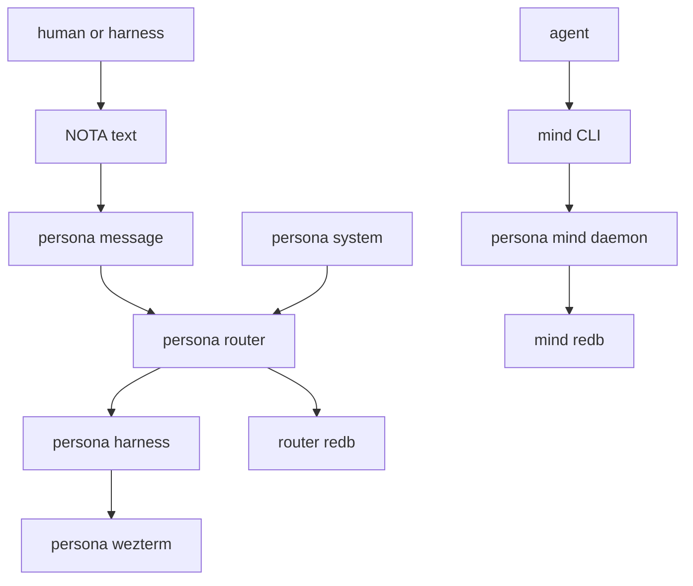
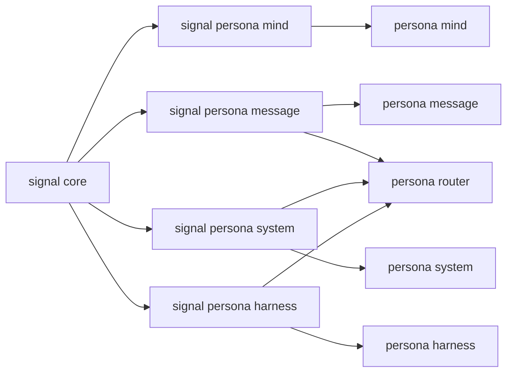
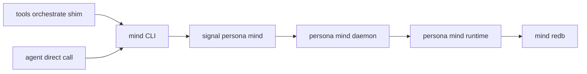
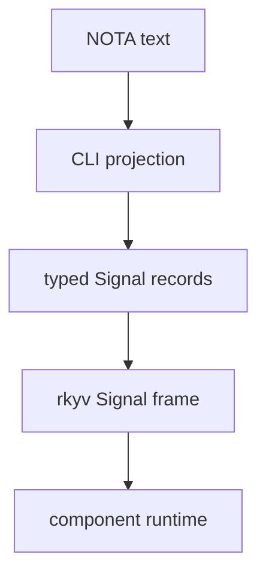
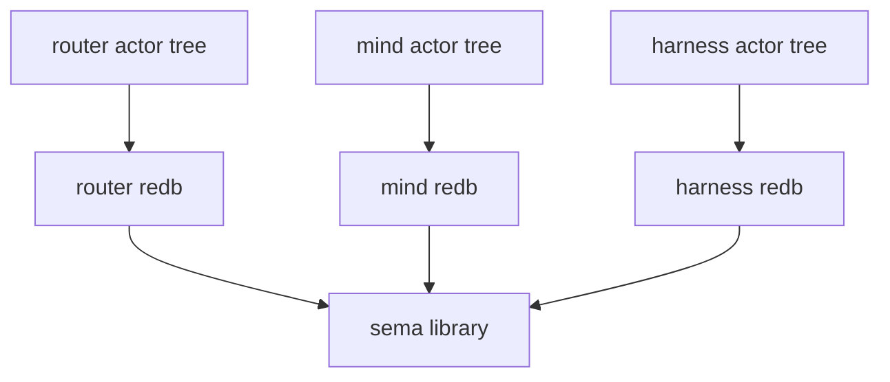
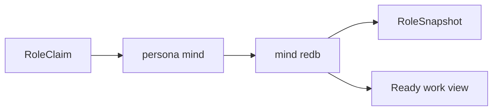

# persona — architecture

*Apex integration repository for the Persona component ecosystem.*

> `persona` composes the system. Component implementations live in component
> repositories. This repo wires them through Nix, documents the whole topology,
> and owns deployment-level verification.

---

## 0 · TL;DR

Persona coordinates interactive AI harnesses as first-class participants in one
inspectable system. The center is `persona-mind`: the daemon-backed state
component for role coordination, activity, work memory, decisions, aliases, and
ready/blocked views. The command-line surface for that state is the `mind`
binary: one NOTA request record in, one NOTA reply record out, with the CLI
acting as a thin client to the daemon.

The architecture is contract-first. A wire boundary is defined in a dedicated
`signal-persona-*` repository before producer and consumer implementations
move against it. Contract crates own typed records and rkyv frame behavior;
runtime crates own actors, policy, storage, and side effects.

`persona` is the apex repo. It owns architecture, flake composition,
deployment wiring, and cross-component tests. It does not own router policy,
mind state transitions, terminal adapters, storage table internals, actor
logic, or signal records.



## 1 · Component Map

| Repository | Role |
|---|---|
| `persona` | Apex Nix/deployment/test composition and meta architecture. |
| `persona-mind` | Central state component and command-line mind runtime. |
| `signal-persona-mind` | Typed contract for role coordination, activity, and work graph operations. |
| `persona-router` | Message routing, delivery state, gate state, and pending-delivery decisions. |
| `persona-message` | Message CLI/projection experiments; transitional as router/mind contracts settle. |
| `persona-system` | System/window/input observation adapters. |
| `persona-harness` | Harness identity, lifecycle, transcripts, and delivery adapter boundary. |
| `persona-wezterm` | Durable PTY and detachable visible terminal transport. |
| `persona-sema` | Persona-facing storage helper library over `sema`. |
| `sema` | Typed database kernel library over redb/rkyv. |
| `signal-core` | Signal wire kernel: frames, channel macro, shared wire primitives. |
| `signal-persona` | Persona-wide umbrella vocabulary. |
| `signal-persona-message` | Message ingress contract. |
| `signal-persona-system` | System observation contract. |
| `signal-persona-harness` | Router/harness delivery and observation contract. |
| `nexus` | Semantic text vocabulary written in NOTA syntax. |
| `nota` / `nota-codec` / `nota-derive` | NOTA language, parser/codec, and derive support. |



## 2 · Command-line Mind

The first foundational implementation target is the command-line mind backed
by a long-lived `persona-mind` daemon.



The target surface:

```sh
mind '<one NOTA request record>'
```

Output:

```sh
'<one NOTA reply record>'
```

`tools/orchestrate` remains a compatibility shim while agents transition. It
should lower ergonomic commands into the same `signal-persona-mind` request
records, send them through the `mind` client path, and stop treating lock files
as authoritative state.

## 3 · Wire Vocabulary

Rust-to-Rust traffic uses Signal frames: length-prefixed rkyv archives with
channel-specific request/reply payloads.

Text uses NOTA syntax. Nexus is semantic content written in NOTA syntax, not a
second parser or alternate text format. Convenience CLIs may hide wrapper
records, but their output must still lower into typed Signal records.



Each contract repo owns only its channel vocabulary: closed request/reply/event
enums, validation newtypes, rkyv round trips, and text projection examples
where useful. It owns no daemon code, Kameo actors, routing policy, storage
policy, or terminal adapter logic.

## 4 · State and Ownership

`sema` is the database kernel library. `persona-sema` is a Persona-facing
helper library. Neither is a process boundary.

Each state-bearing component owns:

- its Kameo actor tree;
- its durable redb file;
- its write-order actor;
- its post-commit subscription behavior.



Component boundaries are crossed with Signal contracts, not by opening another
component's database file.

## 5 · Mind, Router, Harness, System

The central split:

| Component | Owns | Does not own |
|---|---|---|
| `persona-mind` | role state, activity, work graph, decisions, aliases, ready/blocked views. | message delivery, terminal sessions, system focus facts. |
| `persona-router` | message routing, delivery queue, delivery gate state, message durability. | role claims, work graph, harness process lifecycle. |
| `persona-system` | OS/window/input observations. | router decisions, mind state, harness delivery. |
| `persona-harness` | harness identity, lifecycle, injection/observation adapter boundary. | router policy, central work graph. |
| `persona-wezterm` | durable PTY and visible terminal transport. | Persona delivery policy or role state. |

`persona-mind` is not a router. `persona-router` is not the central project
memory. The two communicate through explicit contracts when they need each
other.

## 6 · Lock Files and BEADS

Lock files and BEADS are transitional coordination surfaces in the primary
workspace. They are not the destination architecture.

Destination:



Migration rules:

- lock files may be read or projected only for compatibility;
- lock files are not durable truth;
- BEADS entries may be imported once as items, aliases, or external
  references;
- Persona does not grow a long-term BEADS bridge;
- new work graph behavior belongs in `persona-mind`.

## 7 · Invariants

- The meta repo composes; component repos implement.
- Each wire between components has a Signal contract repo.
- Contract repos own types; runtime repos own behavior.
- Runtime behavior lives in direct Kameo actors inside the owning component.
- `persona-mind` is Persona's central daemon-backed state component.
- Each state-bearing component owns its own redb file.
- Cross-component access is by Signal frame, not database peeking.
- Rust-to-Rust component traffic uses rkyv Signal frames.
- NOTA is the only text syntax.
- Producers push; consumers subscribe. Polling is not a fallback.
- Harnesses are first-class records, not hidden terminal sessions.
- Message delivery is downstream of durable router-owned message commit.
- Command-line mind input is one NOTA request record; output is one NOTA reply
  record.
- The `mind` CLI is a thin client. The long-lived `persona-mind` daemon owns
  `MindRoot` and `mind.redb`.

## 8 · Architectural-Truth Tests

The apex repo owns tests that prove cross-component shape:

| Invariant | Witness |
|---|---|
| `mind` uses the mind contract | CLI decodes into `signal-persona-mind::MindRequest`. |
| `tools/orchestrate` is a shim | shim output reaches the same `mind` path. |
| mind owns role state | deleting lock projections does not delete role claims. |
| router commits before delivery | delivery trace follows durable router commit. |
| router does not own terminal transport | router dependency graph excludes `persona-wezterm`. |
| component databases are separate | router/mind/harness open distinct redb files. |
| NOTA is the only text syntax | no CLI-only parser accepts non-NOTA command records. |

## Code Map

```text
ARCHITECTURE.md  apex system shape
skills.md        how to work in the meta repo
flake.nix        component flake composition
TESTS.md         cross-component test architecture
src/             temporary schema and wire-test shims
tests/           schema tests and multi-component end-to-end tests
```

## See Also

- `~/primary/protocols/active-repositories.md`
- `~/primary/reports/operator/105-command-line-mind-architecture-survey.md`
- `../persona-mind/ARCHITECTURE.md`
- `../signal-persona-mind/ARCHITECTURE.md`
- `../persona-sema/ARCHITECTURE.md`
