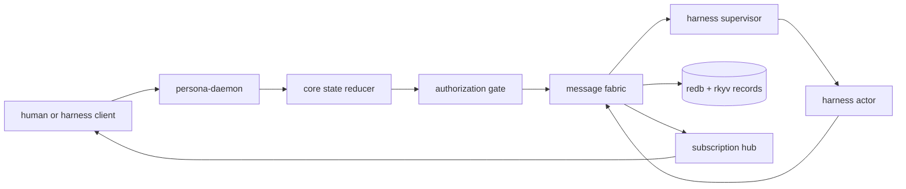

# Persona Architecture

Persona coordinates proprietary code harnesses as first-class participants in
one inspectable AI system. The core is a single reducer-owned state machine:
all durable harness, message, delivery, interaction, and observation changes
land as typed transitions.

The initial shape is a small daemon with a typed message fabric. Harnesses are
the operational unit: each harness has a durable identity, a live process when
running, an inbound message path, an outbound observation path, and an explicit
authorization context.

## Role

Persona owns:

- harness identity and lifecycle records;
- durable harness-to-harness messages;
- live subscriptions for message and lifecycle events;
- direct delivery into running harnesses;
- observed output and transcript projections;
- authorization checks before cross-harness delivery.

Persona does not own:

- model inference itself;
- provider billing or account policy;
- project-specific agent role prompts;
- sema's core database design;
- external product UI.

## Starting Map



## Invariants

- Harnesses are first-class records, not hidden terminal sessions.
- Producers push; consumers subscribe.
- Durable state and live process state are separate records.
- The message fabric is typed before it is clever.
- A delivery attempt produces observable state whether it succeeds, waits, or
  fails.
- Authorization is part of the route, not an afterthought.
- The core state machine is singular; extension state is peripheral and feeds
  the core through typed commands or observations.

## Code Map

```text
src/
  lib.rs       public crate surface
  schema.rs    NOTA-facing records for harnesses, messages, delivery,
               authorization, events, transitions, and state snapshots
  state.rs     minimal core-state holder for reducer-facing tests
  request.rs   NOTA CLI request/output envelope and argument decoding
  error.rs     crate error enum
  main.rs      thin NOTA-in / NOTA-out binary
```

## Status

Implementation is a schema scaffold. The first report is
`reports/2026-05-06-gas-city-harness-design.md`.
