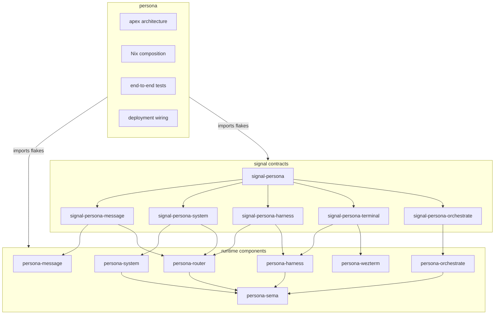
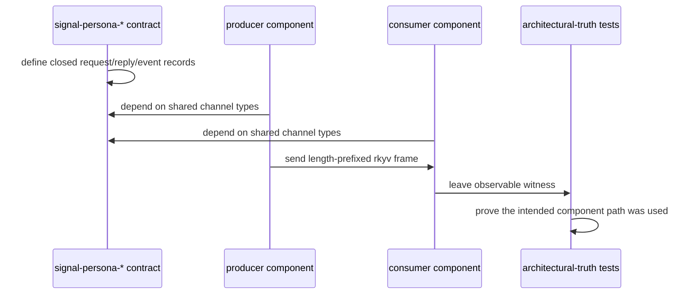
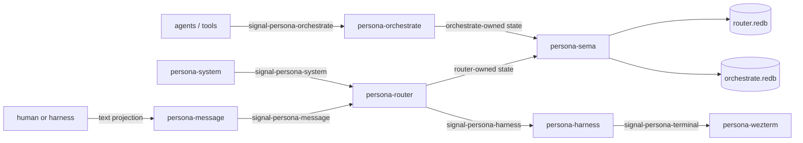
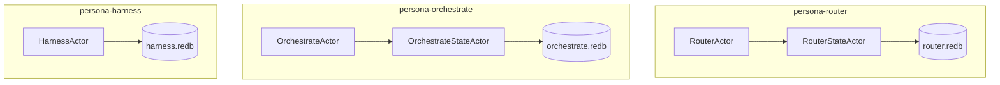

# persona — architecture

*Apex integration repository for the Persona component ecosystem.*

> `persona` composes the system. Component implementation lives in
> component repositories; this repo wires them together through Nix,
> documents the whole topology, and owns deployment-level verification.

---

## 0 · TL;DR

Persona coordinates interactive AI harnesses as first-class
participants in one inspectable system. Runtime components are
ractor-based daemons. Each state-bearing component owns the actors
and redb file for its own domain, using `persona-sema` as a library.

The architecture is channel-first. Each pair of components that
communicates over a wire shares a dedicated `signal-persona-*`
contract repo. That contract repo is the synchronization point for
parallel development: settle the channel vocabulary first, then let
producer and consumer implementations move independently against the
same types.

`persona` is not the home for router internals, terminal adapters,
storage tables, actor logic, or signal records. It is the apex:
architecture, Nix composition, deployment wiring, and end-to-end
tests.

## 1 · Component Map



| Repository | Role |
|---|---|
| `signal-persona` | Umbrella Persona domain records shared across channels. |
| `signal-persona-message` | Message ingress channel: `persona-message` → `persona-router`. |
| `signal-persona-system` | OS/window/input observation channel: `persona-system` → `persona-router`. |
| `signal-persona-harness` | Harness delivery and observation channel: `persona-router` ↔ `persona-harness`. |
| `signal-persona-terminal` | Terminal projection channel: `persona-harness` → `persona-wezterm`. |
| `signal-persona-orchestrate` | Orchestration channel: agents/tools → `persona-orchestrate`. |
| `persona-message` | Human and harness message CLI/projection boundary. |
| `persona-router` | Delivery reducer, gate reducer, message state, and pending-delivery state machine. |
| `persona-sema` | Shared typed database library used by each state-bearing component. |
| `persona-system` | System/window/input observation adapters. |
| `persona-harness` | Harness identity, lifecycle, transcripts, and adapter contracts. |
| `persona-wezterm` | Durable PTY and detachable WezTerm viewer transport. |
| `persona-orchestrate` | Runtime orchestration actors and workspace coordination state. |

## 2 · Choreography Model

The contract repo lands before the runtime behavior that uses it.
Producer and consumer repos do not invent local duplicate message
types while waiting for a channel change. A channel change starts in
the relevant `signal-persona-*` repo; after it is pushed, the
producer and consumer implementation repos update against it.



This lets multiple agents work in parallel without relying on chat
memory: the contract crate is the stable typed agreement.

## 3 · Wire Vocabulary

Rust-to-Rust traffic uses signal-family frames: length-prefixed
rkyv archives with channel-specific request and reply payloads. Text
is NOTA syntax. In practice, Persona request/message text is usually
Nexus: a NOTA-based request surface. Convenience CLIs such as
`message` construct the Nexus record shape in NOTA syntax for the
user instead of asking them to type the full wrapper. None of this is
the inter-component wire.



Each channel contract owns only the records exchanged on that
channel: closed request/reply/event enums, rkyv round trips, text
projection examples where useful, and version expectations. It owns
no daemon code, actors, routing policy, storage policy, or terminal
adapter logic.

## 4 · State and Ownership

`persona-sema` is a library for typed tables and schema guard logic.
It is not a process boundary. Each state-bearing component owns the
actor that orders its transactions and owns its redb handle.



For the first messaging stack, the load-bearing safety rule is
commit-before-deliver: no harness delivery happens without a durable
router-owned message commit that can be read back through
`persona-sema`.

## 5 · Boundaries

This repository owns:

- apex architecture;
- Nix flake inputs and component composition;
- end-to-end tests that prove component composition;
- deployment wiring for a full Persona system;
- architectural-truth tests that need multiple components.

This repository does not own:

- shared Persona records (`signal-persona`);
- per-channel wire contracts (`signal-persona-*`);
- router policy (`persona-router`);
- orchestration actors (`persona-orchestrate`);
- terminal transport (`persona-wezterm`);
- harness lifecycle internals (`persona-harness`);
- OS/window-manager adapters (`persona-system`);
- typed table internals (`persona-sema`);
- workspace coordination internals (`persona-orchestrate`).

## 6 · Invariants

- The meta repo composes; component repos implement.
- Each wire between components has a signal contract repo.
- Contract repos own types; runtime repos own behavior.
- Stateful runtime behavior lives in ractor actors inside the
  component that owns the concern.
- Each state-bearing component uses `persona-sema` as a library and
  owns its own redb file.
- Rust-to-Rust component traffic uses length-prefixed rkyv frames.
- NOTA syntax appears only at human, harness, CLI, configuration,
  and audit projection boundaries. Persona request/message text is
  normally Nexus, which is a NOTA-based surface.
- Producers push; consumers subscribe. Polling is not a fallback.
- Harnesses are first-class records, not hidden terminal sessions.
- Delivery is downstream of durable router-owned message commit.
- Macro extraction follows observed repetition. `signal-derive` does
  not own channel behavior; channel boilerplate is expressed through
  `signal_channel!` until several channels reveal a stronger shape.

## 7 · Architectural-Truth Tests

The end-to-end test suite proves the architecture, not only visible
behavior. The first messaging stack needs witnesses for:

| Invariant | Witness |
|---|---|
| Message CLI uses the message contract | CLI emits a `signal-persona-message` frame. |
| Router commits before delivery | Event trace shows router-owned commit outcome before harness delivery. |
| Router uses sema for durable state | A separate reader opens the router redb through `persona-sema` and sees the message. |
| Router does not import terminal adapters | Router dependency graph excludes `persona-wezterm`. |
| Delivery is push-based | No retry occurs without pushed system or harness observation. |
| Terminal transport stays isolated | Harness-to-terminal traffic crosses `signal-persona-terminal`. |

## Code Map

```text
ARCHITECTURE.md  apex system shape
skills.md        how to work in the meta repo
flake.nix        component flake composition
TESTS.md         cross-component test architecture
src/             temporary schema and wire-test shims
tests/           schema tests and multi-component end-to-end tests
```

## See Also

- `../signal-persona/ARCHITECTURE.md`
- `../persona-message/ARCHITECTURE.md`
- `../persona-router/ARCHITECTURE.md`
- `../persona-system/ARCHITECTURE.md`
- `../persona-harness/ARCHITECTURE.md`
- `../persona-wezterm/ARCHITECTURE.md`
- `../persona-sema/ARCHITECTURE.md`
- `../persona-orchestrate/ARCHITECTURE.md`
- `~/primary/reports/designer/76-signal-channel-macro-implementation-and-parallel-plan.md`
- `~/primary/reports/operator/77-first-stack-channel-boundary-audit.md`
