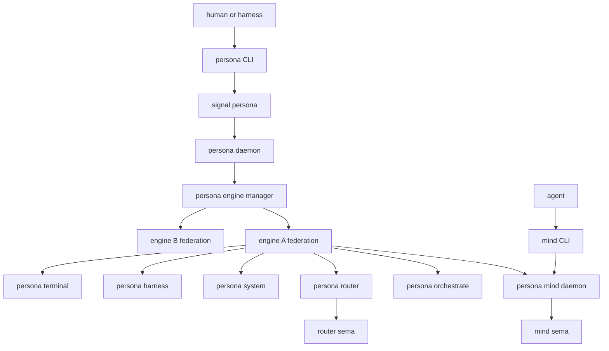
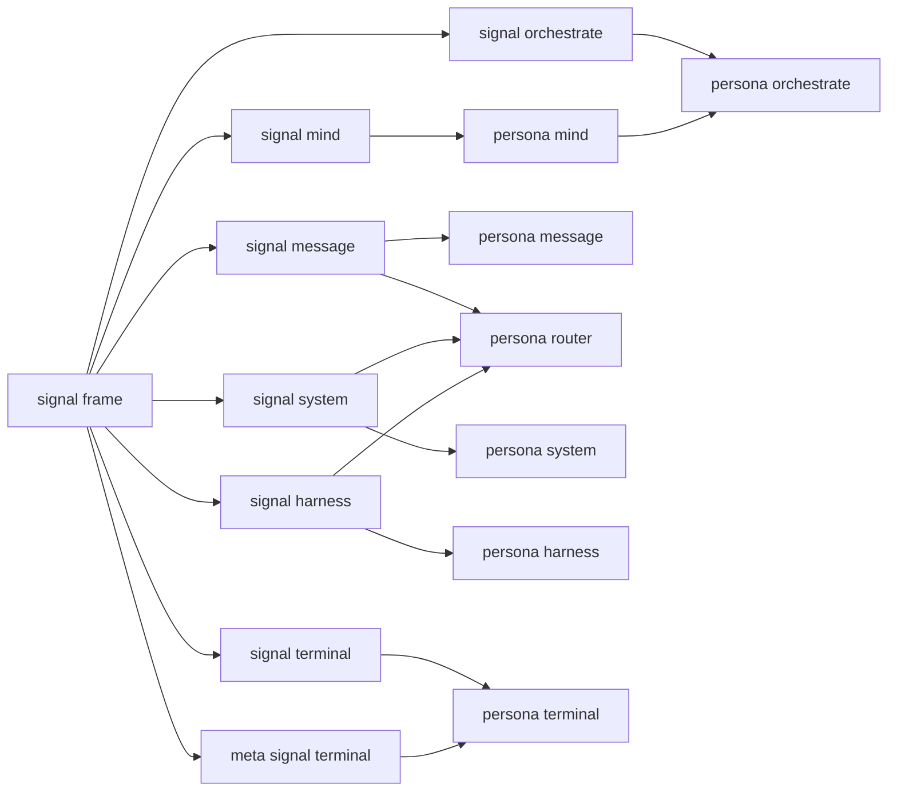
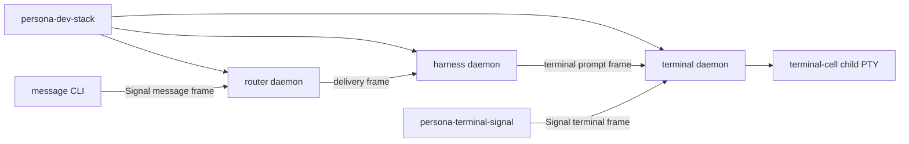
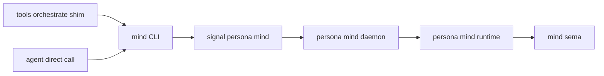
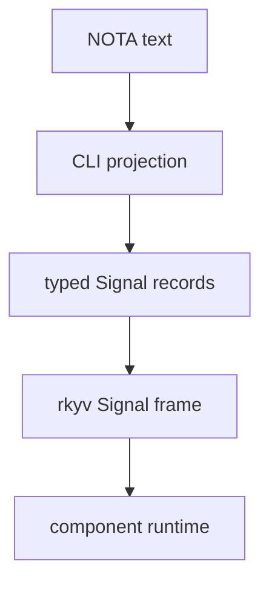
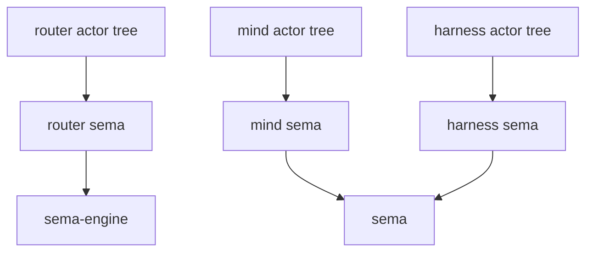
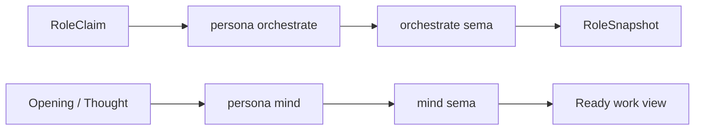

# persona — architecture

*Persona — the engine-management daemon and apex integration repository for the Persona component ecosystem.*

> `persona` is the host-level engine-management daemon for the Persona
> component ecosystem (per spirit records 215 + 216, the canonical short
> name for this component is "Persona"; the repo is `persona`, the daemon
> binary is `persona-daemon`, the CLI binary is `persona`). One privileged
> `persona` daemon supervises multiple engine instances, keeps component
> daemons visible and coordinated, allocates their per-engine sockets and
> state directories, wires them through Nix, documents the whole topology,
> and owns deployment-level verification. Component implementations live in
> component repositories.

---

## 0 · TL;DR

Persona coordinates interactive AI harnesses as first-class participants in
durable, inspectable engines. The top-level `persona-daemon` process is the
host-level engine-management daemon: it runs as the dedicated `persona` system
user, supervises multiple engine instances, exposes engine status, allocates
local socket/state boundaries, records origin context for audit, and gives
operators and harnesses one place to ask whether the total system is up,
healthy, and coherent.

`meta-signal-persona` is the management contract for Persona. It is the contract a
client uses to ask for engine status, component health, engine-visible
projections, and engine-management actions. Component-to-component behavior
uses the relation-specific `signal-*` contracts.

The `persona` CLI is a thin daemon client. It decodes one NOTA request record,
sends one length-prefixed `meta-signal-persona` frame to `persona-daemon`, waits for one
typed reply frame, renders one NOTA reply record, and exits. `persona-daemon` owns
the live Kameo `EngineManager` actor for the daemon lifetime.

The center of mind state is `mind`: the daemon-backed state component
for work memory, typed thoughts, relations, decisions, aliases, subscriptions,
choreography policy, and ready/blocked views. Ordinary role claims, handoffs,
and role activity live in `persona-orchestrate`.

The architecture is contract-first. A wire boundary is defined in a dedicated
`signal-*` or `meta-signal-*` repository before producer and consumer
implementations move against it. Contract crates own typed records and rkyv frame behavior;
runtime crates own actors, policy, storage, and side effects.

`persona` is the apex repo and Persona's home. It owns architecture,
flake composition, supervisor wiring, deployment verification, and
cross-component tests. Component repositories own router policy, mind state
transitions, terminal adapters, storage table internals, actor logic, and
relation-specific signal records.

Sema belongs to the component that owns the state inside an engine:
`mind` has mind Sema / `mind.sema`, `router` has router Sema /
`router.sema`, and so on. Persona owns manager-level state: the engine
catalog, component desired state, health, lifecycle observations,
startup/shutdown activity, inter-engine routes, and engine-level status.



## 0.5 · Persona — the durable agent

Persona is the durable agent. The Persona ecosystem is the workspace's
answer to OpenClaw and Gas City: long-lived, persistent, inspectable
agent runtime instead of one-shot agent CLIs and reconciliation-stack
controllers.

| Failure mode being rejected | Persona answer |
|---|---|
| Many sources of truth reconciled by polling | Each state-bearing component owns one `.sema` file; producers push, consumers subscribe. |
| Hidden mutation under uncertainty | Every state transition has a typed input event, typed output event, durable record. Constraints become witness tests. |
| State-machine controller spawning processes | Direct Kameo actors with named planes, supervised, traceable. |
| Tmux-as-runtime-substrate | Terminal as adapter; harnesses as first-class records. |
| One-shot agent CLIs with no persistent state | Long-lived daemons. CLIs are thin clients to the daemons. |

This positioning is upstream of every individual persona-* component.
It is the criterion that decides what belongs in the persona ecosystem:
durable-agent work belongs here; one-shot operator actions (deploy CLIs)
live in `lojix-cli` / `CriomOS`; declarative cluster data lives in
`goldragon`; auth/security/identity infrastructure (host trust, cluster
identity) lives in the criome ecosystem.

> **Scope.** Today's Persona sits on today's stack — Rust on Linux,
> direct Kameo, component-owned sema-engine/Sema storage, signal-* wire. The
> eventually-self-hosting stack is one Sema-on-Sema substrate that
> subsumes these pieces; today's Persona is a realization step
> toward it, built rightly for the scope it serves now. See
> `~/primary/ESSENCE.md` §"Today and eventually — different things,
> different names".
>
> Eventual cross-trust-domain federation (multiple Persona deployments,
> distinct organizations, schema evolution across the federation) is
> named separately in §"Eventual cross-domain federation" below, marked
> as **future work, not first-prototype work**. Today's Persona is
> single-trust-domain — one user, that user's agents, one workspace
> root. Federation arrives only after today's Persona works.

## 0.6 · Introspection

`introspect` is the supervised inspection-plane component.
It sits next to the six-component operational delivery path instead
of inside that path. It asks each supervised component daemon for
typed inspectable records over Signal and projects them to NOTA at
the edge.

- `introspect` is **not** part of the six-component
  operational delivery path.
- `introspect` **is** part of the prototype-supervised
  component set, so the manager can launch and observe it with the
  rest of the engine skeletons.
- `introspect` does **not** directly open any other
  component's `.sema` store. Live introspection asks the owning
  component daemon through a Signal relation; the component
  decides which records to expose, how to read consistent
  snapshots, and what to redact.
- The contract layer split:
  - **Operational contracts** stay where they are
    (`signal-*` per current pattern).
  - **Component-specific introspection records** live
    inside the existing `signal-<X>` crate at first;
    they split to a sibling `signal-<X>-introspect`
    when they're heavy / high-churn / unrelated to
    operational consumers.
  - **`signal-introspect`** owns the
    central query/projection envelope vocabulary
    (`IntrospectionRequest`, `IntrospectionReply`,
    `IntrospectionSubscription`, etc.).

The first introspection slice is **terminal** — `terminal`
has the largest existing gap between durable local Sema records
(`StoredTerminalSession`, `StoredDeliveryAttempt`,
`StoredTerminalEvent`, `StoredViewerAttachment`,
`StoredSessionHealth`, `StoredSessionArchive`) and
contract-owned inspectable vocabulary. Manager event-log
records are the second slice (likely promoted into
`meta-signal-persona`); router trace/table readouts are the
third.

## 0.7 · Persona-system: paused (FocusTracker is real, plan is deferred)

`system` was originally scoped to push focus and prompt-buffer
observations to the router for injection gating. That use case dissolves:
the terminal-cell lock-and-cache input gate (see §5.1) handles
non-interleaving locally without needing focus observation. The
`FocusTracker` Kameo actor exists in code in `system` and stays;
plan substance does not grow until system is unpaused by a real
consumer.

- The Niri focus observer + `FocusTracker` actor are real and tested.
- `signal-system` keeps its current observation shape; no new
  variants land until a real consumer surfaces.
- The privileged-action surface (`SystemPrivilegedRequest` with
  `ForceFocus` / `SuppressDrift`) is deferred. When system
  returns, force-focus's naming is reopened.
- Likely future consumers: window-focus-aware notifications,
  multi-engine UI coordination, multi-monitor layout observations.

## 0.8 · Orchestrate slot

`orchestrate` is the orchestration-machinery component: ordinary role
claims, handoffs, activity, agent spawning, supervision, scheduling,
escalation, and executor lifecycle. `mind` remains the authority root
for central mind state; orchestrate is the machinery that carries out mind's
down-tree `Mutate` orders.

The engine manager wires the component principal, component kind, socket names,
state path, spawn envelope mapping, Nix input, package/check outputs, prototype
launcher, and the small `mind-orchestrate` topology. The default prototype
topology still does not launch orchestrate; the `mind-orchestrate` topology does
when `PERSONA_ORCHESTRATE_EXECUTABLE` points at the launcher or daemon.

## 1 · Component Map

| Repository | Role |
|---|---|
| `persona` | Engine manager, `persona-daemon` home, apex Nix/deployment/test composition, and meta architecture. |
| `mind` | Central mind-state component and command-line mind runtime: work graph, typed thoughts/relations, subscriptions, and choreography policy. |
| `signal-mind` | Typed contract for central mind state, work graph operations, typed thoughts/relations, subscriptions, and channel choreography. |
| `orchestrate` | Orchestration machinery component: ordinary role claims, handoffs, activity, and future spawn/supervise/schedule/escalate execution under mind authority. |
| `signal-orchestrate` | Typed contract for ordinary role/activity orchestration records. |
| `router` | Message routing, delivery state, gate state, and pending-delivery decisions. |
| `message` | Message ingress component: `message` NOTA CLI plus supervised `message-daemon`; the daemon forwards typed message frames to the internal router socket. |
| `system` | System/window focus observation adapters. |
| `harness` | Harness identity, lifecycle, transcripts, and delivery adapter boundary. |
| `terminal` | Durable PTY/session owner around `terminal-cell`, visible viewer adapters, raw terminal byte transport, and terminal metadata. It exposes an ordinary terminal communication surface, a meta terminal lifecycle surface, plus one engine-management socket. |
| `terminal-cell` | Low-level PTY/transcript library consumed by `terminal`; standalone daemon form is a development/test harness. |
| `sema` | Typed database kernel library over redb/rkyv behind `.sema` files. |
| `signal-frame` | Signal wire kernel: frames, exchange identifiers, handshake, channel macro. |
| `signal-sema` | Universal payloadless Sema classification labels (`Assert` / `Mutate` / `Retract` / `Match` / `Subscribe` / `Validate`) used for observation only; `PatternField<T>`, `Slot<T>`, `Revision` primitives. |
| `meta-signal-persona` | Management contract for Persona. |
| `signal-message` | Message ingress contract. |
| `signal-system` | System observation contract. |
| `signal-harness` | Router/harness delivery and observation contract. |
| `signal-terminal` | Ordinary terminal transport, prompt-gate, injection, session-registry-read, and worker-lifecycle contract. |
| `meta-signal-terminal` | Policy terminal session lifecycle mutation contract (`CreateSession`, `RetireSession`) used by the orchestrate/harness/terminal authority chain. |
| `nexus` | Semantic text vocabulary written in NOTA syntax. |
| `nota-next` | NOTA language, typed codec, and derive support. |



## 1.5 · Engine Manager Model

One host has one `persona` daemon. That daemon can supervise N engine
instances. Each engine owns its own full component federation:
`mind`, `router`, `system`, `harness`,
`terminal`, and `message`.

The daemon runs as the dedicated `persona` system user, not as `root` and not
as the operator's user. The elevated position is for scoped OS authority:
force-focus during prompt injection, system-owned engines, peer credential
inspection, cross-engine auth proofs, and component restart after
operator-user crashes. Components also run under the Persona authority
baseline, but the manager owns cross-engine authority.

Per-engine resources are always scoped by engine id:

| Resource | Shape |
|---|---|
| State directory | `/var/lib/persona/<engine-id>/` |
| Component Sema files | `/var/lib/persona/<engine-id>/{mind,orchestrate,router,harness,terminal,...}.sema` for active topology components |
| Socket directory | `/var/run/persona/<engine-id>/` |
| Component sockets | `/var/run/persona/<engine-id>/{mind,orchestrate,router,system,harness,terminal,message,...}.sock` for active topology components |
| Manager Sema file | `/var/lib/persona/manager.sema` |
| Manager socket | `/var/run/persona/persona.sock` |

Exact host paths are deployment-owned, but the `<engine-id>` scoping is
architectural. Components do not discover peers by scanning the filesystem;
the manager passes peer sockets at spawn time.

The manager Sema store owns the engine catalog: engine identities, owners,
component desired state, lifecycle observations, and inter-engine route
declarations. Every transition appends a typed event and reduces into the
manager tables.

### Spirit-per-engine

**Pattern-based decision (per §1.5 engine-id-scoped resources): each
engine has its own `persona-spirit` daemon, scoped under
`/var/lib/persona/<engine-id>/spirit.sema`.** Spirit is part of the
per-engine component federation alongside `mind`,
`router`, and the others; it does not span engines. The
implicit default that each engine owns its own component federation
applies to spirit identically. Per-engine spirit isolates the intent
substrate, observation scope, and bootstrap-policy provenance to its
engine; cross-engine intent flow (if ever needed) is a federation
concern, not a shared-spirit one.

Concrete resource shape (consistent with the table above):

| Resource | Shape |
|---|---|
| Spirit Sema file | `/var/lib/persona/<engine-id>/spirit.sema` |
| Spirit ordinary socket | `/var/run/persona/<engine-id>/spirit.sock` |
| Spirit meta socket | `/var/run/persona/<engine-id>/meta-spirit.sock` |

## 1.6 · Local Boundary and Routes

The local engine boundary is not an in-band proof scheme. `persona-daemon`
creates the per-engine runtime directory, component sockets, filesystem modes,
and child spawn envelopes. Local trust comes from the operating-system boundary:
dedicated user, ownership, socket permissions, and the manager-controlled
process tree.

Signal traffic may carry an origin/context tag for audit and mind policy, but
agents do not get to assert authority by placing a field in a request. Runtime
authorization lives at the receiving component and is based on the socket it is
serving, the peer credentials it can observe, the manager-supplied spawn
context, and the relevant contract. Persona-local components must not recreate
an in-band proof or class gate inside their application payloads.

### 1.6.1 · Filesystem-ACL trust

Local trust is security through correctness within the privileged group plus
filesystem ACL at the boundary. The kernel enforces the ACL on every
`connect()`; counterfeit credentials are impossible because the credential
check happens before bytes flow. Inside the engine, every connected peer
is by definition either the `persona` daemon or another component running
as `persona`. The crypto-first alternative (every component holds keys,
signs every request) was rejected: it solves a problem the filesystem
ACL already solves, and adds key-management complexity that doesn't
buy reciprocal trust the OS doesn't already give.

| Socket | Path | Mode | Owner |
|---|---|---|---|
| Engine manager | `/var/run/persona/persona.sock` | `0600` | `persona` |
| Per-engine mind/router/system/harness/terminal | `/var/run/persona/<engine-id>/<comp>.sock` | `0600` | `persona` |
| Per-engine message ingress | `/var/run/persona/<engine-id>/message.sock` | `0660` (group = engine owner's group) | `persona` |

Two boundaries still need in-band classification: the `message.sock`
(user submission stamped with `MessageOrigin::External(...)`) and any
future network component. Both stamp origin at accept time using
`SO_PEERCRED`.

### 1.6.2 · ConnectionClass and MessageOrigin

Origin is provenance, not authority. Two closed enums type the boundary:

```
ConnectionClass (minted from SO_PEERCRED at accept):
    Owner | NonOwnerUser(UnixUserIdentifier) | System(SystemPrincipal)
  | OtherPersona { engine_identifier, host } | Network(NetworkSource)

MessageOrigin (stamped on each accepted message):
    Internal(ComponentName) | External(ConnectionClass)
```

These live in the `signal-persona-origin` contract crate (the kernel
extracted from the former Persona manager contract once cross-domain demand fired). Every
domain contract (`signal-message`, `signal-mind`, `signal-system`,
`signal-harness`, `signal-terminal`) depends on it. The Persona manager
contract itself keeps
its narrow surface — engine catalog operations — and no longer owns
the auth vocabulary.

Authority does **not** come from `MessageOrigin`. Authority comes from
**channel state** (§1.6.3).

### 1.6.3 · Channel choreography (router holds, mind decides)

Router holds the live `authorized-channel` state in its sema-db, keyed
by `(source, destination, kind)`. Messages on an active channel
deliver directly; messages without a matching active channel park and
forward to mind for adjudication. **Mind decides; router enforces.**

The `Channel` record shape:

```
Channel {
    id,
    source:       ChannelEndpoint,
    destination:  ChannelEndpoint,
    kinds:        Set<MessageKind>,
    duration:     ChannelDuration,
    granted_by:   GrantSource,
    granted_at,
    status,
}

ChannelEndpoint  = Internal(ComponentName) | External(ConnectionClass)
ChannelDuration  = OneShot | Permanent | TimeBound { until }
ChannelStatus    = Active | Expired | Retracted{...} | Consumed
GrantSource      = Mind | EngineSetup
```

Mind's choreography ops (in `signal-mind`): `ChannelGrant`,
`ChannelExtend`, `ChannelRetract`, `ChannelList`, `AdjudicationDeny`.

**Structural channels** are pre-installed at engine setup. The
federation can't function without them, so `persona-daemon` writes
them into the router's `.sema` store at engine-creation time with
`GrantSource::EngineSetup`:

| Source | Destination | Kinds | Duration |
|---|---|---|---|
| `Internal(Message)` | `Internal(Router)` | message submission, inbox query | `Permanent` |
| `Internal(System)` | `Internal(Router)` | focus, prompt-buffer observations | `Permanent` |
| `Internal(Router)` | `Internal(Harness)` | message delivery | `Permanent` |
| `Internal(Harness)` | `Internal(Terminal)` | terminal input, capture, resize | `Permanent` |
| `Internal(Terminal)` | `Internal(Harness)` | transcript events | `Permanent` |
| `Internal(Router)` | `Internal(Mind)` | adjudication request, delivery notification | `Permanent` |
| `Internal(Mind)` | `Internal(Router)` | channel grant/extend/retract | `Permanent` |
| `External(Owner)` | `Internal(Router)` | message submission via `message-daemon` | `Permanent` |

Unknown-channel messages park in router's `adjudication_pending` table
and emit `AdjudicationRequest` to mind. Mind decides:

```mermaid
sequenceDiagram
    participant src as source
    participant router as router
    participant mind as mind
    src->>router: message on unknown channel
    router->>router: park in adjudication_pending
    router->>mind: AdjudicationRequest
    mind->>mind: decide (grant / extend / retract / deny)
    mind->>router: ChannelGrant or AdjudicationDeny
    router->>router: install channel; release parked message
    router->>src: delivery or rejection
```

### 1.6.4 · Meta sockets and downstream mutation

Some component relations have a meta-scoped ingress surface in addition to
ordinary communication. The socket that accepts the frame determines the
authority lane. A meta socket may accept a `Mutate` order; a non-meta
socket for the same relation does not know that `Mutate` variant and replies
with a typed error. This makes "who is allowed to command" a property of the
listening actor and contract surface, not a string inside the payload.

`persona-orchestrate` uses this shape. A mind-authored or meta-socket
accepted `Mutate` order can sequence downstream `Mutate` orders, such as
router channel grants, but the downstream component still accepts them only on
its meta-scoped relation. Ordinary communication sockets remain for
assertions, matches, subscriptions, and typed denials.

The prototype does not need to enforce final Unix user/group permission
isolation. The first witness is structural: separate sockets, typed
accept/reject behavior, spawn-envelope paths, and no in-band proof field as
authority. The production deployment later tightens those same sockets with
filesystem ownership and modes.

### 1.6.5 · Cross-engine routes collapse into channels

An `EngineRoute` is a `Channel` whose `source` is
`External(OtherPersona { engine_identifier })`. The multi-engine work uses the
same choreography contract: engine B's mind adjudicates incoming
traffic from engine A the same way it adjudicates external owner
submissions. Cross-engine implementation today is **minimal-mode** —
path scoping is baked in (every per-engine resource is keyed by
engine id; see §1.5), but cross-engine ops are deferred until a
second engine is demonstrated alive.

### 1.6.6 · Multi-engine as substrate for federation-level migration

Per-engine resource scoping (every component `.sema` store and socket keyed by
engine id; see §1.5) leaves room for a future federation-level
migration path: `persona-daemon` could spawn engine v2 alongside
engine v1; mind would grant temporary migration channels; typed
records would migrate over the channels (not byte copies); when v2's
health checks pass, the daemon would retire v1 via graceful
shutdown. Engine-level migration sidesteps the storage-kernel
single-writer-per-file constraint — v2 would own its own `.sema` files
under `/var/lib/persona/<engine-id-v2>/`.

This is the path for **federation-shaped** changes (topology,
multi-component re-layout, cross-component schema realignment). It is
**not** the path for ordinary component upgrades. Per intent records
208/209/210 ordinary component version upgrades now run through §1.6.7:
Persona drives a per-component version handover against the target
component's own upgrade socket, leaving the engine identity unchanged.
Engine-level migration remains documented as the substrate it always
was; today's load-bearing upgrade discipline is §1.6.7.

### 1.6.7 · Persona as process-lifecycle participant in upgrades

Per the upgrade-triad merger in designer /318, Persona is no longer
the owner-socket root for component upgrades. Upgrade orchestration
belongs to the `upgrade` component triad: `upgrade` (runtime),
`signal-upgrade` (ordinary working signal), and
`meta-signal-upgrade` (meta policy signal). Persona's
remaining upgrade role is process lifecycle: start, stop, restart,
and observe versioned component units on behalf of the engine. The
handover driver, owner commands, migration catalogue, and quarantine
records live in the upgrade triad.

The active-version selector is not a CriomOS-home symlink. Persona can
project active-version events into its manager store for runtime
routing, but the event records and handover protocol are now
upgrade-owned types. This keeps Persona focused on engine lifecycle
and stable public socket handoff while the upgrade daemon owns schema
migration, handover negotiation, and version policy.

Per Spirit record 320 (Maximum certainty, 2026-05-23), major engine
version upgrades happen **atomically in real time with no
downtime**. The workspace is a continuous runtime; component
upgrades coordinate through Persona to swap versions without
interrupting service. The Design D FD-handoff mechanism (this
section, the `SCM_RIGHTS` flow) is the lossless substrate; the
continuous-runtime invariant is the discipline that flows down to
ARCA cascade work (`arca/ARCHITECTURE.md` §"Cascade migration
discipline") and per-consumer quarantine semantics when a
particular consumer's Migration fails (Persona keeps the failing
consumer on its old version indefinitely while the rest of the
fleet moves; partial-fleet success is acceptable steady state,
not transient).

Per intent records 215 and 216 the canonical short name of this
component is **Persona** (just Persona). The repo is `persona`, the
daemon binary is `persona-daemon`, the CLI binary is `persona`. The
phrase "Persona Engine Manager Daemon" is not used as a noun.

**The four-socket model.** Every upgrade `Target` (`upgrade::Target`)
carries four socket paths plus a component name and main/next version
labels. The upgrade daemon, not Persona, drives those sockets.

| Socket | Used by |
|---|---|
| `current_owner_socket_path` (main meta socket) | Recorded for audit; not driven by Persona's manager today. |
| `current_upgrade_socket_path` (main private upgrade socket) | The upgrade daemon opens a client to this path and walks `AskHandoverMarker -> ReadyToHandover -> HandoverCompleted`. |
| `next_owner_socket_path` (next meta socket) | Recorded for audit; the next daemon's meta-authority surface for follow-on operations. |
| `next_upgrade_socket_path` (next private upgrade socket) | The upgrade daemon opens this path before readiness and requires the next daemon's marker to match the main high-water mark before it can flip the active selector. |

The handover protocol per `signal-upgrade` is driven against both
adjacent versions. The upgrade daemon first reads the main marker,
then reads the next marker, and refuses the handover unless component,
commit sequence, write counter, and last record identifier agree. Only
then does it ask the main daemon to enter readiness and complete. This
keeps the workspace from persisting `v_next` as active when the next
daemon is missing or has not copied/replayed the main high-water mark.

**Meta contract.** Administrative upgrade operations — `Register`,
`Allow`, `Block`, `Query`, `ForceFlip`, `Rollback`, and `Quarantine`
— are carried by `meta-signal-upgrade` and handled by the upgrade
daemon. Persona does not expose a second meta handover socket.

**Manager message.** `EngineManager` (`src/manager.rs`) keeps only the
versioned process-lifecycle message needed by the upgrade daemon:
`StartComponentUnit { component, version }`. The message starts
`persona-component@<component>:<version>.service` through the
`ComponentUnitManager` actor and returns a `UnitReceipt`.

**Component unit control.** `src/unit.rs` owns the process-manager boundary
for component daemons that are not direct children of the sandbox
`EngineSupervisor`. A `ComponentUnit` carries `(EngineIdentifier, ComponentName,
Version)` and projects component+version into the systemd template instance
name `persona-component@<component>:<version>.service`; the engine remains
typed state, not part of the template instance string. `ComponentUnitManager`
is the data-bearing Kameo actor that owns the `UnitController` trait boundary
for `start`, `stop`, `restart`, and `status`. Production can use the
systemd-D-Bus controller; integration tests inject a recording controller.
`StartComponentUnit` starts the requested component unit through this actor, so
process lifecycle remains behind the same controller boundary whether the
caller is a sandbox test, the future upgrade daemon integration, or a production
systemd-backed manager.

For real transient units, `ComponentUnitDefinition` pairs a `ComponentUnit`
with the resolved `ComponentCommand` and restart policy. This is the bridge
from the Nix-owned component command catalog to systemd's `StartTransientUnit`
properties: description, service type, restart policy, `ExecStart` path/argv,
and environment. `SystemdTransientUnitController` uses that catalog-backed
definition model for starts, while stop/restart/status continue to address the
named unit through systemd's normal unit-control methods. Pure tests verify the
projection without mutating host systemd.

**Active-version snapshot.** `manager.active-version-snapshot` (per
§1.7 manager-state discussion) is per-`(EngineIdentifier, ComponentName)`
materialised projection of the event log. The reducer is
authoritative for "which version of component X is live right now".
A truncated or corrupted snapshot rebuilds from the event log on
`ManagerStore::open`.

**Design D public-socket handoff.** Persona owns the stable public
socket for each routed component and a private control socket for the
component's versioned daemon connections. The component daemon connects
to Persona's control socket on startup and waits for public client
descriptors. Persona accepts a client on the public socket, reads the
current active-version snapshot for that component for that exact
handoff, then sends the accepted client descriptor to the active
version over the control connection with `SCM_RIGHTS`. Persona does not
parse or proxy the component's domain frame bytes in this path; the
public client speaks directly to the component after descriptor handoff.

The first implementation surface lives in `src/transport.rs`:

| Type | Role |
|---|---|
| `ComponentHandoffEndpoint` | Names one component's Persona-owned public socket, private control socket, component name, and public socket mode. Engine-component layouts can derive it directly; out-of-topology components such as `persona-spirit` can provide the same fields by name. |
| `ComponentHandoffRouter` | Binds the two sockets, registers per-version receiver connections, and sends each accepted public client descriptor to the selected version. |
| `ManagerStoreActiveVersionReader` | Reads `manager.active-version-snapshot` by component name through `ManagerStore` so runtime handoff loops can select the active version per accepted client. |

This is intentionally descriptor-level routing, not a Signal-frame
router. Selector flips are just steady-state route changes: the next
accepted client uses the active version read for that handoff. Older
connections already handed to the previous daemon continue on their
existing descriptors until they finish.

**Quarantine gate.** Quarantine and rollback policy live in the
upgrade daemon through `meta-signal-upgrade`. Persona stores and
projects upgrade event records when they appear, but it no longer owns
the policy gate.

**Upstream pieces.** The handover protocol depends on two upstream
pieces. First, the next daemon uses `RuntimeMigrationLookup` from
`version-projection` to project records from main's schema into next's
schema as it copies state. Second, the marker exchanged in
`AskHandoverMarker` / `ReadyToHandover` carries `commit_sequence`,
the durable per-database monotonic write counter in `sema-engine`.
That sequence is the high-water mark that lets next replay deltas from
N+1 without losing writes that landed during the copy window.

```mermaid
sequenceDiagram
    actor psyche as psyche
    participant owner as upgrade owner socket
    participant upgrade as upgrade daemon
    participant persona as Persona EngineManager
    participant store as upgrade event log + reducers
    participant driver as upgrade HandoverDriver
    participant current as target main upgrade socket
    participant next as target next upgrade socket
    psyche->>owner: AttemptHandover(Target)
    owner->>upgrade: meta-signal-upgrade request
    upgrade->>store: Read upgrade events (policy gate)
    upgrade->>persona: StartComponentUnit(component, next)
    persona-->>upgrade: UnitReceipt
    upgrade->>store: Append(PreparedEvent)
    upgrade->>driver: drive_current_side(target)
    driver->>current: AskHandoverMarker
    current-->>driver: HandoverMarker
    driver->>next: AskHandoverMarker
    next-->>driver: HandoverMarker
    driver->>driver: require high-water mark parity
    driver->>current: ReadyToHandover(ReadinessReport)
    current-->>driver: HandoverAccepted
    driver->>current: HandoverCompleted(CompletionReport)
    alt completion rejected after readiness
        current-->>driver: HandoverRejected
        driver->>current: RecoverFromFailure(RecoveryRequest)
        current-->>driver: RecoveryCompleted
        driver-->>upgrade: error; selector unchanged
    else completion finalized
    current-->>driver: HandoverFinalized
    driver-->>upgrade: DrivenHandover
    upgrade->>store: Append(ActiveVersionChanged)
    store->>store: active-version reducer
    upgrade-->>owner: HandoverSucceeded
    end
```

## 1.7 · Startup Strategy

Startup has two layers.

Development and integration tests start component binaries directly through
Nix-owned scripts in this meta repo. The scripts allocate a temporary runtime
directory, start the current runnable daemons, push socket paths through
environment variables, and leave inspectable artifacts. This is the
`persona-dev-stack` surface; it exists so integration work can happen before
host-level service installation is settled.

### 1.7.1 · Spawn order

Persona spawns supervised components in a fixed order:

```
supervisor (Persona itself) → sema-upgrade → mind → orchestrate →
router → harness → terminal → message → introspect → spirit
```

Three positions in this ordering are load-bearing:

- **`sema-upgrade` is first** among supervised components. Every
  other component needs the upgrade substrate available before its
  own startup can attempt a schema migration. A component coming up
  against an existing `.sema` store must either find no schema drift or have
  a migration path through sema-upgrade; without that path any
  contract edit after first deploy breaks the next restart.
- **The infrastructure components precede the cognitive components.**
  Router, harness, terminal, and message bind their sockets and
  reach readiness before the cognitive apex. Introspect — the
  observation plane — comes online next, ready to receive Tap
  streams from earlier-spawned components.
- **`persona-spirit` spawns last.** Spirit is the apex of the
  cognitive authority chain; it owns mind; it animates the system.
  Every component spirit depends on must be up before spirit
  reaches readiness. The supervisor (Persona itself) has higher
  *infrastructure* permission than spirit, but spirit is apex among
  thinking components. This is the rule "spirit-as-apex spawns
  last because every supervised component must be up before the
  cognitive layer animates."

The order applies per-engine. When Persona supervises multiple
engines, each engine's component federation follows this sequence
independently.

Persona lands before the Spirit cutover. The engine-management daemon
comes up first so it can drive component lifecycle from day one; only
then does Spirit migrate onto the substrate behind it. The supervisor's
higher permission is infrastructure-shaped — permission to spawn,
restart, and observe — while Spirit's authority is cognitive; the
infrastructure layer is up and supervising before the cognitive apex
animates.

Host deployment is systemd-shaped. The production `persona` daemon is the
host-level manager and should be started by a NixOS module as a systemd
service. Component daemons are represented to the manager as `ComponentUnit`
values, so versioned side-by-side daemons can be started as systemd units
before a handover. The sandbox `EngineSupervisor` still starts direct child
processes for integration tests; production component lifecycle goes through
the unit-controller boundary. Daemons may use systemd readiness/watchdog
notification once they run under systemd. The current Rust surface has a
systemd-D-Bus controller, a catalog-backed systemd transient-unit controller, a
systemctl command fallback, and injectable test controllers behind the same
trait.

Component executables are supplied by the Nix-built stack. The default
component command set comes from the `persona` flake closure or the
deployment's NixOS module, not from whatever happens to be installed on the
host. Development runs may put those commands on `PATH`, but that path is a
Nix-owned environment and must be recorded in the runner artifacts. Production
launch resolves every component command before spawn and fails closed if a
required binary is missing or ambiguous.

The current prototype bridge is
`packages.<system>.persona-prototype-component-launchers`: Nix-built launcher
scripts for the eight default prototype-supervised components plus
`persona-orchestrate` for the `mind-orchestrate` topology. Each launcher adapts
the manager's common spawn-envelope environment
(`PERSONA_ENGINE_ID`, `PERSONA_COMPONENT`, `PERSONA_STATE_PATH`,
`PERSONA_DOMAIN_SOCKET_PATH`, `PERSONA_SUPERVISION_SOCKET_PATH`,
`PERSONA_PEER_*`) to the component daemon's current CLI surface, records an
inspectable capture file under the component state directory, then execs the
real Nix-built component binary. This is integration glue, not a new
component. The component daemon owns both its domain socket and its typed
engine-management relation.

The engine launch configuration is the place for explicit component command
overrides. A NOTA launch record may provide an override for one component
command, for example a custom `message` build during an integration
test. Omitted components use the Nix-provided default.

**Two distinct records** carry the spawn information:

- **`persona::launch::ResolvedComponentLaunch`** — the **manager-internal**
  Rust composite. Carries executable path, argv, environment,
  working directory, process-group mode, restart policy, and an embedded
  `SpawnEnvelope`. `DirectProcessLauncher` consumes
  `ResolvedComponentLaunch`, forks/execs the executable, and writes the
  embedded envelope to the per-component file. This record is
  operator's lane; it is not on the wire.
- **`signal-engine-management::SpawnEnvelope`** — the **child-readable typed
  wire form**. Carries engine_identifier, component_kind, component_name,
  owner_identity, state_dir, domain_socket_path, domain_socket_mode,
  engine_management_socket_path, engine_management_socket_mode,
  peer_sockets, manager_socket, and engine_management_protocol_version.
  The manager writes the envelope file at
  `/var/run/persona/<engine-id>/<component>.envelope` at spawn
  time; the child reads it via `signal-engine-management`'s typed decoder
  and proceeds. Per ESSENCE §"Infrastructure mints identity, time,
  and sender," the child does not invent its socket path or
  component name.

The child reads only the `SpawnEnvelope`. It does not see executable
path, argv, environment, restart state, or other manager-internal
launch state — those stay inside `ResolvedComponentLaunch`.

**State directory for stateless components**: every component
receives a `state_dir` via its `SpawnEnvelope`. Stateless
components (today: `message-daemon`, `system` in
skeleton mode) leave the directory empty and do not open a `.sema`
file until they own durable state. The manager prepares the
directory at spawn-envelope mint time; the child opens it only if
it has state to persist.

**Manager state — event log is authoritative; snapshots are acceleration**:
the manager owns one append-only `engine-events` log inside `manager.sema`.
The log is the only durable source of truth for engine lifecycle, component
health, and active component versions. Three snapshot tables —
`engine-lifecycle-snapshot`, `engine-status-snapshot`, and
`manager.active-version-snapshot` — are **materialised projections** over the
event log, maintained by reducers:

- **Engine-lifecycle reducer** — per `(EngineIdentifier, ComponentName)`, materialises
  `ComponentProcessState` (closed enum: `Launched → Ready → Stopping → Exited`,
  with a future `SocketBound` slot reserved between `Launched` and `Ready` for
  the push-based readiness contract). Snapshot table:
  `engine-lifecycle-snapshot`.
- **Engine-status reducer** — per `(EngineIdentifier, ComponentName)`, materialises
  `ComponentHealth` (closed enum: `Starting | Running | Degraded | Stopped |
  Failed`). Snapshot table: `engine-status-snapshot`.
- **Active-version reducer** — per `(EngineIdentifier, ComponentName)`, materialises
  the component version selected by a completed upgrade handover, together with
  its schema hash and handover commit sequence. Snapshot table:
  `manager.active-version-snapshot`.

The reducers run together. One sema-engine storage transaction appends the event
and reduces it into all snapshot tables; the event log and the snapshots
move together or not at all. A snapshot table can be deleted, truncated, or
corrupted in any way without losing manager truth: the snapshot rebuilds from
the event log on next `ManagerStore::open` (see "Manager restore" below).
This is the **hybrid model**: lazy reducer-on-append plus eager rebuild on
startup. CLI status queries (`ComponentStatusQuery`, `EngineStatusQuery`)
read the engine-status snapshot. Upgrade orchestration reads the active-version
snapshot after a successful handover. Audit/debug paths walk the event log
directly. Snapshots accelerate reads; the event log decides truth.

**Manager restore**: on daemon startup the manager loads the latest
`StoredEngineRecord` per engine from `manager.sema`, then replays every
persisted `EngineEvent` through every reducer, overwriting any existing
snapshot rows. The two-step open — schema-check + table-ensure, then
event-log replay into snapshots — runs once per `ManagerStore::open`, so
the on-disk snapshot state always equals the event log's projection by the
time the first ask is served. `EngineManager::start_with_store` then reads
the status snapshot and overlays per-component health onto the in-memory
`EngineState`, so the manager's first `ComponentStatusQuery` reply matches
the persisted history. A daemon that crashes between event append and
snapshot reduce is not possible — both happen in one transaction; a daemon
that crashes between transactions resumes at the highest persisted event
sequence with no state lost.

**Socket and engine-management verification**: each child binds its own
domain socket from the envelope and applies the requested mode. Each child
also binds the envelope's engine-management socket at mode `0600`.
The manager verifies both sockets' *type*, *path*, and *mode* on disk, then
sends typed `signal_persona::engine_management::Operation` frames over the
engine-management socket: `Announce`, `Query(ReadinessStatus)`, and
`Query(HealthStatus)`. Only a matching identity, ready reply, and `Running`
health report lets the manager append `ComponentReady` to the event log. A
child that fails to bind, binds the wrong mode, gives the wrong identity, or
does not answer the engine-management relation does not progress to `Ready`.

**Bounded reachability probe vs ongoing polling**: the kernel offers no push
primitive for *"another process has called `bind(2)` on a path I just minted
for it."* The manager's startup-time check that a child's domain socket
exists and has the requested mode is a **bounded reachability probe across
a process boundary** — *"is the child alive and listening"* — not state-change
polling. It carries `ESSENCE.md` §"Polling is forbidden" §"Named carve-outs"'s
reachability-probe carveout. The probe terminates: success appends
`ComponentReady`; timeout returns a typed `ComponentReadinessTimeout`. No
manager loop continues to ask *"did anything change?"* after the probe
resolves. Ongoing health observation is push-shaped: the component's
engine-management socket emits typed health events to the manager when its
own state changes, not on a manager-driven clock.

**Child-exit observation is push, not poll**: the manager does not poll
child PIDs. Each `DirectProcessLauncher` launch owns its child handle in a
**dedicated watcher task** that awaits `child.wait()` and pushes one of two
events: a `StopComponentReceipt` (when the manager initiated a stop) or a
`ChildProcessExited` (natural exit). The natural-exit path appends a typed
`EngineEventBody::ComponentExited(ComponentExited { component, exit_code })`
to the manager event log through the `ExitNotifier`. The exit then
materialises through the engine-lifecycle reducer into
`ComponentProcessState::Exited` and through the engine-status reducer into
`ComponentHealth::Stopped` (exit code 0) or `ComponentHealth::Failed`
(non-zero). The watcher task is supervised: its panic does not leave a
child unobserved; the supervision tree replaces the watcher and resumes
the wait.

**Orphan detection on manager restart**: on `EngineManager::start_with_store`,
the manager replays the event log and finds any `(EngineIdentifier, ComponentName)`
pair with `ComponentSpawned` but no matching `ComponentReady` *and* no
matching `ComponentExited`. Such a pair names a child the prior daemon
launched but never observed reaching readiness and never observed exiting —
the prior daemon crashed mid-spawn-sequence, or was sent SIGKILL while a
child was alive. The manager appends a typed `ComponentOrphaned` event for
each such pair before serving its first request. The supervisor's restart
policy then decides whether to relaunch, mark `Failed`, or escalate; the
event is the audit witness that the orphan was detected, not silently lost.

Component process supervision belongs behind an actor boundary. The manager
may first use a direct child-process backend, but it should be driven by a
data-bearing Kameo launcher/supervisor actor that owns child handles, process
groups, readiness state, restart state, stop order, and lifecycle events.
Request decoding and the `EngineManager` mailbox do not run blocking process
management directly. If systemd features become load-bearing for component
children, the same launcher boundary may gain a systemd transient-unit backend
with EngineIdentifier-scoped unit names, explicit unit properties, cgroup cleanup,
resource accounting, credentials, sandboxing, journald visibility, and
readiness/watchdog integration.

The first meta-repo runner starts only the executable halves that exist today:



That runner proves the current fixture router-to-harness-to-terminal delivery
path and terminal transport. It is still not the final federation witness
because mind adjudication, live harness login, and terminal-cell live-agent
delivery are separate lanes.

The full-engine sandbox witness starts at the same apex layer. The Nix app
`persona-engine-sandbox` creates an isolated `state/`, `run/`, `home/`,
`work/`, and `artifacts/` tree, writes NOTA manifests, and launches a
`systemd-run --user` transient unit with `PrivateUsers=yes`,
`ProtectHome=tmpfs`, `ReadWritePaths=<sandbox>`, `WorkingDirectory=<work>`,
and `HOME=<home>`. The current host-visible socket scaffold does not enable
`PrivateTmp`: user-mode systemd mount namespacing rejects the writable
host-visible sandbox path when `PrivateTmp` is combined with
`ReadWritePaths`. Dedicated credential roots outside the sandbox tree must be
made visible with a bind/credential mechanism such as `BindPaths=` or
`LoadCredential=`; `ReadWritePaths=` alone is not a visibility mechanism under
`ProtectHome=tmpfs`. The optional bwrap profile remains the next hardening layer.
Prompt-bearing Claude and Codex runs require dedicated sandbox credentials;
the runner does not copy live host `~/.claude` or `~/.codex` authentication
files. Pi is the preferred first harness because it uses the local
Prometheus-backed model path.

The current executable inside-unit witness is still deliberately smaller than
the final federation: it runs the existing Nix-built `persona-dev-stack-smoke`
under `state/dev-stack`, starts real `router-daemon` and
`harness-daemon` and `terminal-daemon` processes, drives them
through the `message` and terminal signal CLIs, and writes
`dev-stack-run.nota`, `dev-stack-processes.nota`, and
`dev-stack-sockets.nota` under `artifacts/`. This proves the sandbox envelope
runs real component daemons inside the unit and carries a message through the
fixture router-to-harness-to-terminal path; it does not claim router-to-mind
adjudication or a terminal-cell live-agent path yet.

The managed three-harness topology writes router bootstrap through
`signal-router::RouterBootstrapDocument`. `persona` chooses the
topology and writes the startup file, but the `RegisterActor` /
`GrantDirectMessage` / `InstallStructuralChannels` vocabulary belongs to the
router contract crate and is decoded by `router` from the same types.

The terminal-cell sandbox lane is a separate witness. It runs
`terminal-cell-daemon` directly at `$sandbox_dir/run/cell.sock`, launches one
child harness inside the cell, drives the harness through the packaged
`terminal-cell-send` / `terminal-cell-wait` / `terminal-cell-capture` clients,
and writes `terminal-cell-run.nota`, `terminal-cell-processes.nota`,
`terminal-cell-sockets.nota`, `terminal-cell-transcript.txt`,
`terminal-cell-prompt.nota`, `host-attach.nota`, and
`harness-environment.nota`. The fixture variant proves the terminal-cell lane
deterministically; the Pi variant proves a real prompt-bearing local model
harness can start inside the sandbox and receive input through terminal-cell.
Pi snapshots only model catalog/settings into the isolated config directory and
writes an empty auth file.

The sandbox runner also owns the dedicated-auth bootstrap surface:
`persona-engine-sandbox --bootstrap-auth --harness <kind>`. Codex bootstrap
uses a separate sandbox `CODEX_HOME` and the real `codex login --device-auth`
flow so the host browser can authorize a distinct `auth.json`. Claude
bootstrap either consumes a dedicated `PERSONA_CLAUDE_OAUTH_TOKEN_FILE`
through `LoadCredential=` or runs `claude auth login --claudeai` under a
separate `CLAUDE_CONFIG_DIR`. Pi bootstrap creates isolated
`PI_CODING_AGENT_DIR` and `PI_CODING_AGENT_SESSION_DIR` paths and records
`PI_PACKAGE_DIR`. This bootstrap path is specifically not a host-auth copy
path; copying `~/.codex/auth.json` or `~/.claude/.credentials.json` for
prompt-bearing tests is forbidden.

The host-visible attach helper is `persona-engine-sandbox-attach`. It runs
outside the sandbox, locates the sandbox `run/cell.sock`, and opens host
Ghostty with host `terminal-cell-view`. The helper writes
`artifacts/host-attach.nota` and `artifacts/host-attach-command.txt` so the
exact view command is inspectable. It does not pass a Wayland socket into the
sandbox; only the terminal-cell socket path crosses the boundary.

The sandbox runner also writes `artifacts/bwrap-profile.nota`, an optional
strict-mount profile plan. It is intentionally marked `DocumentedNotEnabled`:
today's runner is systemd-run first, while the bwrap layer remains a later
hardening step. The profile limits read-only binds to `/nix`,
`/run/current-system`, `/etc`, and `/etc/static`, gives write access to the
sandbox directory and any existing dedicated credential root, and records that
Wayland stays on the host for the Ghostty attach path.

The first daemon-first apex slice is present: `persona-daemon` binds a Unix socket,
starts the Kameo `EngineManager`, accepts one Signal frame per connection,
dispatches through `HandleEngineRequest`, writes one Signal reply frame, and
keeps manager state across CLI invocations. The manager Sema path is present
through a dedicated `ManagerStore` Kameo actor backed by sema-engine; manager
mutations persist by sending typed messages to that actor.

The first engine-management slice is also present. When the daemon receives an
explicit launch plan from environment, it starts the data-bearing
`EngineSupervisor` actor, resolves prototype-supervised component commands through
`ComponentCommandResolver`, prepares EngineIdentifier-scoped state/run directories,
creates spawn envelopes, launches every prototype-supervised component process through
`DirectProcessLauncher`, and records typed `ComponentSpawned` events in
`manager.sema`. The default manager-only mode remains available for tests and
for hosts that have not yet supplied component commands.

`nix flake check
.#persona-daemon-launches-nix-built-prototype-topology` now starts
`persona-daemon` with the Nix-built prototype launcher set. In a pure Nix
builder it proves every prototype-supervised component receives the spawn
envelope and reaches its launcher, proves every domain socket binds with the
envelope-declared mode, proves every engine-management socket binds with mode `0600`,
and proves the manager receives typed engine-management identity/readiness/health
replies before recording `ComponentReady`. `terminal` still needs the
stateful terminal-cell smoke lane for real PTY readiness, because pure Nix
builders do not provide the PTY environment that terminal-cell needs. The
remaining engine-manager layers are restore-on-restart, socket owner/group ACL
application, component exit subscriptions, restart policy, multi-engine
catalog, origin tagging, and privileged-user deployment witnesses.

The same supervisor path also has a narrow two-component topology for the
current Signal refactor wave: `PERSONA_ENGINE_TOPOLOGY=message-router`
launches only `message` and `router`, gives each component
one peer socket, and proves the manager can start a focused integration
sandbox without booting the full prototype federation. This is a test
topology, not a separate production engine shape.

## 2 · Command-line Mind

The first foundational implementation target is the command-line mind backed
by a long-lived `mind` daemon.



The target surface:

```sh
mind '<one NOTA request record>'
```

Output:

```sh
'<one NOTA reply record>'
```

`tools/orchestrate` may remain as external cutover glue while agents
transition. It should lower ergonomic commands into
`signal-orchestrate` request records, send them through the
orchestrate client path, and stop treating lock files as authoritative state.

## 3 · Wire Vocabulary

Rust-to-Rust traffic uses Signal frames: length-prefixed rkyv archives with
channel-specific request/reply payloads.

`meta-signal-persona` is the contract for talking to Persona. A client uses it
to ask Persona for engine status, component health, engine-visible
projections, and engine-management actions.
It is also the home for engine catalog and lifecycle records: `EngineIdentifier`,
component desired state, component health, socket layout, spawn envelopes, and
shutdown/restart requests. Authorization/provenance vocabulary belongs in the
auth/route contract layer when it is needed; `meta-signal-persona` should not grow a
Persona-local in-band proof system.

The `signal-*` repos are relation-specific contracts between concrete
components: mind, message, router, system, harness, terminal, and their
neighbors. Runtime crates move against those contracts instead of reaching into
another component's state.

Text uses NOTA syntax. Nexus is semantic content written in NOTA syntax, not a
second parser or alternate text format. Convenience CLIs may hide wrapper
records, but their output must still lower into typed Signal records.



Each contract repo owns only its channel vocabulary: closed request/reply/event
enums, validation newtypes, rkyv round trips, and `NotaEnum` / `NotaRecord` /
`NotaTransparent` derives on the typed records (so contract values are
NOTA-encodable directly, with rkyv and NOTA round-trip witnesses both in the
contract crate's `tests/`). It owns no daemon code, Kameo actors, routing
policy, storage policy, terminal adapter logic, or text-surface composition
(which CLI prints NOTA, how a daemon endpoint formats audit output — that
projection policy lives in the boundary component).

## 4 · State and Ownership

`sema` is the database kernel library. There is no shared Persona storage
layer. Every state-bearing component owns its own Sema layer or table module
inside that component's implementation. Neither `persona` nor `sema` is a
process boundary for another component's state.

Each state-bearing component owns:

- its Kameo actor tree;
- its durable `.sema` file;
- its write-order actor;
- its post-commit subscription behavior.



Component boundaries are crossed with Signal contracts, not by opening another
component's database file.

## 5 · Mind, Router, Harness, System

The central split:

| Component | Owns | Does not own |
|---|---|---|
| `mind` | work graph, typed thoughts/relations, subscriptions, decisions, aliases, choreography policy, ready/blocked views. | ordinary role/activity ledger, message delivery, terminal sessions, system focus facts. |
| `persona-orchestrate` | ordinary role claims, handoffs, activity, and execution orchestration. | central work graph, message delivery, terminal sessions, system focus facts. |
| `router` | message routing, delivery queue, delivery gate state, message durability. | role claims, work graph, harness process lifecycle. |
| `system` | OS/window focus observations. | router decisions, mind state, harness delivery, terminal prompt/input gates. |
| `harness` | harness identity, lifecycle, injection/observation adapter boundary. | router policy, central work graph. |
| `terminal` | durable PTY/session ownership, visible viewer adapters, and raw terminal byte transport. | Persona delivery policy or role/activity state. |

`mind` is not a router. `router` is not the central project
memory. The two communicate through explicit contracts when they need each
other.

Runtime authorization and origin handling are component-owned:

| Component | Boundary behavior |
|---|---|
| `router` | Holds live authorized-channel state in `channels` sema-db table. Parked messages awaiting mind adjudication live in `adjudication_pending`. `OneShot` channels mark `Consumed` after delivery; `TimeBound` channels expire by deadline; `Retract` writes `Retracted` before re-adjudication. |
| `system` | Currently paused (see §0.7). When active, exposes the observation surface as `signal_system::SystemRequest` / `SystemEvent`. Privileged-action surface deferred. |
| `harness` | Owns harness identity and lifecycle records. **`HarnessKind` is a closed enum** — variants `Codex`, `Claude`, `Pi`, `Fixture`. No `Other` variant. New harness types are coordinated schema bumps. |
| `terminal` | Owns terminal input safety, prompt cleanliness, and the lock-and-cache injection mechanism (§5.1). The gate is for non-interleaving, not auth. `MessageBody(String)` is the durable freeform body shape; typing grows by adding `MessageKind` variants additively, not by retroactive body migration. |
| `mind` | Owns choreography (`ChannelGrant`/`Extend`/`Retract`/`Deny`). Non-`Owner` messages arrive as typed `ThirdPartySuggestion` records; the owner explicitly `AdoptSuggestion` for them to become claims. The `OwnerApprovalInbox` (formerly proposed as router-owned) lives in mind. |

### 5.1 · Terminal injection: lock-and-cache

When the router or harness needs to inject a programmatic message into
a terminal where a human may be typing, the mechanism is local to
`terminal`: lock the input gate; cache human keystrokes during
the lock; check prompt cleanliness against a pre-registered
`PromptPattern`; if clean, inject; on release, the cache replays as
human input. Focus observation is **not** required — the gate solves
non-interleaving locally.

Key pieces:

- `PromptPattern` typed record registered by `terminal` with
  `terminal-cell` at session-create time, identified by
  `PromptPatternIdentifier`. Variants: `LiteralSuffix(bytes)`,
  `RegexSuffix(pattern_bytes)`. `terminal-cell` runs literal/regex
  byte matches; it doesn't know what harness it's hosting.
- `AcquireInputGate { reason, prompt_pattern_uid }` returns
  `GateAcquired { lease, prompt_state: Clean | Dirty | NotChecked }`
  in one round-trip — the check happens inside lock-acquisition.
- Default policy on `Dirty`: **defer**. Clean-then-inject (send
  backspaces, save chars, inject, replay) is deferred — multi-line and
  history-search prompts misbehave.

This mechanism replaces the originally-proposed router-side join of
`FocusObservation` + `InputBufferObservation` from
`signal-system`.

### 5.2 · Transcript fanout: typed observations, not raw bytes

Router and mind subscribe to **typed observations + sequence pointers**
from terminal/harness — not raw transcript bytes. Raw bytes stay in
terminal storage. Direct authorized queries can read sequence
ranges by request. A future move (not designed today): a **transcript
inspection agent**, a persona-mind-resident role with direct typed
range-query access to terminal transcript storage. Range-shaped, not
stream-shaped.

### 5.3 · terminal owns communication; terminal-cell owns the cell primitive

`terminal` is the Persona component. It exposes the ordinary component
communication socket that speaks `signal-terminal` frames
(length-prefixed rkyv), a policy terminal surface that speaks
`meta-signal-terminal` frames for session lifecycle mutation, and the
component engine-management socket. The production daemon embeds `terminal-cell` as
its low-level PTY/transcript library.

`terminal-cell` still has a local control/data split inside the terminal
primitive. The local control endpoint carries gate ops, prompt registration,
lifecycle subscriptions, and injection requests; the data endpoint carries
attached-viewer keyboard bytes ↔ child PTY with minimal framing for
attach/detach/resize. The non-negotiable invariant: keystrokes from the
attached viewer reach the child PTY without traversing an actor mailbox.

| Plane | Wire shape | Why |
|---|---|---|
| Control | Signal frames | Commands and observations; latency-tolerant |
| Data | Raw byte stream | Human keystroke latency must not pass through application-level relay |

The cell-level socket split remains useful for local development and tests:
each standalone terminal cell exposes `control.sock` and `data.sock`.
Production Persona does not make `terminal-cell-daemon` the engine boundary;
the component boundary is `terminal`.

## 6 · Lock Files and BEADS

Lock files and BEADS are transitional coordination surfaces in the primary
workspace. They are not the destination architecture.

Do not implement lock-file projections in Persona. The current lock files are
part of the temporary operator workflow and will be retired when agents switch
to `persona-orchestrate` for role/activity and `mind` for central work
state. Neither component writes lock files as a compatibility feature.

Destination:



Migration rules:

- lock files are not part of Persona implementation work;
- lock files are not durable truth and do not get projections from
  `mind`;
- BEADS entries may be imported once as items, aliases, or external
  references;
- Persona does not grow a long-term BEADS bridge;
- new work graph behavior belongs in `mind`.

## 7 · Constraints

- `persona` composes the stack; component repos implement behavior.
- One host has one privileged `persona` daemon supervising multiple engine
  instances.
- The daemon runs as the dedicated `persona` system user, not as root and not
  as the operator's user.
- Persona's privilege is scoped to its supervisory role, not ambient root. Its
  OS authority covers only what supervision requires: spawning, restarting, and
  observing component daemons; managing systemd units; routing public client
  traffic via FD-handoff; inspecting peer credentials; minting spawn envelopes.
  This scoped privilege is the basis for Persona's process-lifecycle role in
  component upgrades — it is *because* Persona is privileged infrastructure that
  it can drive versioned unit starts and stable-socket handoff on the engine's
  behalf.
- `persona` may wire Nix inputs, checks, deployment modules, and
  cross-component witness tests.
- The meta repo exposes Nix apps for stateful integration runners; recurring
  daemon startup commands are not left as ad hoc shell history.
- The sandboxed engine runner is a Nix app named `persona-engine-sandbox`;
  its reusable command line is not an ad hoc shell transcript.
- `persona-engine-sandbox --inside-unit` runs a Nix-built production-code
  stack runner and leaves process/socket artifacts; it is not allowed to stop
  at manifest writing.
- The dev-stack sandbox smoke is a stateful Nix app because it starts PTY
  daemons; pure Nix checks only prove that the app is packaged.
- The terminal-cell sandbox smoke is a separate stateful Nix app. It starts a
  real `terminal-cell-daemon`, creates `run/cell.sock`, runs a child harness
  inside the PTY, drives that harness with `terminal-cell-send`/`wait`, records
  a transcript, and records a host attach command. It is deliberately separate
  from `persona-dev-stack`, whose terminal socket is the terminal
  contract socket rather than the raw terminal-cell attach surface.
- Prompt-bearing Claude/Codex sandbox tests require dedicated sandbox
  credentials; the runner never copies live host authentication files.
- The Pi live-agent sandbox smoke may snapshot Pi `settings.json` and
  `models.json` into the sandbox so local providers are known, but it writes an
  empty Pi auth file and does not copy provider OAuth/API credentials.
- Sandboxed engine artifacts are sanitized manifests and targeted witness
  outputs, not raw home snapshots.
- Dedicated auth bootstrap is an explicit runner mode; prompt-bearing Codex
  and Claude tests never bootstrap by copying live host OAuth files.
- Auth-isolation witnesses run the actual sandbox runner against fake host
  auth/session files and fail if host paths leak into artifacts, host files
  change, or credential files are copied into the sandbox.
- Host attach uses `persona-engine-sandbox-attach`: Ghostty and
  `terminal-cell-view` run on the host and attach to the sandbox cell socket.
  Wayland is not passed into the sandbox for viewing.
- The optional bwrap strict profile is a generated NOTA artifact before it is
  executable policy; it must stay tiny and must not add Wayland passthrough for
  host viewing.
- Development runners push socket paths to components through environment and
  argv, never by filesystem discovery.
- Production startup is systemd/NixOS-shaped. Persona has a unit-controller
  actor boundary for starting, stopping, restarting, and reading status for
  versioned component units, and tests use injectable recording controllers
  instead of invoking the host system manager.
- Transient unit starts are derived from typed component definitions:
  component+version unit identity, resolved executable path, argv, environment,
  and restart policy. Tests prove the property model without depending on a
  mutable systemd instance.
- Component executables are Nix-built stack dependencies. Default resolution
  comes from the flake closure or NixOS module, not the ambient host
  installation.
- Component command overrides are explicit launch-config fields. An override
  may replace one component command for a test or custom build; omitted
  components use the Nix-provided default.
- Component command resolution fails closed when a required command is missing
  or ambiguous. A spawn request does not continue with a best-effort host PATH
  guess.
- Engine topology is explicit. The default prototype topology launches every
  prototype-supervised component; the `message-router` topology launches only
  `message` and `router` for focused Signal refactor witnesses.
- The prototype launcher set adapts the shared spawn-envelope environment to
  the current component daemon CLIs and records which Nix-built binary it
  executed.
- The pure Nix prototype uses `persona-terminal-supervisor` for the terminal
  component socket. PTY-bearing `terminal-daemon` readiness belongs in
  the stateful terminal-cell lane because pure builders do not provide a real
  interactive PTY surface.
- Resolved spawn envelopes carry executable path, argv, environment, state
  path, domain socket path/mode, engine-management socket path/mode, and peer sockets.
- The first engine-management witness starts every prototype-supervised component, not
  only the components with useful behavior already implemented.
- Every prototype-supervised component has a Nix-built prototype launcher before
  the full-topology witness is considered real.
- A daemon skeleton accepts its component Signal boundary, answers
  health/status/readiness, and returns typed unfinished-state replies for
  valid requests whose behavior is not built yet.
- Prototype `ComponentReady` means the manager observed the component's
  envelope-declared domain socket, observed the component's engine-management socket,
  and completed a typed engine-management identity/readiness/health round-trip. It is
  not emitted merely because `spawn(2)` returned a child PID.
- Unfinished-state replies are closed typed records such as `Unimplemented`,
  `Unsupported`, `Unavailable`, or `Failed`; they are never plain strings or
  catch-all text errors.
- `Unimplemented` records carry a closed `ComponentOperation` variant. Tests
  pattern-match the operation; they never grep operation strings.
- Component skeletons decode every request variant in their Signal contract.
  Unbuilt valid variants return `Unimplemented(<operation>)`; `Unsupported`
  is reserved for requests delivered to the wrong component boundary.
- The engine manager owns a typed engine event log in the manager catalog,
  written through the manager writer path.
- Components do not write the engine event log. Component-sourced event
  records are manager observations about that component.
- Engine event sequences are per-manager monotonic keys, not per-engine
  counters.
- Engine events record management facts such as component spawned, component
  ready, component returned `Unimplemented`, component exited, restart
  scheduled, restart exhausted, component stopped, and engine state changed.
- NOTA log output is a projection of typed engine events, not the durable
  source of truth.
- The default NOTA event projection carries event payloads such as component
  name, operation, unimplemented reason, exit code, restart attempt, and phase.
  Kind-only summaries may exist as compact views but are not the truth
  projection.
- The engine event log is not a terminal transcript. Terminal and harness
  transcript data remains owned by terminal/harness components.
- The `manager.engine-events` table is append-only. Existing event rows never
  mutate; the only legal write is `insert` at a fresh sequence key.
- The `manager.engine-lifecycle-snapshot` and `manager.engine-status-snapshot`
  tables are materialised by reducer-on-append. Writers append events; no
  caller writes snapshot rows directly outside the reducer path.
- Event append and snapshot reduce land in one sema-engine storage transaction. A
  daemon crash cannot leave an event persisted without its snapshot reduction.
- The snapshot tables can be deleted, truncated, or corrupted in any way
  without losing manager truth. `ManagerStore::open` rebuilds them from the
  event log on the next start.
- `EngineManager::start_with_store` reads the engine-status snapshot and
  overlays per-component health onto the in-memory `EngineState` before
  serving any request. The manager's first `ComponentStatusQuery` reply
  reflects the persisted history.
- `ManagerStore::close_and_stop` first sends a close request through the
  store actor mailbox, dropping the `ManagerTables` handle, then stops the
  actor. Plain `on_stop` also drops the handle as a fallback, but the
  close-then-stop protocol is the path with a storage lock-release witness.
- `ComponentReady` is appended only after Hello + ReadinessQuery + HealthQuery
  all return non-error replies over the child's engine-management socket. Filesystem
  socket existence alone does not promote a component to `Ready`.
- Manager startup-time socket reachability is a bounded reachability probe
  carrying the `ESSENCE.md` §"Named carve-outs" carveout, not ongoing
  state-change polling. Ongoing health observation is push-shaped from the
  component's engine-management socket.
- Each `DirectProcessLauncher`-spawned child is owned by a dedicated watcher
  task that awaits `child.wait()` and pushes one of two messages: a
  `StopComponentReceipt` for manager-initiated stops, or a
  `ChildProcessExited` for natural exits. The launcher's mailbox never holds
  a `child.wait()` future.
- A `ChildProcessExited` notification routed through `ExitNotifier` appends
  one `EngineEventBody::ComponentExited` to the manager event log; the
  snapshot reducer projects the exit into `ComponentProcessState::Exited`
  and `ComponentHealth::Stopped`/`Failed` in the same transaction.
- The child-exit watcher task is supervised. Its panic does not leave a
  child process unobserved.
- Manager startup replays the event log to detect orphan components — pairs
  of `(EngineIdentifier, ComponentName)` with `ComponentSpawned` but no matching
  `ComponentReady` *and* no matching `ComponentExited` — and appends one
  `EngineEventBody::ComponentOrphaned` event per orphan before serving its
  first request.
- Component process supervision is owned by data-bearing Kameo launcher /
  supervisor actors. Request handlers do not spawn, wait, reap, or restart
  child processes directly.
- A direct child-process backend must own process groups, readiness state,
  kill/reap behavior, restart tracing, and reverse-order shutdown before it is
  treated as production-worthy.
- A systemd child-process backend is an implementation behind the unit-manager
  actor boundary. It uses component+version template instances and records
  unit names, properties, and lifecycle results in the manager catalog.
- Dedicated sandbox credential roots hidden by `ProtectHome=tmpfs` are exposed
  with `BindPaths=` or `LoadCredential=`, not by assuming `ReadWritePaths=`
  makes them visible.
- `persona` does not own mind state transitions, router policy, harness
  lifecycle, terminal transport, storage table internals, or Signal records.
- Every runtime boundary in the stack has a dedicated Signal contract repo.
- Manager-written router bootstrap uses `signal-router` contract
  records; `persona` must not carry private duplicate `RegisterActor` or
  `GrantDirectMessage` record definitions.
- Cross-component tests prove boundaries by bytes, processes, dependency
  graphs, or durable files; they do not share in-process memory as the witness.
- State-bearing components own separate `.sema` files and separate Sema table
  declarations.
- Per-engine state and socket paths include the engine id; cross-engine state
  lives only in the manager catalog.
- Engine layout planning names every prototype-supervised component socket and state
  file before a component is spawned.
- Manager-created component sockets are authority-boundary inputs. Current
  local enforcement is path ownership, socket mode, and sandbox discipline;
  stronger per-component proof belongs in the auth substrate. The
  `message.sock` is group-writable for owner ingress (bound by
  `message-daemon`, the supervised prototype message-ingress
  component). `router.sock` (mode 0600) is bound by `router` for
  internal traffic. The "proxy" name retires; the daemon itself stays.
- Spawn envelopes carry the component's own state/socket paths and every peer
  socket path plus the manager's owner identity; components do not derive peers
  by scanning directories and do not infer engine ownership from their own uid.
- Stateful sandbox stacks that bypass the manager still write typed
  spawn-envelope artifacts for component daemons under test. The sandbox must
  exercise the same owner-identity path as the managed engine, not the
  daemon-uid fallback.
- Local engine trust is created by manager-owned sockets, ownership, modes, and
  spawn envelopes. Components do not accept agent-supplied in-band auth proofs
  as authority.
- Inter-engine routes are typed, manager-owned records; their exact approval
  contract is deferred to the auth/route implementation wave.
- Component spawn receives peer socket paths from the manager; components do
  not scan the filesystem to discover peers.
- Components talk by Signal frames, not by opening another component's `.sema`
  file.
- The manager catalog is written through the `ManagerStore` actor; request
  handling does not open `manager.sema` directly.
- NOTA is the only text syntax; Nexus is semantic content written in NOTA.
- The `mind` CLI is a daemon client: one NOTA request record in, one NOTA reply
  record out.
- The `persona` CLI is also a daemon client: one NOTA request record in, one
  NOTA reply record out.
- Lock files and BEADS are temporary workspace surfaces, not Persona
  implementation targets.
- Existing transitional shims in this repo remain visibly marked as shims until
  component-owned implementations replace them.
- The Persona ecosystem owns durable-agent runtime work. Auth/security/identity
  infrastructure (host trust, cluster identity) is **not in persona** — it
  lives in the auth/security ecosystem as a new sibling component to
  ClaviFaber (cluster-trust runtime; name TBD by system-specialist). It is
  **not inside ClaviFaber** (ClaviFaber stays narrow: per-host key-generation
  shim for legacy systems; deliberate non-expansion). It is **not inside
  today's `criome` daemon** (today's criome is the sema-ecosystem records
  validator). The eventual-Criome shape eventually subsumes both, but today
  they are separate components. One-shot deploy actions live in `lojix-cli`
  / `CriomOS`. Declarative cluster proposals live in `goldragon`.
- Internal sockets are mode `0600`, owner `persona`; `message.sock` is mode
  `0660`, group matches engine owner's group.
- `MessageOrigin` is stamped on every router-accepted message before commit.
- The router never delivers on an inactive channel; unknown-channel
  messages park and emit `AdjudicationRequest` to mind.
- Mind's `ChannelGrant` installs a channel into router's sema-db before
  the parked message delivers.
- `OneShot` channels mark `Consumed` after delivery; `TimeBound` channels
  with `until` in the past fail the active-channel check.
- Engine setup pre-installs the federation's structural channels.
- Engine v2 upgrade uses typed migration over channels, not filesystem copy.
- The terminal injection cannot write to PTY without a current gate lease;
  human bytes are cached during a locked gate and replay in original order
  on release; dirty prompts defer injection by default.
- `terminal-cell`'s data plane (viewer keystrokes → PTY) does not traverse
  a Kameo mailbox.
- `HarnessKind` is a closed enum; no `Other` variant.
- `MessageBody(String)` is the durable freeform body shape; typing grows
  by adding `MessageKind` variants.

## 8 · Invariants

- The meta repo composes; component repos implement.
- The `persona` runtime owns the top-level engine-manager actor and supervisor
  status surface.
- The `persona` runtime owns the manager catalog and supervises multiple
  per-engine component federations.
- Component binaries are resolved from the Nix-built stack or explicit launch
  overrides before spawn; components are not discovered from the ambient host.
- Component OS-process supervision is an actor-owned plane, not a side effect
  hidden in request decoding.
- Local engine authority comes from manager-created sockets, filesystem modes,
  peer process context, and spawn envelopes; not from agent-supplied request
  fields.
- Each wire between components has a Signal contract repo.
- Contract repos own types; runtime repos own behavior.
- Runtime behavior lives in direct Kameo actors inside the owning component.
- `mind` is Persona's central daemon-backed state component.
- Each state-bearing component owns its own `.sema` file.
- Each state-bearing component owns its own Sema layer/table declarations.
  There is no shared `persona-sema` component in the current architecture.
- The engine manager owns `manager.sema` through sema-engine and its own Sema
  table layer.
  The write path is a data-bearing Kameo `ManagerStore` actor, not a CLI
  helper or direct storage-kernel call in request decoding.
- The engine manager event log is typed manager state; text logs are views.
- The event log is authoritative for manager state. Snapshot tables
  (`engine-lifecycle-snapshot`, `engine-status-snapshot`) are materialised
  projections — acceleration for reads, never truth in their own right.
- Deleting the snapshot tables does not lose manager state. The next open
  rebuilds them from the event log.
- Full-engine supervision first proves every prototype-supervised component is
  launched from the Nix-built stack, that each component domain socket reaches
  the envelope-declared type/mode, and that each engine-management socket answers
  the typed engine-management relation. PTY readiness stays in a stateful
  terminal-cell witness.
- The message-router topology first proves a two-component sandbox can launch
  through the same manager/supervisor/launcher path, with one peer socket per
  component and no accidental full-stack component spawn.
- Component skeletons must be honest: valid unfinished operations return typed
  unfinished-state replies instead of hanging, crashing, or printing untyped
  text errors.
- Cross-component access is by Signal frame, not database peeking.
- Rust-to-Rust component traffic uses rkyv Signal frames.
- NOTA is the only text syntax.
- Producers push; consumers subscribe. Polling is not a fallback.
- Harnesses are first-class records, not hidden terminal sessions.
- Message delivery is downstream of durable router-owned message commit.
- Command-line mind input is one NOTA request record; output is one NOTA reply
  record.
- Command-line persona input is one NOTA request record; output is one NOTA
  reply record.
- The `mind` CLI is a thin client. The long-lived `mind` daemon owns
  `MindRoot` and `mind.sema`.
- Persona is the durable agent — long-lived, persistent, inspectable.
  One-shot agent CLIs and reconciliation-stack controllers are not
  persona-shaped. Auth/security/identity is criome-shaped, not
  persona-shaped.
- Local engine trust comes from filesystem ACL on `persona`-owned sockets,
  not from in-band crypto proofs.
- `ConnectionClass` and `MessageOrigin` live in the `signal-persona-origin`
  contract crate, depended on by every domain contract; they describe
  origin/provenance, not authority.
- Authority comes from channel state, not from message origin.
- The router holds the authorized-channel table; mind owns
  grant/extend/retract decisions.
- `HarnessKind` is closed.
- `terminal-cell`'s control plane is signal-framed; its data plane is raw
  byte stream and never routed through actor mailboxes.

## 9 · Architectural-Truth Tests

The apex repo owns tests that prove cross-component shape:

| Invariant | Witness |
|---|---|
| `mind` uses the mind contract | CLI decodes into `signal-mind::MindRequest`. |
| orchestrate owns ordinary role/activity state | lock files are absent and role claims route to `signal-orchestrate`. |
| mind owns central work state | work graph requests route to `signal-mind`. |
| router commits before delivery | delivery trace follows durable router commit. |
| router does not own terminal transport | router dependency graph excludes `terminal` and `terminal-cell`. |
| component databases are separate | router/mind/harness open distinct `.sema` files. |
| NOTA is the only text syntax | no CLI-only parser accepts non-NOTA command records. |
| engine resources are scoped | generated state/socket paths include `EngineIdentifier`. |
| in-band auth proof is not accepted as authority | request decoding and component handlers ignore agent-supplied proof/class fields for local authority. |
| persona CLI is daemon client | CLI accepts exactly one NOTA request and prints one NOTA reply. |
| persona-daemon preserves unrelated files | daemon startup refuses a non-socket endpoint path instead of deleting it. |
| manager catalog writes go through the writer actor | `nix build .#checks.x86_64-linux.persona-manager-store-writes-engine-status-through-writer-actor` |
| Persona persists accepted mutations | `nix build .#checks.x86_64-linux.persona-engine-manager-persists-component-mutation-through-manager-store` |
| Persona restores persisted snapshot before serving status | `nix build .#checks.x86_64-linux.persona-engine-manager-restores-persisted-snapshot-before-status` |
| manager store reduces lifecycle events into both snapshot tables in one transaction | `nix build .#checks.x86_64-linux.persona-manager-store-reduces-lifecycle-events-into-snapshots` |
| Persona hydrates component health from the status snapshot on startup | `nix build .#checks.x86_64-linux.persona-engine-manager-hydrates-component-health-from-snapshot` |
| snapshot tables rebuild from the event log after a `ManagerStore::open` against an empty snapshot table | `nix build .#checks.x86_64-linux.persona-manager-store-rebuilds-snapshots-from-event-log` |
| active component version is projected from the manager event log and survives snapshot rebuild | `nix build .#checks.x86_64-linux.persona-manager-store-projects-active-component-version` |
| Persona keeps only versioned component-unit start authority for upgrade orchestration | `nix build .#checks.x86_64-linux.persona-engine-manager-starts-versioned-component-unit` |
| component unit names use the component+version systemd template instance shape | `nix build .#checks.x86_64-linux.persona-component-unit-name-is-component-version-template-instance` |
| component unit manager dispatches start, stop, restart, and status through the controller boundary | `nix build .#checks.x86_64-linux.persona-component-unit-manager-dispatches-control-actions` |
| transient unit definitions project component commands into systemd start properties | `nix build .#checks.x86_64-linux.persona-transient-unit-definition-projects-exec-start` |
| manager store close protocol releases its storage lock before shutdown completion | `nix build .#checks.x86_64-linux.persona-manager-store-close-protocol-releases-storage-lock-before-shutdown` |
| manager startup detects orphans — `ComponentSpawned` without matching `ComponentReady` or `ComponentExited` — and appends `ComponentOrphaned` events | `nix build .#checks.x86_64-linux.persona-manager-startup-appends-orphaned-events-for-unfinished-spawn` |
| event-log append and snapshot reduce land in one sema-engine storage transaction (no daemon crash can persist an event without its snapshot reduction) | `nix build .#checks.x86_64-linux.persona-manager-store-event-append-and-snapshot-reduce-share-one-transaction` |
| direct process launcher observes natural child exit and appends `ComponentExited` to manager event log | `nix build .#checks.x86_64-linux.persona-component-launcher-observes-natural-child-exit` |
| persona CLI mutation reaches manager.sema via daemon path | `nix build .#checks.x86_64-linux.persona-daemon-persists-cli-mutation-to-manager-store` |
| engine supervisor scopes `persona-spirit-daemon` per engine with distinct process captures, sockets, and `.sema` paths | `nix build .#checks.x86_64-linux.persona-engine-supervisor-scopes-spirit-per-engine` |
| persona test docs name live Nix witnesses rather than bare cargo review commands | `nix build .#checks.x86_64-linux.persona-engine-meta-testing-docs-are-nix-backed` |
| sandbox runner is a Nix-owned app | `nix build .#checks.x86_64-linux.persona-engine-sandbox-script-builds` |
| sandbox runner supports each first harness name | `nix build .#checks.x86_64-linux.persona-engine-sandbox-supports-all-harnesses` |
| sandbox runner documents dedicated auth | `nix build .#checks.x86_64-linux.persona-engine-sandbox-documents-dedicated-auth` |
| sandbox auth bootstrap emits real dedicated login surfaces | `nix build .#checks.x86_64-linux.persona-engine-sandbox-bootstrap-auth-dry-run` |
| Pi bootstrap creates isolated config/session directories | `nix build .#checks.x86_64-linux.persona-engine-sandbox-pi-bootstrap-creates-isolated-dirs` |
| auth isolation witness protects host credential/session files | `nix build .#checks.x86_64-linux.persona-engine-sandbox-auth-isolation-witness` |
| host attach helper is a Nix-owned app | `nix build .#checks.x86_64-linux.persona-engine-sandbox-attach-script-builds` |
| sandbox dev-stack smoke is a Nix-owned stateful app | `nix build .#checks.x86_64-linux.persona-engine-sandbox-dev-stack-smoke-script-builds`; run with `nix run .#persona-engine-sandbox-dev-stack-smoke` |
| sandbox dev-stack passes a manager-style spawn envelope to message | run `nix run .#persona-engine-sandbox-dev-stack-smoke` and inspect `dev-stack-processes.nota` / `dev-stack-sockets.nota` for `MessageSpawnEnvelope` |
| sandbox three-harness chain is a Nix-owned stateful app | `nix build .#checks.x86_64-linux.persona-engine-sandbox-dev-stack-chain-smoke-script-builds`; run with `nix run .#persona-engine-sandbox-dev-stack-chain-smoke` |
| sandbox three-harness chain routes through message, router, harness, and terminal | run `nix run .#persona-engine-sandbox-dev-stack-chain-smoke` and inspect `dev-stack-chain-manifest.nota`, terminal captures, and owner inbox for the final `reviewer completed task` |
| manager-started three-harness chain is a Nix-owned stateful app | `nix build .#checks.x86_64-linux.persona-daemon-three-harness-chain-smoke-script-builds`; run with `nix run .#persona-daemon-three-harness-chain-smoke` |
| manager writes the router bootstrap for the three-harness chain | `nix build .#checks.x86_64-linux.persona-three-harness-router-bootstrap-is-manager-written` |
| manager writes instance-specific daemon configurations for the three-harness chain | `nix build .#checks.x86_64-linux.persona-three-harness-chain-writes-instance-specific-daemon-configurations` |
| manager-started three-harness chain routes through message, router, harness, terminal supervisor, and terminal-cell | run `nix run .#persona-daemon-three-harness-chain-smoke` and inspect `router-bootstrap.nota`, terminal captures, and owner inbox for sender `reviewer` with body `reviewer completed task` |
| sandbox terminal-cell smoke is a Nix-owned stateful app | `nix build .#checks.x86_64-linux.persona-engine-sandbox-terminal-cell-script-builds`; run fixture with `nix run .#persona-engine-sandbox-terminal-cell-fixture-smoke` |
| sandbox terminal-cell Pi smoke uses local model config without copied auth | run with `nix run .#persona-engine-sandbox-terminal-cell-pi-smoke` and inspect `pi-model-snapshot.nota` plus `terminal-cell-transcript.txt` |
| sandbox terminal-cell Pi message-router smoke routes a live local-model tool call through the real message/router engine | run with `nix run .#persona-engine-sandbox-terminal-cell-pi-message-router-smoke` and inspect `pi-message-command.txt`, `terminal-cell-transcript.txt`, and `pi-message-router-inbox.nota` |
| sandbox terminal-cell Pi managed-harness smoke routes a live local-model tool call into the manager-started harness chain | run with `nix run .#persona-engine-sandbox-terminal-cell-pi-managed-harness-smoke` and inspect `pi-message-command.txt`, `terminal-cell-transcript.txt`, managed terminal captures, and `pi-managed-harness-owner-inbox.nota` |
| host attach helper plans Ghostty without Wayland-in-sandbox | `nix build .#checks.x86_64-linux.persona-engine-sandbox-attach-plans-host-ghostty` |
| optional bwrap strict profile is documented as a tiny bind set | `nix build .#checks.x86_64-linux.persona-engine-sandbox-documents-bwrap-strict-profile` |
| engine resources are scoped | `nix build .#checks.x86_64-linux.persona-engine-layout-uses-engine-id-scoped-paths` |
| socket policy is boundary-specific | `nix build .#checks.x86_64-linux.persona-engine-layout-assigns-socket-modes-by-component-boundary` |
| engine topology is explicit | `nix build .#checks.x86_64-linux.persona-engine-layout-can-select-message-router-topology` |
| three-harness-chain topology allocates real component instances | `nix build .#checks.x86_64-linux.persona-engine-layout-allocates-three-harness-chain-instances` |
| spawn envelopes carry manager-supplied peers | `nix build .#checks.x86_64-linux.persona-spawn-envelope-carries-component-paths-and-peer-sockets` |
| message-router topology gives each component one peer | `nix build .#checks.x86_64-linux.persona-message-router-topology-spawn-envelope-has-one-peer-socket` |
| three-harness-chain spawn envelope pairs harness instances with named terminal instances | `nix build .#checks.x86_64-linux.persona-three-harness-chain-spawn-envelope-pairs-harness-with-named-terminal` |
| three-harness-chain router receives manager-written bootstrap | `nix build .#checks.x86_64-linux.persona-three-harness-router-bootstrap-is-manager-written` |
| engine preparation does not write global manager state as a side effect | `nix build .#checks.x86_64-linux.persona-engine-layout-prepares-only-engine-scoped-directories` |
| component command resolution is Nix-owned | `nix build .#checks.x86_64-linux.persona-component-commands-resolve-from-nix-closure` |
| launch config overrides are narrow | `nix build .#checks.x86_64-linux.persona-launch-config-overrides-one-component-command` |
| spawn envelope carries the resolved command | `nix build .#checks.x86_64-linux.persona-spawn-envelope-carries-resolved-component-command` |
| engine supervisor starts every prototype-supervised process through the launcher actor | `nix build .#checks.x86_64-linux.persona-engine-supervisor-launches-prototype-supervised-components-through-process-launcher` |
| engine supervisor can launch the focused message-router topology without full-stack side effects | `nix build .#checks.x86_64-linux.persona-engine-supervisor-launches-message-router-topology-without-full-stack` |
| engine supervisor launches three-harness-chain as distinct child instances | `nix build .#checks.x86_64-linux.persona-engine-supervisor-launches-three-harness-chain-instances` |
| persona-daemon launches three-harness-chain through the engine supervisor | `nix build .#checks.x86_64-linux.persona-daemon-launches-three-harness-chain-topology-through-engine-supervisor` |
| persona-daemon launch plan reaches the engine supervisor and manager event log | `nix build .#checks.x86_64-linux.persona-daemon-launches-prototype-supervised-components-through-engine-supervisor` |
| persona-daemon can launch the focused message-router topology | `nix build .#checks.x86_64-linux.persona-daemon-launches-message-router-topology-through-engine-supervisor` |
| full topology starts from Nix-built prototype launchers | `nix build .#checks.x86_64-linux.persona-daemon-launches-nix-built-prototype-topology` |
| message-router topology starts from Nix-built prototype launchers and carries a real message payload | `nix build .#checks.x86_64-linux.persona-daemon-launches-nix-built-message-router-topology` |
| engine events are typed manager state | `nix build .#checks.x86_64-linux.persona-engine-event-log-records-typed-manager-events` |
| NOTA event logs are projections | `nix build .#checks.x86_64-linux.persona-engine-event-log-nota-projection-is-view` |
| component launcher does not block manager request handling | `nix build .#checks.x86_64-linux.persona-component-launcher-does-not-block-manager-mailbox` |
| component launcher passes spawn envelope to child environment | `nix build .#checks.x86_64-linux.persona-component-launcher-passes-spawn-envelope-environment` |
| component stop cleans up the child process tree | `nix build .#checks.x86_64-linux.persona-component-launcher-reaps-process-group` |
| sandbox credential roots remain visible under home hiding | `nix build .#checks.x86_64-linux.persona-engine-sandbox-binds-dedicated-credential-root` |

The launcher checks above now cover both the primitive direct-process backend
and the `persona-daemon` launch-plan path. They prove readiness and socket
shape for the prototype stack plus fixture router/harness/terminal delivery;
they do not yet prove restart policy, mind adjudication, or live provider
harness behavior.

## 10 · Eventual cross-domain federation

*This section is **future work, not first-prototype work**.* Today's
Persona is single-trust-domain — one user, one workspace root, agents
that all derive their authority from that root. Cross-trust-domain
federation (multiple Persona deployments, distinct organizations,
schema evolution across the federation) arrives **only after today's
Persona works**. The pattern is named here so the today-stack stays
honest about what it's a realization step toward.

### 10.1 · Schema as proposal-and-recompile (medium-term)

Once `mind` carries real traffic, the workspace will encounter
the need for new typed record kinds — node-kinds, edge-kinds, or new
contract variants — that today require a human writing Rust and
recompiling. The medium-term shape is **proposal-and-recompile**, run
through the same Signal verb spine as everything else:

1. An agent encounters a domain that needs a new typed record kind.
2. The agent `Asserts` a `TypeProposal` record into `mind`'s
   proposal table. The proposal carries the proposed kind name, the
   field sketch (name × type × constraints), worked examples, and the
   proposer's identity + motivation.
3. Other agents (or a human via NOTA) `Match` the proposal feed
   and produce adjudication `Mutate`s on the proposal's state:
   `Pending → UnderReview → Accepted` (or `Rejected` /
   `NeedsRevision`). Adjudication policy is configurable per kind:
   fully automatic (LLM agent with parameters), quorum-of-agents,
   or human-in-loop (the agent surfaces the proposal to the user
   through the same channel everything else surfaces through).
4. On `Accepted`: an agent writes the actual Rust
   (`#[derive(NotaRecord)] struct NewKind { ... }`) into the
   appropriate contract crate, commits, pushes. CI/CD recompiles
   the engine binary; new binaries deploy.
5. Post-deploy, the engine on startup registers the new typed table
   through `Engine::register_table::<NewKind>()`, which emits the
   `Assert` on the catalog row that announces the type is now
   live.

The flow uses only the existing contract-local verbs in each
component's `signal-*` contract — there is no new "declare a type"
verb. The type-system mutation happens in the Rust source layer,
out-of-band from the Signal wire. The wire sees only the
proposal-record traffic and the post-deploy catalog announcement.
(Daemon-side, the Component Commands project to Sema classes for
observation; the universal Sema classification labels — `Assert`,
`Mutate`, etc. — live in `signal-sema` and are payloadless.)

### 10.2 · Multi-version runtime + translator nodes (long-term)

When the workspace federates across trust domains — two Persona
deployments owned by different organizations, or two Sema-on-Sema
substrates — schema agreement cannot be forced via shared recompile.
Each domain controls its own deploys; consensus on a single current
schema version is structurally impossible.

The long-term resolution is **content-addressed schema versioning
plus translation reducers**:

- On the eventual Sema-on-Sema stack (per
  `~/primary/ESSENCE.md` §"Today and eventually" + §"Versioning on
  the eventual stack"), Sema's purity makes every schema content-
  addressable by hash. The schema-hash is the identity; equal hash
  means equal schema by construction.
- Components carry **multiple schema versions in their runtime**.
  A component running in domain A holds both v3 and v4 simultaneously
  and can decode records under either schema-hash address. Peers in
  domain B that have not yet adopted v4 keep sending v3 records;
  the receiver decodes them through its retained v3 shape without
  needing the sender to upgrade.
- **Translation between versions is reducer work.** A v3-to-v4
  reducer is a typed Sema function over records; it can run inline
  in the receiving component's runtime, or it can be hosted by a
  dedicated **translator component** that holds many versions and
  mediates between peers without bloating either endpoint's
  runtime. Translator components are themselves first-class typed
  components in the federation — they speak the six Signal
  verbs, they own their own catalog, and they declare which
  version pairs they bridge.
- **Federation needs no quorum primitive at the verb level.**
  Schema "agreement" reduces to "both sides can decode each other"
  — which content-addressed versioning plus translation reducers
  provides directly. The six-root Signal verbs handle the wire;
  schema bridging is reducer/translator work, not verb work.

The reason this matters for the verb-spine question: cross-trust-
domain federation was the strongest case for an eighth `Structure`
verb (a consensus-shaped boundary primitive). The content-addressing
plus translator pattern removes that case — federation runs in the
six verbs without needing schema-consensus as a verb-level
operation.

### 10.3 · Ordering

The three horizons stack:

1. **Today (first prototype)**: single-trust-domain Persona working
   end-to-end. Schema changes through manual Rust edits +
   recompile + redeploy, just as any code change. No proposal
   record yet.
2. **Medium-term**: §10.1 proposal-and-recompile flow lands once
   real traffic produces schema-change pressure. The
   `TypeProposal` record family takes its place in
   `signal-mind` alongside other coordination records.
3. **Long-term**: §10.2 content-addressed versioning + translator
   nodes land alongside the eventual Sema-on-Sema substrate. The
   proposal flow continues to exist; the recompile-on-acceptance
   step becomes content-addressing in the Sema layer instead of
   binary-rebuild in Rust.

None of this is first-prototype work. Today's `mind` does
not have proposals, translation, or content-addressed versioning.
The path is sequential: today, then medium, then long.

## Code Map

```text
ARCHITECTURE.md  apex system shape
skills.md        how to work in the meta repo
flake.nix        component flake composition
TESTS.md         cross-component test architecture
scripts/persona-engine-sandbox  systemd-run sandbox scaffold for full-engine witnesses
scripts/persona-engine-sandbox-auth-isolation-witness  Nix witness for host auth/session isolation
scripts/persona-engine-sandbox-attach  host Ghostty attach helper for sandbox cell sockets
scripts/persona-engine-sandbox-terminal-cell-smoke  terminal-cell fixture/Pi live-agent sandbox witness
scripts/persona-dev-stack-chain  three-harness message/router/harness/terminal chain witness
scripts/persona-daemon-three-harness-chain-smoke  manager-started three-harness route witness
src/main.rs      thin CLI client for persona-daemon
src/bin/persona_daemon.rs  long-lived daemon entry
src/engine.rs    EngineIdentifier-scoped layout, socket policy, spawn envelope records
src/engine_event.rs  typed engine-management event records
src/unit.rs      component unit identity, transient unit definitions, unit-manager actor, and injectable manual/systemd unit controllers
src/direct_process.rs  direct child-process launcher actor
src/launch/      launch configuration, resolved commands, command resolver actor
src/supervisor.rs  Kameo EngineSupervisor actor that starts/stops prototype-supervised processes
src/supervision_readiness.rs  Kameo actor for typed component engine-management probes (file pending rename to engine_management_readiness.rs per primary-u8vo)
src/transport.rs Unix-socket Signal codec, client, daemon, endpoint, caller
src/manager.rs   Kameo EngineManager actor scaffold and trace witness
src/manager_store.rs  Kameo ManagerStore actor and manager.sema Sema tables
src/request.rs   NOTA projection into meta-signal-persona requests and replies
src/state.rs     in-memory engine-state reducer
src/bin/persona_component_fixture.rs  typed component/engine-management fixture for tests
src/bin/wire_*   signal-message wire-test shims
tests/           daemon, manager, store, supervisor, process, layout, wire, and meta-test witnesses
```

## Pending schema-engine upgrade

**Status:** scheduled for migration to schema-language-based contract per `reports/designer/326-v13-spirit-complete-schema-vision.md` + `reports/designer/324-migration-mvp-spirit-handover-re-specification.md`.

**Target:** this component's hand-written `signal_channel!` invocation + Layer 2 Command/Effect + storage types convert to a single `persona/persona.schema` file. The brilliant macro library (`primary-ezqx.1`) reads the schema + emits all the wire types + ShortHeader projection + dispatcher + VersionProjection + storage descriptors.

**Sequence:** Spirit is the MVP pilot landing first via `primary-ezqx.1`; Persona follows after pilot succeeds and per-component schema cutover beads land. Persona's contract surface is now narrow post-/318 (engine supervision + systemd unit-start; AttemptHandover shed to the upgrade triad), so the cutover edits one small daemon contract and the engine-management surface.

**Per-component concerns:**
- Narrowed role per /318 Wave-4 — Persona is engine supervision + systemd unit-start; the AttemptHandover verb and handover-dispatch state have moved to the upgrade triad. The schema cutover lands a much smaller wire surface than the pre-/318 design (no longer covers the upgrade-orchestration verbs).
- Manager state (engine catalog, component desired state, lifecycle event log, snapshot projections, active-version reducer) is the storage surface the schema file declares — events plus reducer-projected snapshots, per the §1.7 manager-state model.
- The Design D `SCM_RIGHTS` public-socket handoff (§1.6.7) is descriptor-level routing, not a Signal-frame relation; it stays out of the schema cutover.

**References:**
- `reports/designer/326-v13-spirit-complete-schema-vision.md` — uniform header form + schema-language design
- `reports/designer/324-migration-mvp-spirit-handover-re-specification.md` — migration MVP + handover state
- `reports/designer/322-spirit-mvp-positional-schema-worked-example.md` — Spirit MVP worked example
- `reports/operator/174-schema-import-header-design-critique-2026-05-24.md` — header/body/feature separation + lowering rules

## See Also

- `~/primary/protocols/active-repositories.md`
- `../mind/ARCHITECTURE.md`
- `../signal-mind/ARCHITECTURE.md`
