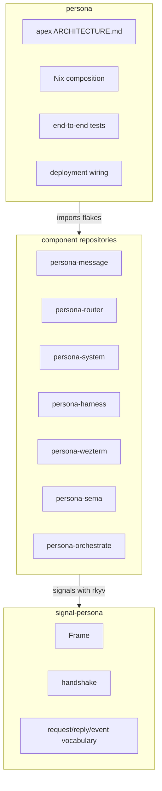
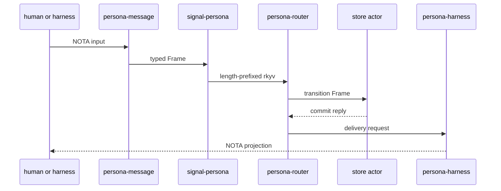

# persona — architecture

*Apex integration repository for the Persona component ecosystem.*

> `persona` composes the system. Component implementation lives in the
> component repositories; this repo wires them together through Nix, documents
> the whole topology, and owns deployment-level verification.

---

## 0 · TL;DR

Persona coordinates interactive AI harnesses as first-class participants in one
inspectable system. The runtime shape is a set of typed components signaling
through `signal-persona`; the meta repo imports those components and assembles
the deployment.

`persona` is not the home for router internals, terminal adapters, storage
tables, or signal records. It is the apex: architecture, Nix composition,
deployment wiring, and end-to-end tests.

## 1 · Components



| Repository | Role |
|---|---|
| `signal-persona` | Shared length-prefixed rkyv signal contract. |
| `persona-message` | Human and harness NOTA message boundary. |
| `persona-router` | Delivery reducer and pending-delivery state. |
| `persona-system` | OS/window/input observation boundary. |
| `persona-harness` | Harness identity, lifecycle, transcripts, adapter contracts. |
| `persona-wezterm` | Durable PTY and detachable WezTerm viewer transport. |
| `persona-sema` | Typed storage layer and schema guard over Sema. |
| `persona-orchestrate` | Workspace coordination: roles, claims, handoffs. |

## 2 · Wire Vocabulary

Rust components signal each other with `signal-persona::Frame`, encoded as
length-prefixed rkyv archives. NOTA is a projection format for humans, CLIs,
harness prompts, and debug output.



## 3 · State and Ownership

`persona-sema` owns Persona's typed storage tables and schema version. During
parallel development, component repos may keep local development state so their
CLIs and tests are useful in isolation. At assembly time durable writes go
through one store actor using `persona-sema`.

```mermaid
flowchart LR
    "component CLI" -->|"typed request"| "component library"
    "component library" -->|"local tests"| "component-local state"
    "component library" -->|"assembled runtime"| "store actor"
    "store actor" -->|"write transaction"| "persona-sema"
    "persona-sema" -->|"redb + rkyv"| "unified redb"
```

`signal-persona` remains the record-shape authority. `persona-sema` owns table
identity. The store actor owns ordering, transactions, and durable commit
visibility.

## 4 · Boundaries

This repository owns:

- apex architecture;
- Nix flake inputs and component composition;
- end-to-end tests that prove component composition;
- deployment wiring for a full Persona system.

This repository does not own:

- shared signal records (`signal-persona`);
- router policy (`persona-router`);
- terminal transport (`persona-wezterm`);
- harness lifecycle internals (`persona-harness`);
- OS/window-manager adapters (`persona-system`);
- durable database internals (`persona-sema`);
- workspace coordination internals (`persona-orchestrate`).

## 5 · Invariants

- The meta repo composes; component repos implement.
- Rust-to-Rust component traffic uses `signal-persona` rkyv frames.
- NOTA appears only at human, harness, CLI, and audit projection boundaries.
- Producers push; consumers subscribe. Polling is not a fallback.
- Harnesses are first-class records, not hidden terminal sessions.
- Durable writes in the assembled runtime pass through one store actor using
  `persona-sema`.
- Every component remains testable in isolation through its library, CLI, and
  tests.

## Code Map

```text
ARCHITECTURE.md  apex system shape
skills.md        how to work in the meta repo
flake.nix        component flake composition
src/             temporary schema stub while component repos absorb runtime
tests/           schema tests and multi-component end-to-end tests
```

## See Also

- `../signal-persona/ARCHITECTURE.md`
- `../persona-message/ARCHITECTURE.md`
- `../persona-router/ARCHITECTURE.md`
- `../persona-system/ARCHITECTURE.md`
- `../persona-harness/ARCHITECTURE.md`
- `../persona-wezterm/ARCHITECTURE.md`
- `../persona-sema/ARCHITECTURE.md`
- `../persona-orchestrate/ARCHITECTURE.md`
- `~/primary/reports/designer/19-persona-parallel-development.md`
- `~/primary/reports/operator/10-persona-parallel-implementation.md`
