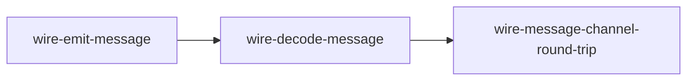
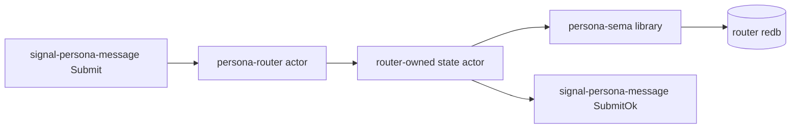

# Test architecture — `persona` meta repo

How tests across multiple Persona components are organised in this
repo and run via Nix.

This document is the per-repo test-architecture record per the
workspace's architectural-truth testing pattern. When a new
cross-component test lands, update this file with its shape and
witnesses.

---

## What lives here

The `persona` meta repo holds **cross-component tests**: tests that
exercise more than one Persona component together, using each
component's published contract repo as the integration surface.

Tests that exercise a single contract or component live in that
contract's or component's own `tests/` directory, not here.

---

## The test surfaces

### 0 · Component flake checks

`persona` imports component and contract flakes, then exposes their
checks under this meta repo. When a new `signal-persona-*` contract
lands, the meta repo imports it so a single `nix flake check` sees
the contract health alongside the runtime components.

### 1 · Cargo unit/integration tests (`tests/*.rs`)

Standard `cargo test` paths. Each test file is one integration test.
Currently:

- `tests/request.rs` — request shapes.
- `tests/schema.rs` — schema declarations.
- `tests/state.rs` — state engine.

### 2 · Wire-test shim binaries (`src/bin/wire_*.rs`)

Small CLI binaries that exercise Signal contract repos end to end
through real bytes on stdin/stdout. **Used by the Nix derivations
below**, not by `cargo test`.

| Binary | Role |
|---|---|
| `wire-emit-message` | Construct a `signal_persona_message::Frame` containing a `Submit`, encode length-prefixed, write to stdout. |
| `wire-decode-message` | Read length-prefixed bytes from stdin; decode as `signal_persona_message::Frame`; assert `--expect-recipient` / `--expect-body` match. |

Each shim is intentionally terse: one encode-or-decode operation and
exit. Architectural-truth witnesses come from the Nix chaining, not
from inside a large shim.

### 3 · Nix derivations (`flake.nix#checks`)

The current production witness is the message-channel byte
round-trip.



What the check proves:

| Check | Witnesses |
|---|---|
| `wire-message-channel-round-trip` | `signal-persona-message` constructs a `Submit` request frame, emits real length-prefixed bytes, decodes those bytes through a separate binary, and preserves the recipient + body. |

Run all checks:

```sh
nix flake check
```

The output names each derivation; failures point at the specific
step that broke.

---

## Next witness

The next load-bearing integration test targets the corrected first
stack:



The intended Nix-chained witness is:

| Step | Witness |
|---|---|
| Emit | A separate derivation writes a `signal-persona-message::Submit` frame. |
| Commit | A router-shaped binary reads only those bytes, mints router-owned metadata, and writes through `persona-sema` into a router-owned redb file. |
| Read back | A separate reader opens the redb through `persona-sema` and asserts the durable message exists. |
| Reply | The router-shaped binary emits `signal-persona-message::SubmitOk`. |

That future test should prove the component path, not only the
visible behavior.

---

## When a new contract gets added

Adding `signal-persona-<channel>` should also add a matching
Nix-chained check in this repo when the contract participates in a
cross-component behavior. Pattern:

1. Add `<channel>` to the deps in `Cargo.toml`.
2. Add shim bins for the new channel where needed.
3. Add `[[bin]]` entries in `Cargo.toml`.
4. Add derivations in `flake.nix#checks` chaining the shims or real
   component binaries.
5. Update this document with the new step and witness table.

The witness pattern is the same: each step is one derivation; bytes
or durable state artifacts flow between steps; no in-process fakery
can satisfy the test.

---

## What the current wire test does NOT do

- It does NOT exercise the actual `persona-router` daemon.
- It does NOT yet consume `signal-persona-system` in router code; the
  meta repo currently verifies that contract through its own imported
  flake checks.
- It does NOT write a redb file through `persona-sema`.
- It does NOT exercise delivery guards, harness adapters, or terminal
  adapters.
- It does NOT exercise `persona-orchestrate`; orchestration has its
  own state domain.

---

## See also

- `~/primary/skills/architectural-truth-tests.md` — the test
  discipline this fixture demonstrates.
- `~/primary/reports/designer/76-signal-channel-macro-implementation-and-parallel-plan.md`
  — macro and contract repo implementation report; records the
  domain-owned state correction.
- `~/primary/reports/operator/77-first-stack-channel-boundary-audit.md`
  — operator counter-plan for the first-stack channel boundary.
- `signal-persona-message/` — the message channel contract consumed
  here.
- `signal-persona-system/` — the system observation contract imported
  by the meta flake and consumed by the router next.
- `signal-core/src/channel.rs` — the `signal_channel!` macro.
