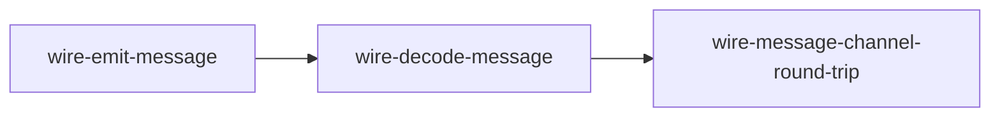
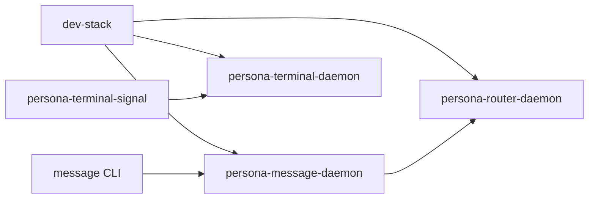
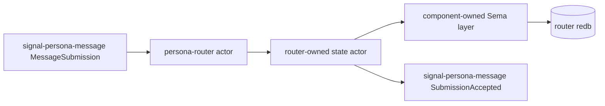

# Test architecture — `persona` meta repo

How tests across multiple Persona components are organised in this
repo and run via Nix.

This document is the per-repo test-architecture record per the
workspace's architectural-truth testing pattern. When a new
cross-component test lands, update this file with its shape and
witnesses.

---

## What lives here

The `persona` meta repo holds **cross-component tests**: tests that
exercise more than one Persona component together, using each
component's published contract repo as the integration surface.

Tests that exercise a single contract or component live in that
contract's or component's own `tests/` directory, not here.

---

## The test surfaces

### 0 · Component flake checks

`persona` imports component and contract flakes, then exposes their
checks under this meta repo. When a new `signal-persona-*` contract
lands, the meta repo imports it so a single `nix flake check` sees
the contract health alongside the runtime components.

### 1 · Cargo unit/integration tests (`tests/*.rs`)

Standard `cargo test` paths. Each test file is one integration test.
Currently:

- `tests/request.rs` — request shapes.
- `tests/schema.rs` — NOTA projection records for engine-manager replies.
- `tests/state.rs` — in-memory engine-manager status reducer.
- `tests/manager.rs` — Kameo actor-path constraints for the engine manager.

### 2 · Wire-test shim binaries (`src/bin/wire_*.rs`)

Small CLI binaries that exercise Signal contract repos end to end
through real bytes on stdin/stdout. **Used by the Nix derivations
below**, not by `cargo test`.

| Binary | Role |
|---|---|
| `wire-emit-message` | Construct a `signal_persona_message::Frame` containing a `MessageSubmission`, encode length-prefixed, write to stdout. |
| `wire-decode-message` | Read length-prefixed bytes from stdin; decode as `signal_persona_message::Frame`; assert `--expect-recipient` / `--expect-body` match. |

Each shim is intentionally terse: one encode-or-decode operation and
exit. Architectural-truth witnesses come from the Nix chaining, not
from inside a large shim.

### 3 · Nix derivations (`flake.nix#checks`)

The current production witness is the message-channel byte
round-trip.



What the check proves:

| Check | Witnesses |
|---|---|
| `wire-message-channel-round-trip` | `signal-persona-message` constructs a `MessageSubmission` request frame, emits real length-prefixed bytes, decodes those bytes through a separate binary, and preserves the recipient + body. |
| `persona-dev-stack-script-builds` | The Nix-created dev-stack runners are executable. It does not start PTY daemons inside a pure Nix builder. |
| `constraint_persona_cli_talks_to_persona_daemon_over_socket` | Spawns `persona-daemon`, sends two separate `persona` CLI requests through `PERSONA_SOCKET`, and proves the daemon-owned manager state survives between invocations. |
| `constraint_persona_daemon_does_not_delete_non_socket_endpoint_path` | Starts `persona-daemon` on an occupied regular-file path and proves daemon startup rejects it without deleting the file. |
| `constraint_engine_layout_can_select_message_router_topology` | Proves the engine layout can name the focused two-component `message-router` topology without allocating unrelated component layouts. |
| `constraint_message_router_topology_spawn_envelope_has_one_peer_socket` | Proves the focused topology gives `persona-message` exactly one manager-supplied peer socket: `persona-router`. |
| `constraint_engine_supervisor_launches_message_router_topology_without_full_stack` | Starts the `EngineSupervisor` actor with the focused topology, proves only `persona-message` and `persona-router` launch, and verifies each child sees one peer. |
| `constraint_engine_supervisor_launches_prototype_supervised_components_through_process_launcher` | Starts the `EngineSupervisor` actor with a component skeleton launch plan, proves all prototype-supervised component processes go through `DirectProcessLauncher`, verifies domain and supervision sockets, completes typed supervision identity/readiness/health round-trips, and reads typed spawn/ready/stop events back from `manager.redb`. |
| `constraint_persona_daemon_launches_message_router_topology_through_engine_supervisor` | Starts the real `persona-daemon` with `PERSONA_ENGINE_TOPOLOGY=message-router`, proves the launch plan reaches the supervisor, and proves no unrelated component capture appears. |
| `constraint_persona_daemon_launches_prototype_supervised_components_through_engine_supervisor` | Starts the real `persona-daemon` with `PERSONA_PROTOTYPE_STACK_EXECUTABLE`, proves all prototype-supervised spawn envelopes reached child processes, verifies supervision round-trips through the supervisor path, and verifies typed `ComponentSpawned`/`ComponentReady` events in `manager.redb`. |
| `persona-daemon-launches-nix-built-prototype-topology` | Starts the real `persona-daemon` with the Nix-built prototype launcher set, proves all seven prototype-supervised components receive the spawn-envelope environment and point at real component package binaries, proves every domain and supervision socket binds in a pure Nix builder, and proves the manager records readiness only after typed supervision replies. Terminal PTY readiness is deliberately left to the stateful terminal-cell smoke lane. |
| `persona-daemon-launches-nix-built-message-router-topology` | Starts the real `persona-daemon` with only the Nix-built `persona-message` and `persona-router` launchers, proves each receives exactly one peer socket, and proves the focused topology does not accidentally launch the full stack. |
| `persona-engine-sandbox-script-builds` | The Nix-created sandbox runner is executable. |
| `persona-engine-sandbox-supports-all-harnesses` | Dry-run mode creates isolated `state/`, `run/`, `home/`, `work/`, and `artifacts/` directories for `pi`, `claude`, `codex`, and `codex-api`. |
| `persona-engine-sandbox-documents-dedicated-auth` | Dry-run credential policy artifacts say prompt-bearing Claude/Codex runs need dedicated sandbox credentials and do not copy live host auth. |
| `persona-engine-sandbox-bootstrap-auth-dry-run` | Bootstrap dry-run emits the real dedicated auth surfaces: `codex login --device-auth`, separate `CLAUDE_CONFIG_DIR` login or token-file credential, and isolated Pi config/session directories. |
| `persona-engine-sandbox-pi-bootstrap-creates-isolated-dirs` | Live Pi bootstrap creates isolated config/session directories without touching paid-provider auth. |
| `persona-engine-sandbox-auth-isolation-witness` | Runs the actual sandbox runner against fake host Codex/Claude/Pi auth/session files and proves they are not copied, modified, or leaked into artifacts. |
| `persona-engine-sandbox-attach-script-builds` | The Nix-created host attach helper is executable. |
| `persona-engine-sandbox-dev-stack-smoke-script-builds` | The Nix-created stateful sandbox dev-stack smoke app is executable. |
| `persona-engine-sandbox-terminal-cell-script-builds` | The Nix-created terminal-cell smoke apps are executable and the persona flake packages `terminal-cell-daemon`, `terminal-cell-view`, `terminal-cell-send`, `terminal-cell-wait`, and `terminal-cell-capture`. |
| `persona-engine-sandbox-attach-plans-host-ghostty` | Dry-run host attach emits a Ghostty + `terminal-cell-view` command against the sandbox `run/cell.sock` and records that Wayland is not passed into the sandbox. |
| `persona-engine-sandbox-documents-bwrap-strict-profile` | Dry-run writes the optional bwrap strict-mount plan as a NOTA artifact with a tiny read-only/read-write bind set and no Wayland passthrough. |
| `persona-engine-sandbox-binds-dedicated-credential-root` | Dry-run pre-creates a credential root and proves the systemd command uses `BindPaths=` for it under `ProtectHome=tmpfs`, never `ReadWritePaths=`. |

Run all checks:

```sh
nix flake check
```

The output names each derivation; failures point at the specific
step that broke.

### 4 · Stateful Nix apps

The meta repo exposes the current integration runner as Nix apps:

```sh
nix run .#persona-daemon
nix run .#dev-stack
nix run .#dev-stack-smoke
nix run .#persona-engine-sandbox -- --harness pi --dry-run
nix run .#persona-engine-sandbox-dev-stack-smoke
nix run .#persona-engine-sandbox-terminal-cell-fixture-smoke
nix run .#persona-engine-sandbox-terminal-cell-pi-smoke
nix run .#persona-engine-sandbox -- --harness codex --bootstrap-auth --dry-run
nix run .#persona-engine-sandbox-attach -- --sandbox-dir /tmp/persona-engine-sandbox.example --dry-run
```

`persona-daemon` starts the daemon-first apex slice. It accepts an optional socket
path argument, otherwise it uses `PERSONA_SOCKET` or the production manager
socket path from `PersonaDaemonPaths`.
When `PERSONA_PROTOTYPE_STACK_EXECUTABLE` or all per-component executable
variables are supplied, the daemon starts the prototype-supervised process supervisor
before reporting readiness.

The meta repo also packages `persona-prototype-component-launchers`, a
Nix-built launcher set used by the topology witness. These scripts adapt the
manager's spawn-envelope environment to the component daemons' current CLI
surfaces, write inspectable capture files, and exec the real component
daemons. Each component daemon owns its own domain socket and supervision
socket; the launchers are adaptation glue only.

`dev-stack` starts the current runnable halves and keeps them alive:



The dev-stack currently runs three daemons end-to-end: `persona-router-daemon`
(binds `router.sock`), `persona-message-daemon` (binds `message.sock`,
forwards stamped submissions to `router.sock`), and `persona-terminal-daemon`
(binds `responder.terminal.sock`, owns a PTY). The `message` CLI talks to
`message.sock` via `PERSONA_MESSAGE_SOCKET`; the daemon adds an SO_PEERCRED
origin stamp before forwarding to the router.

`dev-stack-smoke` starts those three daemons, then proves:

| Witness | What it proves |
|---|---|
| `message Send` returns `(SubmissionAccepted N)` | The CLI's `MessageSubmission` reaches `persona-message-daemon`, gets stamped, forwards to `persona-router`, and the router accepts at a slot. |
| `message Inbox responder` returns the body | The router holds the submitted message at a slot, an `InboxQuery` round-trips, and the listing carries the origin-stamped sender plus the original body. |
| `persona-terminal-signal connect` returns `TerminalReady` | The terminal daemon owns a live PTY at the named terminal and reports a generation. |
| `persona-terminal-signal prompt` returns `TerminalInputAccepted` | The PTY accepts injected input through the typed Signal path. |
| `persona-terminal-signal capture` returns `TerminalCaptured` | The PTY's transcript is readable through Signal. |

The smoke deliberately does not prove router-to-harness-to-terminal end-to-end
message delivery yet (the harness side is still wave-4 push-primitive work).
It is a stateful app, not a pure
`checks` derivation, because the terminal daemon owns a live PTY.

`persona-engine-sandbox` is the scaffold for the full federation witness from
`reports/designer/129-sandboxed-persona-engine-test.md`. It creates the
sandbox directory layout, writes NOTA manifests and credential policy
artifacts, and launches the `systemd-run --user` invocation. Its current
inside-unit witness runs `persona-dev-stack-smoke` under
`state/dev-stack`, then copies the dev-stack process/socket manifests into the
sandbox artifacts directory. That proves the envelope runs real component
daemons; it is still not the full router-to-mind-to-harness-to-terminal
federation.

Pure Nix checks exercise dry-run mode and packaging. The production-code
inside-unit smoke is exposed as the stateful app
`persona-engine-sandbox-dev-stack-smoke` because it starts PTY daemons and is
not valid inside the pure Nix build sandbox. Real prompt-bearing Claude/Codex
runs require dedicated sandbox credentials and are not driven from live host
auth files.

`persona-engine-sandbox-terminal-cell-fixture-smoke` and
`persona-engine-sandbox-terminal-cell-pi-smoke` exercise the separate
terminal-cell lane. They start a real `terminal-cell-daemon` at
`$sandbox_dir/run/cell.sock`, drive it with Nix-packaged terminal-cell clients,
write host attach artifacts, and capture the transcript. The fixture variant
uses a deterministic shell child; the Pi variant starts the real Pi TUI with a
local Prometheus-backed model. The Pi variant snapshots only `settings.json`
and `models.json` into the sandbox and writes an empty `auth.json`.

Auth bootstrap mode is the live handoff for those dedicated credentials:

```sh
nix run .#persona-engine-sandbox -- --harness codex --bootstrap-auth
nix run .#persona-engine-sandbox -- --harness claude --bootstrap-auth
nix run .#persona-engine-sandbox -- --harness pi --bootstrap-auth
```

Codex uses a dedicated runner `CODEX_HOME` and `codex login --device-auth`.
Claude uses `PERSONA_CLAUDE_OAUTH_TOKEN_FILE` when present, otherwise a
separate `CLAUDE_CONFIG_DIR` login. Pi creates isolated config/session
directories and records the package path used for the local Prometheus-backed
model path.

The auth isolation witness is artificial in the intended architectural-truth
style: it creates fake host `~/.codex`, `~/.claude`, and Pi session files, runs
the real runner, and proves those files are unchanged while generated harness
env files use sandbox or dedicated paths. This catches accidental regressions
back toward live host auth/home usage.

Host attach mode is deliberately separate from engine launch:

```sh
nix run .#persona-engine-sandbox-attach -- --sandbox-dir "$sandbox_dir"
```

It expects a terminal-cell socket at `$sandbox_dir/run/cell.sock`, opens host
Ghostty with the packaged `terminal-cell-view`, and writes the planned command
under `$sandbox_dir/artifacts/`. The viewer stays on the host side, so Wayland
does not need to enter the sandbox.

The bwrap profile is currently a generated plan, not active policy. The runner
writes `bwrap-profile.nota` so the hardening boundary is reviewable while the
systemd-run path remains the executable scaffold.

---

## Next witness

The next load-bearing integration work is split by lane:

| Lane | Current state | Next target |
|---|---|---|
| Router persistence | Planned | Router-shaped binary commits `signal-persona-message::MessageSubmission` through router-owned Sema/redb and emits `SubmissionAccepted`. |
| Sandbox dev-stack | Landed | Keep proving real persona daemons run under the systemd sandbox. |
| Sandbox terminal-cell | Landed for fixture and Pi | Add dedicated Codex/Claude auth smoke after sandbox credentials are provisioned. |
| Full federation | Not landed | Route message through router/mind/harness/terminal with durable traces. |

The next router persistence witness targets the corrected prototype stack:



The intended Nix-chained witness is:

| Step | Witness |
|---|---|
| Emit | A separate derivation writes a `signal-persona-message::MessageSubmission` frame. |
| Commit | A router-shaped binary reads only those bytes, mints router-owned metadata, and writes through the router-owned Sema layer into a router-owned redb file. |
| Read back | A separate reader opens the redb through the router-owned Sema layer and asserts the durable message exists. |
| Reply | The router-shaped binary emits `signal-persona-message::SubmissionAccepted`. |

That future test should prove the component path, not only the
visible behavior.

---

## When a new contract gets added

Adding `signal-persona-<channel>` should also add a matching
Nix-chained check in this repo when the contract participates in a
cross-component behavior. Pattern:

1. Add `<channel>` to the deps in `Cargo.toml`.
2. Add shim bins for the new channel where needed.
3. Add `[[bin]]` entries in `Cargo.toml`.
4. Add derivations in `flake.nix#checks` chaining the shims or real
   component binaries.
5. Update this document with the new step and witness table.

The witness pattern is the same: each step is one derivation; bytes
or durable state artifacts flow between steps; no in-process fakery
can satisfy the test.

---

## What the current wire test does NOT do

- It does NOT exercise the actual `persona-router` daemon.
- It does NOT yet consume `signal-persona-system` in router code; the
  meta repo currently verifies that contract through its own imported
  flake checks.
- It does NOT write a redb file through a router-owned Sema layer.
- It does NOT exercise delivery guards, harness adapters, or terminal
  adapters.
- `persona-dev-stack-smoke` does NOT register router recipients with terminal
  endpoints because that control surface is not exposed yet.
- It does NOT exercise `persona-mind`; central mind state has its
  own component tests.

---

## See also

- `~/primary/skills/architectural-truth-tests.md` — the test
  discipline this fixture demonstrates.
- `~/primary/reports/designer/76-signal-channel-macro-implementation-and-parallel-plan.md`
  — macro and contract repo implementation report; records the
  domain-owned state correction.
- `~/primary/reports/operator/77-first-stack-channel-boundary-audit.md`
  — operator counter-plan for the earlier first-stack channel boundary.
- `signal-persona-message/` — the message channel contract consumed
  here.
- `signal-persona-system/` — the system observation contract imported
  by the meta flake and consumed by the router next.
- `signal-core/src/channel.rs` — the `signal_channel!` macro.
