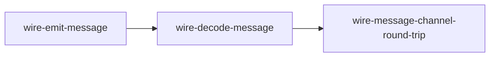
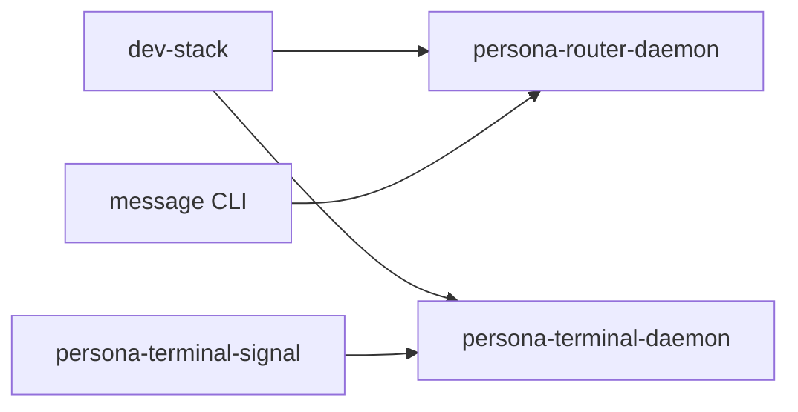
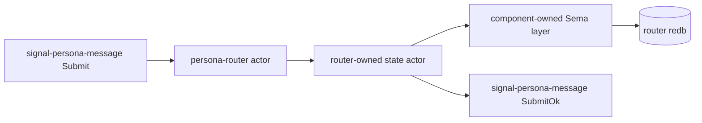

# Test architecture — `persona` meta repo

How tests across multiple Persona components are organised in this
repo and run via Nix.

This document is the per-repo test-architecture record per the
workspace's architectural-truth testing pattern. When a new
cross-component test lands, update this file with its shape and
witnesses.

---

## What lives here

The `persona` meta repo holds **cross-component tests**: tests that
exercise more than one Persona component together, using each
component's published contract repo as the integration surface.

Tests that exercise a single contract or component live in that
contract's or component's own `tests/` directory, not here.

---

## The test surfaces

### 0 · Component flake checks

`persona` imports component and contract flakes, then exposes their
checks under this meta repo. When a new `signal-persona-*` contract
lands, the meta repo imports it so a single `nix flake check` sees
the contract health alongside the runtime components.

### 1 · Cargo unit/integration tests (`tests/*.rs`)

Standard `cargo test` paths. Each test file is one integration test.
Currently:

- `tests/request.rs` — request shapes.
- `tests/schema.rs` — NOTA projection records for engine-manager replies.
- `tests/state.rs` — in-memory engine-manager status reducer.
- `tests/manager.rs` — Kameo actor-path constraints for the engine manager.

### 2 · Wire-test shim binaries (`src/bin/wire_*.rs`)

Small CLI binaries that exercise Signal contract repos end to end
through real bytes on stdin/stdout. **Used by the Nix derivations
below**, not by `cargo test`.

| Binary | Role |
|---|---|
| `wire-emit-message` | Construct a `signal_persona_message::Frame` containing a `Submit`, encode length-prefixed, write to stdout. |
| `wire-decode-message` | Read length-prefixed bytes from stdin; decode as `signal_persona_message::Frame`; assert `--expect-recipient` / `--expect-body` match. |

Each shim is intentionally terse: one encode-or-decode operation and
exit. Architectural-truth witnesses come from the Nix chaining, not
from inside a large shim.

### 3 · Nix derivations (`flake.nix#checks`)

The current production witness is the message-channel byte
round-trip.



What the check proves:

| Check | Witnesses |
|---|---|
| `wire-message-channel-round-trip` | `signal-persona-message` constructs a `Submit` request frame, emits real length-prefixed bytes, decodes those bytes through a separate binary, and preserves the recipient + body. |
| `persona-dev-stack-script-builds` | The Nix-created dev-stack runners are executable. It does not start PTY daemons inside a pure Nix builder. |
| `constraint_persona_cli_talks_to_persona_daemon_over_socket` | Spawns `persona-daemon`, sends two separate `persona` CLI requests through `PERSONA_SOCKET`, and proves the daemon-owned manager state survives between invocations. |
| `constraint_persona_daemon_does_not_delete_non_socket_endpoint_path` | Starts `persona-daemon` on an occupied regular-file path and proves daemon startup rejects it without deleting the file. |
| `persona-engine-sandbox-script-builds` | The Nix-created sandbox runner is executable. |
| `persona-engine-sandbox-supports-all-harnesses` | Dry-run mode creates isolated `state/`, `run/`, `home/`, `work/`, and `artifacts/` directories for `pi`, `claude`, `codex`, and `codex-api`. |
| `persona-engine-sandbox-documents-dedicated-auth` | Dry-run credential policy artifacts say prompt-bearing Claude/Codex runs need dedicated sandbox credentials and do not copy live host auth. |
| `persona-engine-sandbox-bootstrap-auth-dry-run` | Bootstrap dry-run emits the real dedicated auth surfaces: `codex login --device-auth`, separate `CLAUDE_CONFIG_DIR` login or token-file credential, and isolated Pi config/session directories. |
| `persona-engine-sandbox-pi-bootstrap-creates-isolated-dirs` | Live Pi bootstrap creates isolated config/session directories without touching paid-provider auth. |
| `persona-engine-sandbox-auth-isolation-witness` | Runs the actual sandbox runner against fake host Codex/Claude/Pi auth/session files and proves they are not copied, modified, or leaked into artifacts. |

Run all checks:

```sh
nix flake check
```

The output names each derivation; failures point at the specific
step that broke.

### 4 · Stateful Nix apps

The meta repo exposes the current integration runner as Nix apps:

```sh
nix run .#persona-daemon
nix run .#dev-stack
nix run .#dev-stack-smoke
nix run .#persona-engine-sandbox -- --harness pi --dry-run
nix run .#persona-engine-sandbox -- --harness codex --bootstrap-auth --dry-run
```

`persona-daemon` starts the daemon-first apex slice. It accepts an optional socket
path argument, otherwise it uses `PERSONA_SOCKET` or `/tmp/persona.sock`.

`dev-stack` starts the current runnable halves and keeps them alive:



`dev-stack-smoke` starts the same daemons, proves router ingress through the
`message` CLI, proves terminal Signal connect/input/capture, and exits with
artifact paths. It is intentionally explicit that it does not yet prove
router-to-harness-to-terminal delivery. It is a stateful app, not a pure
`checks` derivation, because the terminal daemon owns a live PTY.

`persona-engine-sandbox` is the scaffold for the full federation witness from
`reports/designer/129-sandboxed-persona-engine-test.md`. In the first slice it
creates the sandbox directory layout, writes NOTA manifests and credential
policy artifacts, and plans the `systemd-run --user` invocation. The pure Nix
checks exercise its dry-run mode; real prompt-bearing Claude/Codex runs require
dedicated sandbox credentials and are not driven from live host auth files.

Auth bootstrap mode is the live handoff for those dedicated credentials:

```sh
nix run .#persona-engine-sandbox -- --harness codex --bootstrap-auth
nix run .#persona-engine-sandbox -- --harness claude --bootstrap-auth
nix run .#persona-engine-sandbox -- --harness pi --bootstrap-auth
```

Codex uses a dedicated runner `CODEX_HOME` and `codex login --device-auth`.
Claude uses `PERSONA_CLAUDE_OAUTH_TOKEN_FILE` when present, otherwise a
separate `CLAUDE_CONFIG_DIR` login. Pi creates isolated config/session
directories and records the package path used for the local Prometheus-backed
model path.

The auth isolation witness is artificial in the intended architectural-truth
style: it creates fake host `~/.codex`, `~/.claude`, and Pi session files, runs
the real runner, and proves those files are unchanged while generated harness
env files use sandbox or dedicated paths. This catches accidental regressions
back toward live host auth/home usage.

---

## Next witness

The next load-bearing integration test targets the corrected first
stack:



The intended Nix-chained witness is:

| Step | Witness |
|---|---|
| Emit | A separate derivation writes a `signal-persona-message::Submit` frame. |
| Commit | A router-shaped binary reads only those bytes, mints router-owned metadata, and writes through the router-owned Sema layer into a router-owned redb file. |
| Read back | A separate reader opens the redb through the router-owned Sema layer and asserts the durable message exists. |
| Reply | The router-shaped binary emits `signal-persona-message::SubmitOk`. |

That future test should prove the component path, not only the
visible behavior.

---

## When a new contract gets added

Adding `signal-persona-<channel>` should also add a matching
Nix-chained check in this repo when the contract participates in a
cross-component behavior. Pattern:

1. Add `<channel>` to the deps in `Cargo.toml`.
2. Add shim bins for the new channel where needed.
3. Add `[[bin]]` entries in `Cargo.toml`.
4. Add derivations in `flake.nix#checks` chaining the shims or real
   component binaries.
5. Update this document with the new step and witness table.

The witness pattern is the same: each step is one derivation; bytes
or durable state artifacts flow between steps; no in-process fakery
can satisfy the test.

---

## What the current wire test does NOT do

- It does NOT exercise the actual `persona-router` daemon.
- It does NOT yet consume `signal-persona-system` in router code; the
  meta repo currently verifies that contract through its own imported
  flake checks.
- It does NOT write a redb file through a router-owned Sema layer.
- It does NOT exercise delivery guards, harness adapters, or terminal
  adapters.
- `persona-dev-stack-smoke` does NOT register router recipients with terminal
  endpoints because that control surface is not exposed yet.
- It does NOT exercise `persona-mind`; central mind state has its
  own component tests.

---

## See also

- `~/primary/skills/architectural-truth-tests.md` — the test
  discipline this fixture demonstrates.
- `~/primary/reports/designer/76-signal-channel-macro-implementation-and-parallel-plan.md`
  — macro and contract repo implementation report; records the
  domain-owned state correction.
- `~/primary/reports/operator/77-first-stack-channel-boundary-audit.md`
  — operator counter-plan for the first-stack channel boundary.
- `signal-persona-message/` — the message channel contract consumed
  here.
- `signal-persona-system/` — the system observation contract imported
  by the meta flake and consumed by the router next.
- `signal-core/src/channel.rs` — the `signal_channel!` macro.
