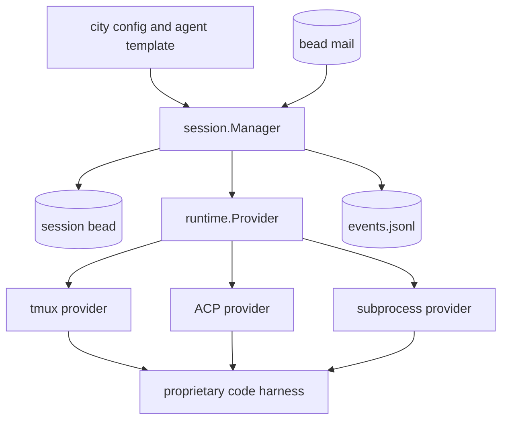
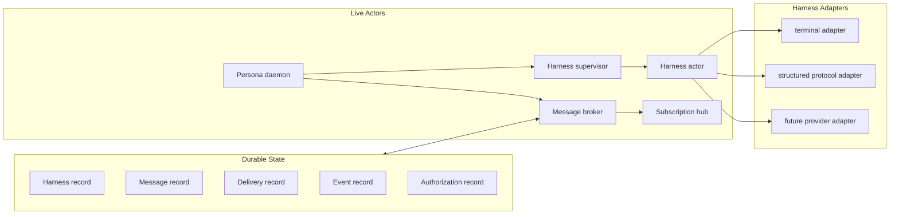
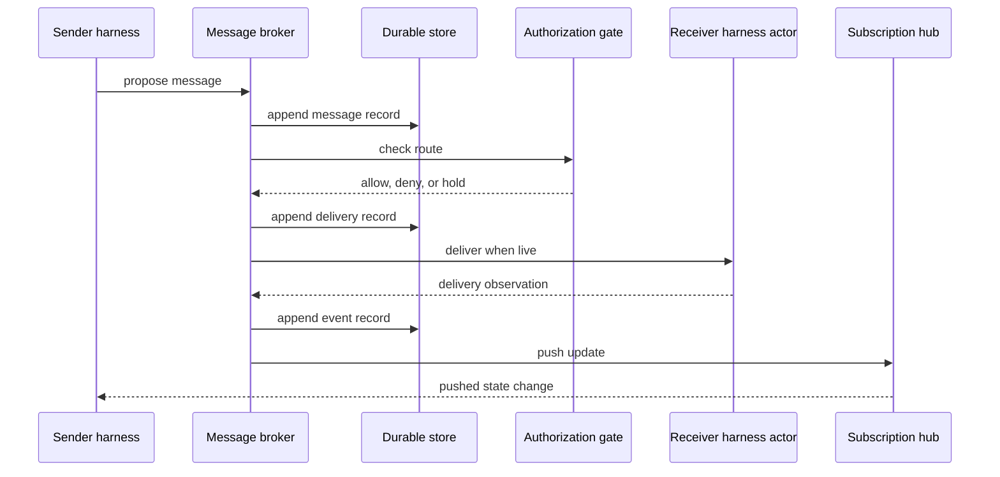
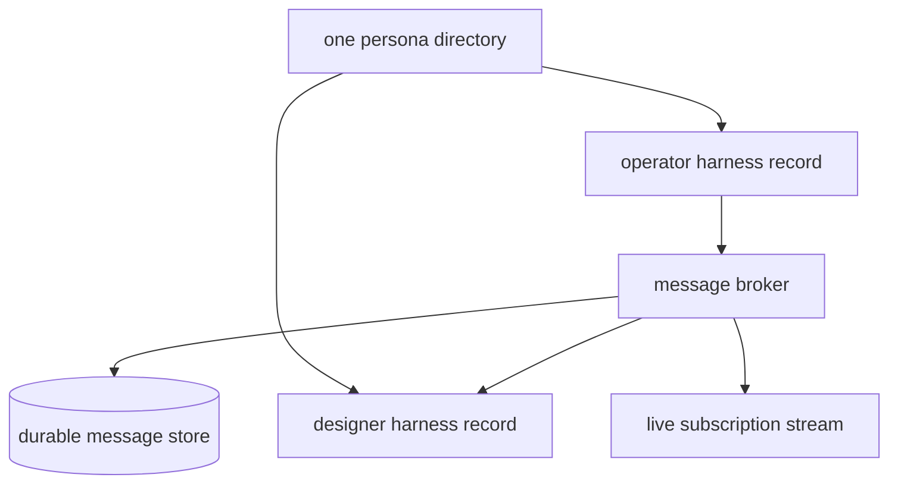

# Gas City Harness Design Read

Date: 2026-05-06

Persona starts from one practical claim: the proprietary code harness is the
real API surface available today. The system should treat each harness as a
first-class participant, then build durable messaging, live observation, and
authorization around that participant.

This report is deliberately high level. It records the shape to preserve from
Gas City and the shape Persona should grow toward before implementation code
exists.

## Gas City Shape

Gas City's harness unit is spread across three layers:



The useful idea is the provider boundary. Gas City gives callers one surface
for starting, stopping, waking, observing, attaching, copying files into, and
querying a harness-like session.

The pressure point is that the live harness often becomes a terminal session,
and the terminal session becomes the API. Once that happens, observation,
input delivery, state, and lifecycle are all inferred from terminal behavior.

## Gas City Mechanisms Worth Studying

| Gas City mechanism | What it proves | Persona reading |
|---|---|---|
| `runtime.Provider` | A harness can be controlled through a small lifecycle and I/O boundary. | Keep a narrow harness boundary, but type the records around it. |
| `session.Manager` | Durable session identity can outlive the live process. | Separate harness identity from live process state from message state. |
| `Nudge` / `NudgeNow` | Harness input needs both safe-boundary delivery and immediate delivery. | Model delivery intent explicitly instead of hiding it in provider behavior. |
| `Peek` / transcript discovery | Output must be inspectable after delivery. | Treat observation as a pushed stream plus durable projection. |
| ACP provider | Some harnesses can speak structured protocol over stdio. | Prefer structured adapters when available; keep terminal adapters as adapters. |
| beadmail | Messages as durable records are enough for a first mailbox. | Build a message fabric first, then route live nudges from it. |
| event watcher | Consumers need a cursor and subscription. | Provide push subscriptions directly; no polling file watcher as the core. |

## Persona Starting Components



The component list stays small:

| Component | Owns | First responsibility |
|---|---|---|
| Persona daemon | Process root and supervision tree | Starts the live actor system. |
| Harness registry | Durable harness identity | Knows which harnesses exist and what adapter starts them. |
| Harness supervisor | Live harness lifecycle | Starts, stops, and reconnects harness actors. |
| Harness actor | One live harness | Owns input delivery, output capture, and lifecycle state. |
| Message broker | Cross-harness messaging | Appends messages and routes allowed deliveries. |
| Subscription hub | Live observation | Pushes message, delivery, and lifecycle changes to consumers. |
| Authorization gate | Delivery permission | Decides whether one principal may send to another. |
| Durable store | Persistent state | Uses the local redb/rkyv pattern from criome/sema-era projects. |

## Message Lifecycle



The important design choice is that a message exists before live delivery.
Delivery is a state transition on the message route, not the definition of
the message. A stopped harness can still have a real inbox; a failed delivery
can still be inspected; a denied message can still leave an authorization
record.

## Harness Boundary

Persona should view a harness through four planes:

```text
+-------------------+----------------------------------------------+
| Plane             | Meaning                                      |
+-------------------+----------------------------------------------+
| Control plane     | start, stop, interrupt, resume, observe live |
| Message plane     | deliver prompt, attachment, follow-up        |
| Stream plane      | output, transcript, tool events, errors      |
| State plane       | durable identity, live process, cursors      |
+-------------------+----------------------------------------------+
```

Gas City has versions of all four, but they are entangled by the session
provider and bead metadata. Persona should make the four planes visible as
separate records and actor responsibilities.

## First Milestone



The first working core should prove only this:

1. A Persona directory can declare two harnesses.
2. A message can be appended from one harness to another.
3. The message has an authorization decision.
4. The recipient can receive it if live.
5. Every transition is pushed to a subscriber.
6. The same transitions can be read back from durable state.

That is enough to start replacing Gas City's session-mail-nudge tangle with a
typed message fabric.

## Design Commitments For Now

| Concern | Direction |
|---|---|
| Language | Rust. |
| Actor model | ractor for daemon components with state and protocols. |
| Durable store | redb with rkyv records, matching the criome/sema pattern. |
| External text | Text at human and harness edges only. Internal records stay typed. |
| Live updates | Push subscriptions. Features that need live state wait for this primitive. |
| Harness adapters | Multiple adapters behind one conceptual boundary. Terminal control is an adapter, not the system API. |
| Authorization | Built into routing and delivery records from the start. |

## Open Shape Questions

These are intentionally high-level because code should wait until the nouns
settle:

| Question | Why it matters |
|---|---|
| Is a harness a principal, an endpoint, or both? | Authorization and message identity depend on the answer. |
| Is a conversation separate from a message thread? | Harness-to-harness direct messages and group work may need different records. |
| Does delivery target a harness, a session, or a live process? | Durable identity and live execution should not collapse into one noun. |
| Which observations are transcript and which are events? | Events drive subscriptions; transcripts preserve conversation. |
| What is the smallest authorization record? | The first system should be explicit without becoming policy-heavy. |

## Reading Back Into Gas City

Gas City shows that harness control must include lifecycle, input, output, and
resume. It also shows that putting those concerns behind a terminal multiplexer
and metadata reconciliation makes the system hard to reason about.

Persona should keep the provider lesson and change the center of gravity:

```text
Gas City center: session provider + bead metadata + controller loops
Persona center: typed messages + harness actors + pushed observations
```

That is the first architectural difference worth preserving.
