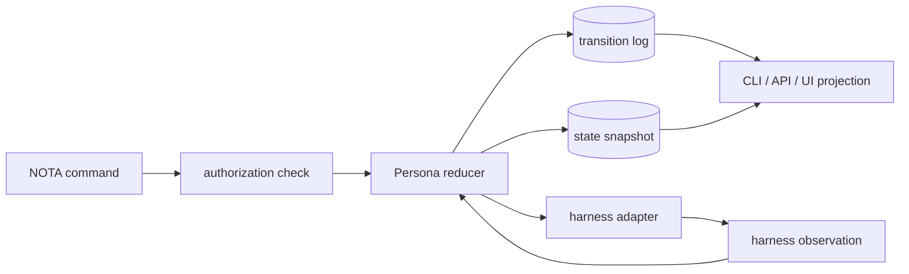
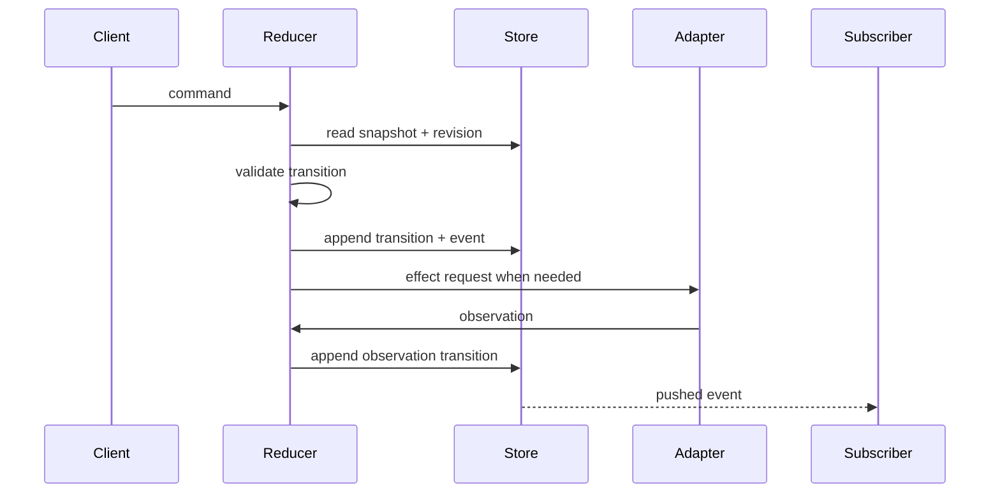
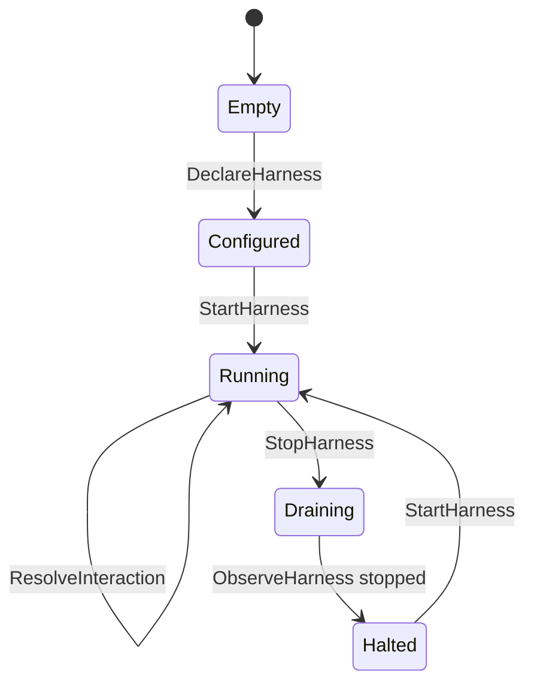
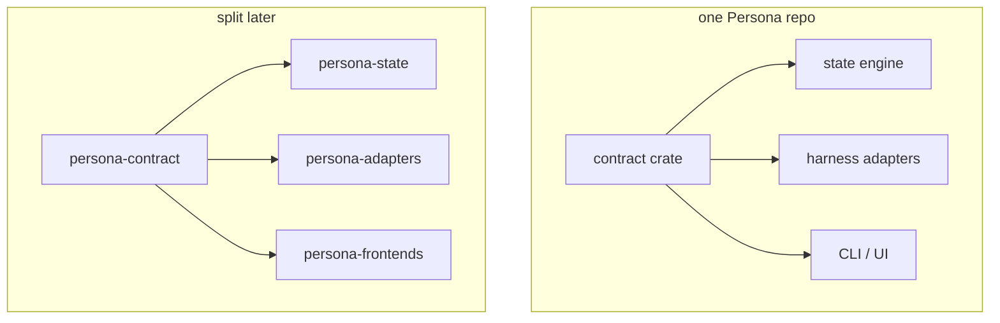

# Persona Core State Machine Design

Date: 2026-05-06

## Intent

Persona is the system that turns multiple proprietary harnesses into one
inspectable AI. The core should be one state machine. Peripheral adapters can
have local operational state, but Persona state itself is the reducer-owned
truth: commands enter, transitions land, observations are appended, and every
projection reads from that same record.

## Source Shape

Gas City has useful primitives but too many truths. The useful parts are the
runtime provider verbs, session interaction surfaces, event streams, and typed
API projection. The hazardous part is the stack of reconcilers and hidden
metadata control flow.

The separate orchestrator repo shows a better shape for deterministic progress:
persist a cursor, process ordered events, write an archived decision record,
then advance the cursor.

## Core Map



The adapter is not the state machine. It is an effect boundary. It can keep
local process handles, pipes, PTYs, provider sessions, and retry state, but it
reports back to the reducer through typed observations.

## Reducer Loop



## Records Added

| Record | Purpose |
|---|---|
| `PersonaStateSnapshot` | The reducer-owned view of the current world. |
| `StateTransitionRecord` | The durable decision the reducer made. |
| `StateCursorRecord` | Restart-safe cursor for ordered sources. |
| `HarnessObservationRecord` | A normalized observation from a live harness. |
| `PendingInteractionRecord` | A surfaced approval/question/blocking prompt. |

Supporting enums describe the single core phase, harness lifecycle states,
delivery states, and transition command kinds.

## State Topology



This is intentionally coarse. The harness lifecycle is richer than the core
phase, but all lifecycle changes still enter through the same transition log.

## Harness Manipulation Boundary

Gas City's runtime provider interface exposed the right primitive verbs:
start, stop, interrupt, nudge, send keys, peek, pending interaction, respond,
wait for idle, and get activity. Persona should keep the verbs, but reject tmux
as the truth layer.

```text
Persona reducer
  |
  | effect request
  v
Harness adapter port
  |-- direct process / PTY
  |-- structured provider protocol
  |-- future extension adapter
  |
  v
Harness observation
  |-- lifecycle
  |-- output tail or transcript cursor
  |-- pending interaction
  |-- delivery result
```

The adapter reports facts; the reducer decides what those facts mean.

## Repository Shape

Two shapes remain viable:



The current code can stay in one repo while acting like a contract boundary.
If UI/front-end churn starts forcing state-engine rebuilds or release coupling,
extract the contract first. The state engine and adapters should depend on the
contract, not on front-end code.

## Current Code Status

This pass adds schema-level state-machine vocabulary and a small
`PersonaState` holder. It does not add redb tables, rkyv archives, runtime
process control, or actors yet.

The next durable implementation step is a reducer API:

```text
Command + expected revision
  -> validate
  -> transition record
  -> event record
  -> new snapshot revision
```

## Questions

- Should the old `orchestrator` repo be folded into Persona as the first
  `persona-state` prototype, or remain a reference implementation?
- Should the contract boundary be a crate inside Persona first, or a separate
  repo immediately?
- What is the first non-tmux runtime substrate: direct PTY process, raw
  subprocess streams, or a structured provider protocol?
- Are extensions allowed to emit commands only, or can an extension own a
  narrow sub-state that the reducer imports as an observation?
- Does BEADS remain workspace orchestration only, or does Persona also model
  BEADS tasks as one kind of work object?
