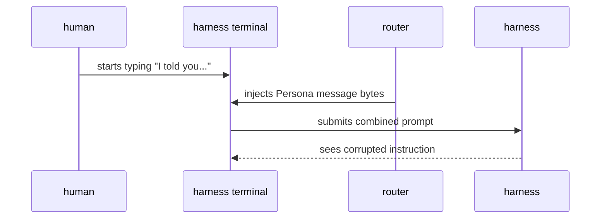
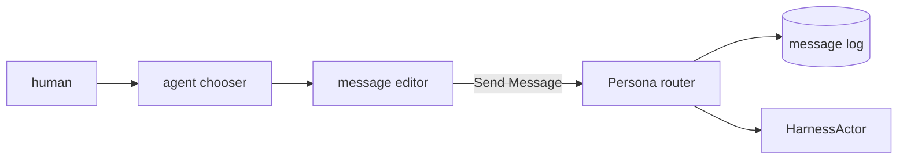
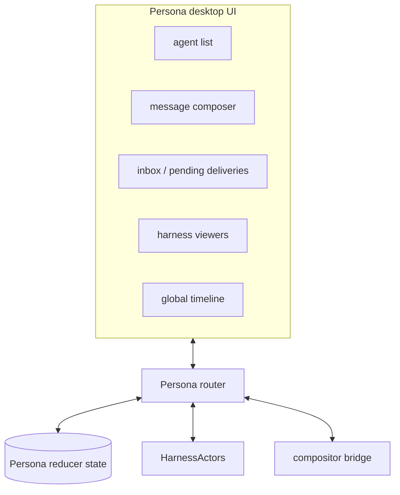
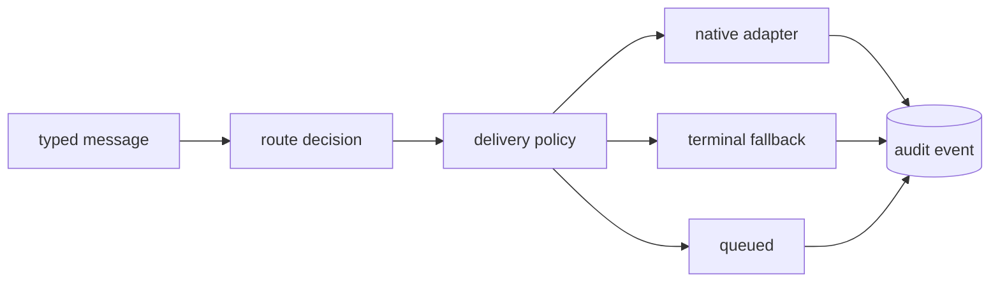
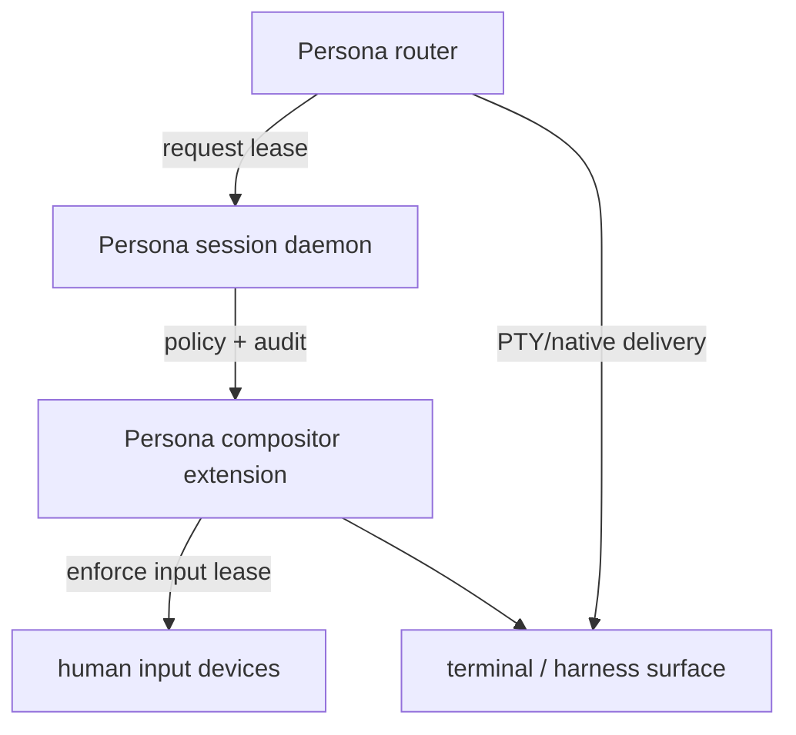
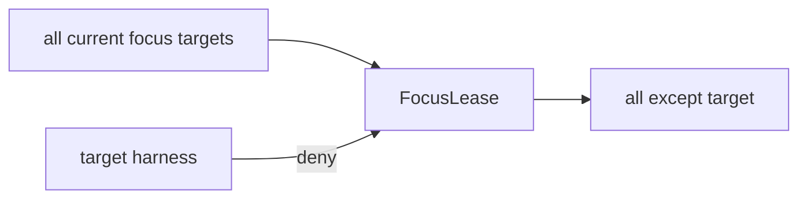
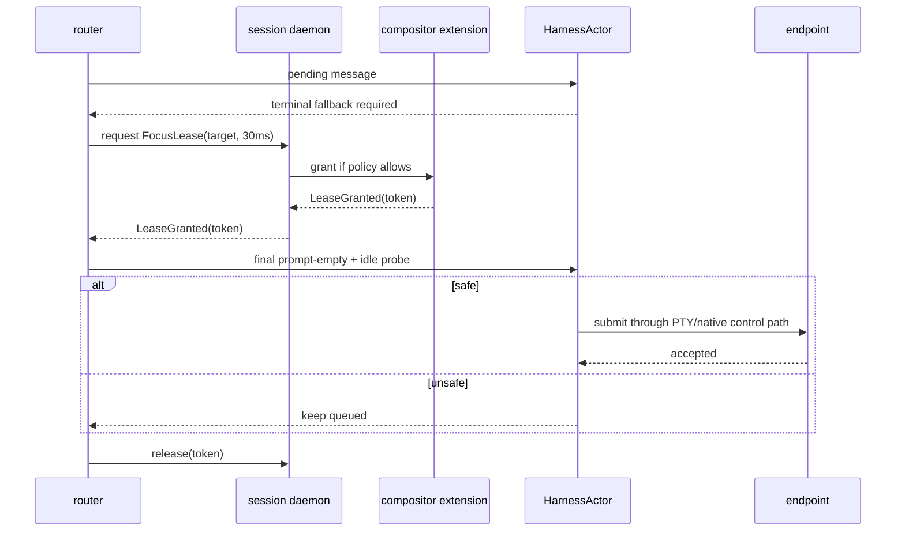
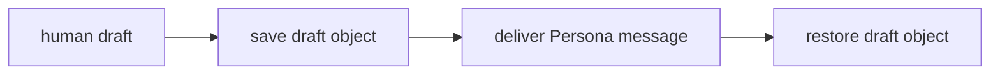
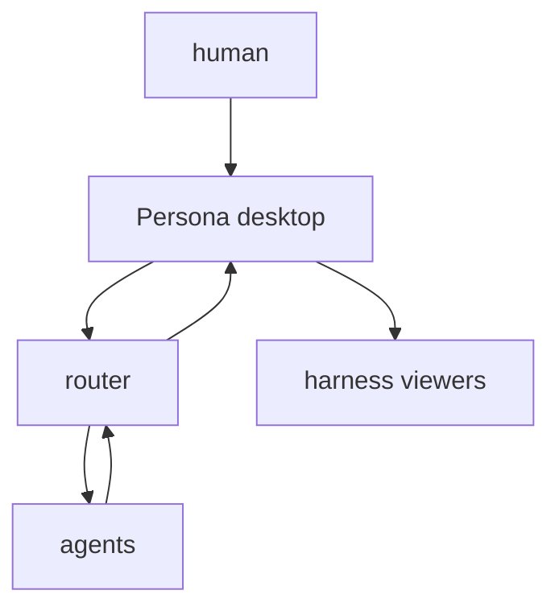
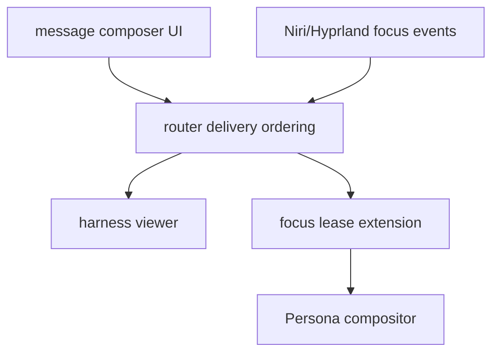

# Persona desktop control plane

Date: 2026-05-07
Author: Codex (operator)

Persona's terminal-delivery problem is not only a harness problem. It is a
desktop ownership problem: the human and the router can both try to write into
the same prompt at the same time. The fix is a desktop control plane where the
human writes Persona messages through a dedicated composer, and where the
router can ask the compositor for short critical-section authority when a
terminal fallback is still required.

This report describes a future shape. The immediate implementation can still
use guarded terminal fallback, but this is the direction that removes the class
of "human typing got spliced with router delivery" failures.

## The failure

The visible harness prompt is a shared mutable buffer:



The terminal accepted two writers. Neither writer had a typed boundary. The
terminal did what terminals do: it serialized bytes, then submitted them.

## Split human composition from harness prompts

Humans should not need to type into a harness prompt to send a Persona message.
The primary human UI should be a message composer:



The composer owns the draft. The harness prompt is no longer the human's
message editor. If the human wants to talk to a running agent, they choose the
agent, type in the Persona editor, and submit a typed message to the router.

That gives Persona one ingress path:

```text
human intent
  -> Persona message draft
  -> typed message
  -> router ordering
  -> harness delivery policy
```

The router can order, queue, audit, and authorize messages before any harness
prompt is touched.

## Desktop overview

The same UI can become the desktop-wide observability surface:



The first useful version can be modest:

| Surface | Purpose |
|---|---|
| Agent list | choose recipient by Persona identity, not terminal pane |
| Message editor | compose durable Persona message |
| Pending deliveries | show queued/deferred/delivered state |
| Harness viewer | inspect current screen/transcript without owning prompt input |
| Timeline | audit messages, delivery attempts, replies, focus leases |

## Router as the input arbiter

The router should be the only component that decides when a message may enter a
harness:



This avoids the current problem where a human prompt and router prompt compete.
The harness terminal remains a viewer and fallback substrate, not the primary
human command entry point.

## Compositor authority

Focus and input routing are compositor-owned. A normal external daemon can
observe windows through IPC, but it does not own other clients' `wl_surface`
handles. The compositor has the full surface registry and the input dispatcher.

So the durable system has three pieces:



The session daemon owns policy and audit. The compositor extension owns
enforcement. The router owns message state and delivery attempts.

## Focus lease

A focus lease is a short-lived compositor contract:

```rust
struct FocusLeaseRequest {
    target: HarnessTarget,
    max_duration: Duration,
    reason: DeliveryReason,
}

enum FocusLeaseReply {
    Granted(FocusLeaseToken),
    Denied(FocusLeaseDenial),
}
```

Its semantic is not "steal focus." Its semantic is:

```text
for this target and this very short critical section:
  do not let human focus/input enter the target
  keep all existing non-target focus behavior available
  cancel on explicit human override
  expire through an OS deadline event
```

That is the blacklist-via-compositor-authority form:



Hyprland's `hyprland-focus-grab-v1` shows that compositor-level focus limiting
is plausible, but its public protocol is whitelist-oriented and takes Wayland
surface objects. A separate router process cannot normally pass arbitrary
surfaces owned by other Wayland clients. A Persona compositor extension can
implement the exact target-by-window-id lease because it lives inside the
authority boundary.

## Delivery under lease

The terminal fallback path becomes:



The lease protects only the final submit section. It is not a retry loop and it
does not wait for stability. If the lease is denied, delivery remains queued.

## Prompt save and restore

Saving a partially typed human prompt is a good product idea, but only when the
prompt is a typed object:



Doing this by sending terminal backspaces and retyping bytes is not acceptable.
It can corrupt multi-line input, shell escapes, paste state, IME composition,
and hidden TUI state. Draft save/restore belongs in:

- the Persona message composer;
- a native harness adapter that owns the prompt model;
- a future Persona terminal protocol that exposes drafts as typed state.

## Product direction

The desktop UI should make direct prompt typing less necessary:



The human still can attach to a harness and type directly. That remains an
escape hatch and a debugging tool. The normal path is Persona-native: choose an
agent, compose a message, let the router deliver it, and inspect the result in
the timeline or viewer.

## Implementation path



1. Add Persona message composer as a simple desktop or terminal UI.
2. Route all human-to-agent messages through the router.
3. Keep visible harness prompts as manual escape hatches.
4. Consume compositor focus events for wakeups.
5. Add a lease provider only when the compositor side can enforce it.
6. Fold the lease into a future Persona session daemon or compositor.

## Open questions

| Question | Current answer |
|---|---|
| Is the first composer GUI or TUI? | Either works; the contract is typed Persona messages |
| Does terminal fallback need focus leases before shipping? | No; it can defer more aggressively until lease exists |
| Can Hyprland's focus grab be used directly? | Only if Persona owns/gets suitable surfaces; otherwise use it as precedent |
| Is a display manager enough? | No; enforcement belongs in compositor authority |
| Can a session daemon coordinate this? | Yes; policy in daemon, enforcement in compositor |

## Recommendation

Move human conversation out of harness prompts and into Persona messages. Then
use compositor authority only for the remaining unsafe terminal fallback. The
long-term desktop becomes a Persona control plane: message composer, agent
overview, harness viewers, delivery audit, and short focus leases where the
compositor can enforce them.
